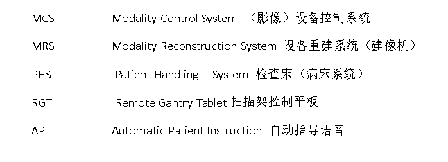

## 缩略语
### A
AEC Automated Exposure Control 自动曝光控制
AP Angle Pulse 角度脉冲
AP Anterior-Posterior（前位-后位），即从前向后。
API Automatic Patient Instruction 自动指导语音；病人呼吸指令。
### C
CARE Combined Applications to Reduce Exposure（用组合的应用程序来减少辐射）旨在达到最佳的图像质量，减少对病人的辐射剂量和造影剂用量。
CD Compact Disk 光盘
CD-R Compact Disk Recordable（可刻录光盘）。
CPU Central Processing Unit（中央处理器），执行计算功能的部件。CPU 的速度不仅确定例如 RAM 配置等的因素，而且还确定计算机的处理速度。
CT Computed Tomography （计算机断层成像）计算机 X 射线断层技术CT 值 用于对一对象的射束衰减能力进行定量的数字。标度使用水作为参考，水的 CT 值为 0（空气：CT 为-1000）。
CTA CT Angiography（CT 血管造影），它使用 CT 来显示血管系统。
CTDI CT Dose Inde（x CT 剂量指数），是根据 21CFR，§1020.33 计算的PMMA（透明合成树脂）吸收剂量。剂量分布的积分是沿一条垂直于断层平
面的直线进行计算的（从-7T 至+7T），T 是标称断层厚度单位）。
CTDI 100 CT Dose Index（剂量指数）是 IEC 60601-2-44 计算的空气吸收剂量。剂量分布的积分是沿一条垂直于断层平面的直线进行计算的（从-50mm 至+50 mm）。
CTDI vol The CT Dose Index vol（CT 剂量指数容积）（IEC 60601-2-44）为标准头部或体部 CT 剂量模体中一个断层的平均剂量近似值，以空气吸收剂量（mGy）表示。 
### D
DAS Date Acquisition System 数据采集系统
DICOM Digital Imaging and Communication in Medicine 医学数字影像和通信标准
DICOMDIR 一种 DICOM 格式文件给所有相关 DICOM 文件编排索引信息。
DLP Dose Length Produc（t 剂量长度乘积）。DLP 按以下公式计算：DLP[mGyx cm]=CTDIvol[mGy]×层厚×每次扫描的断层位置数
Glossary of Terms
SW VT10_19001-SWERS-005-01 第 3 页 共 8 页
DSA Digital Subtraction Angiography 数字减影血管造影
DVD Digital versatile Disc 数字多功能光盘
### E
ECG Electro Cardiogram Gate 心电门控
ENT Ear, Nose and Throat 耳鼻喉； 耳鼻喉科医院
ERS Engineering Requirement Specifications 工程需求规范
### F
FBP Filtered Back Projection 滤波反投影
FOV （重建）Field Of View（显示野），使用该重建区计算断层图像。
FPGA Field Programmable Gate Array 现场可编程逻辑门阵列
### G
GUI Graphical User Interface 图形用户界面
### H
HIS Hospital Information System（医院信息系统）。在医院内用于传输病人数据和图像的网络。
HU Hounsfield units 亨氏单位
HW Hardware 硬件
### I
ICT CT 介入；提供检查床和机架间更大空间的采集方法，如 C 臂中的
使用。
IEC International Electrotechnical Commission 国际电工委员会
IV Intro Venous 介入静脉
### K
kV Kilo-volt（千伏，1kV = 1000V）；用于计算球管电压的单位。
### L
LAT Lateral 侧
LED Light Emitting Diode（发光二级管），一个可以亮起的像灯泡的半导
LP Line Pairs 线对
### M
mA Milliampere（毫安，1mA = 1/1000A）；用于测量球管电流的单位。
mAs Milliampere per second product（毫安和秒的乘积）；用于测量球管电流（mA）和扫描时间（s）的乘积的单位。等于施加的辐射剂量。
MCA Motion Artifact Correction Algorithm（运动伪影校正算法）：用于校正运动伪影的算法。
MCS Modality Control System （影像）设备控制系统；设备控制系统（控制机）
METRO This is a functionality parallel to scanning and reconstruction 这是与扫描和重建并行的功能
mGy milli Gray 毫格瑞
MHU Mega Heat Units 巨型热机组
MinIP Minimum Intensity Projection（最小密度投照）类似于 MIP，但显示最黑体素最小吸收区域）的可视化。
MIP Maximum Intensity Projection（最大密度投照）是一种三维显示方法：在各种情况下，沿着通过体积的显示方向，具有最强吸收的体素被显示在结果图像内。
MOD 可刻录光盘驱动器；用来转换数据的系统。
MPR Multi Planar Reconstruction（多平面重建）：使用图像数据集您可以在不同方位的平面内进行回顾性重建（比如，从轴位图像重建冠状面、矢状面和近轴位图像）。
MRS Modality Reconstruction System 设备重建系统（建像机）
MTF Modulation Transfer Function（调制传递函数）；对象对比度与图像对
比度的频率相关比。MTF 可以定性确定成像系统的空间分辨率。
MWS Modality Workstation 影像后处理工作站
### P
PA Posterior Anterior（前后位）。
PACS Picture Archiving & Communication System（图片接收与通讯系统）。专门用于存档和发送医疗图像的网络。
PC Personal Computer 个人电脑
PDS Power Distribution System 配电系统
PDU Power Distribution Unit 电源柜。电源柜用来限制和隔离电源，使医学成像设备免受尖峰噪声，谐波噪声，本底噪声的干扰，确保清楚的准确的扫描图像。
PHS Patient Handling System 检查床（病床系统）
PSB PSB（电源开关盒）是用于连接控制台和主电源的小型配电装置。
PT03 The project name for PT03 研发产品的项目名称
Glossary of Terms
SW VT10_19001-SWERS-005-01 第 5 页 共 8 页
### R
RAM Random Access Memory 快速，永久记忆（随机存储器），使用它进行计算机操作。RAM 的可用容量决定了其他因素，包括处理速度。数据长期保存在硬盘、MOD 或 CD-R 中。
RCB Remote Control Box 远程控制盒（遥控板）
RGT Remote Gantry Tablet 扫描架控制平板
RIS Radiology Information System（放射学信息系统）。用于将病人数据和显示传输到放射科的网络，另请参见 HIS。
ROI CT 图像中的 Region Of Interest（感兴趣区）。它的位置、大小和形状可以选择而且可以对它进行定量评估。
RTD Real Time Display（实时显示）。
### S
SSD Shaded Surface Display（表面遮盖显示）：三维表面构建用重现技术：只有 CT 值超过定义阈值的体素才被考虑。
SW Software 软件
SA System Availability 系统可用性； 计算公式为 SA [％] = 100-（部分和全部故障的停机时间+维护+更新）/操作时间；操作时间= 24x365 = 8760 小时 。
### T
TCO Total Control Ownership 生命周期成本
TOMO Tomogram X 线断层影像
TOPO Topogram 定位片
### U
UFC Ultra-Fast Ceramic（超高速陶瓷）。
UI User Interface 人机交互
UPS Uninterrupted Power Supply（不间断电源）确保电源故障时正常运作
### V
VAC Voltage in Alternating Current 交流电压（伏特）
VAR Volume Artifact Reduction（容积伪影削减）。用于减少部分容积伪影的处理方法。
VRT Volume Rendering Technique（容积再现技术）。用于三维显示的重现技术。
### W
W/L Window Width and Window Level 窗宽和窗位
## 术语
### A
Air cal 空气校准
Authorized service Provider 授权服务供应商；由纳米维景授权在定义的 CT 机上提供服务的工程师或技术人员，例如 纳米维景客户服务工程师，经销商服务工程师，客户内部技术人员。
Axial scan 轴向扫描
### C
Calibration （Cal） 校准
Circuit 电路
Collimator 层后控制器
Control Box 控制盒
### D
Dynamic scan cycle time 动态扫描循环时间：在最快旋转速度、异步重建、病床无运动的情况下，设备旋转一周所需的时间。
Detector row 探测器的物理排数，由探测器的分部形成
Dynamic Serio 序列扫描技术，用于在单个病床位置上进行多次扫描的连续数据采
集。 
### E
E-STOP 急停按钮
### F
Filament 球管灯丝
Fliter 滤线器
### G
Glossary of Terms
SW VT10_19001-SWERS-005-01 第 7 页 共 8 页
Gantry 扫描架。扫描架包含有 X 射线发射装置、探测器、运动控制系统和集成电子器件。 
### H
Heater control board 灯丝控制板
Helical scan 螺旋扫描
High voltage 高压
HV cable 高压电缆
HV inverter 高压逆变
### I
i-Control 可在介入检查时用于控制 CT 系统或软件功能的组件。
Image data 图像数据包括生数据和重建影像，包括相应图像对象和图形
Insert 管芯
### K
kV control board 千伏控制板
### O
Operator’s console 操作台。操作台是操作者操作该系统并接收扫描数据和图像的接口。
操作台包括操作控制柜和相关的控制系统。
Osteo CT 用于对腰椎内的骨矿物质成分进行定量评估的半自动骨矿物质密度测量和评估方法。 P
Patient data 患者数据包括人口统计数据，报告，实验室结果，但无图像数据
Patient table 诊断床。在扫描期间，诊断床在计算机控制下移动患者进出扫描架。
Phantom Cal 模体校准
Pitch 该术语仅适用于旋转 CT。它定义为病床的步进和单层准直器每旋转一圈之间的比率。
Pitch factor 螺距系数；该术语仅适用于旋转 CT。即扫描旋转架旋转一周检查床运行的距离与全部射线束宽度的比值。 
### R
Raw data 原始数据；预处理后可获得原始数据。 原始数据是指可用于计算切片厚度，FOV 和任何可用内核的特定范围内的图像的数据。 这些原始数据可以是“真实原始数据”或体积数据。
Reconstruction rate 重建率；重建图像数除以重建时间
Reconstruction time 重建时间
Rotor 球管旋转阳极
Rotor control board 旋转阳极控制板
### S
Scan cycle time 扫描周期时间；从扫描启动到下一次扫描启动的总时间。（请参阅“标准扫描周期时间”）
Scan Protocol 扫描协议；特定于区域和器官的协议，例如 由定位片和几个序列或旋转范围组成。
Scout scan 定位扫描
Sequence CT CT 序列；床不动时的序列运动扫描过程。
SPIRAL CT 旋转 CT；具有连续旋转，连续数据采集和连续病床移动的扫描技术。
Standard scan cycle time 标准扫描周期时间；从一次 360°顺序扫描到下一次以特定类型的标称转速（包括最大）旋转的时间。 10mm 病床步进和每转一幅图像的同步重建。 
### T
Teleradiology 远程放射学；通过电话线或无线方式将数字信息（例如图像，报告）传输到远程站。
Topogram 通过使用固定管位置和连续床运动进行扫描，从而得到定位片。
Tube 球管
### U
Update 更新在可靠性，生产率，用户友好性方面提高了性能。 它不会在新的临床应用方面增加功能。
Upgrade 升级为现有系统，提供新的应用程序或应用程序的新功能。
User 按预期用途使用系统的人（患者检查，重建，数据处理等；例如 MTA，放射科医生）
### W
Warm up 球管预热
Water Cal 水模校准