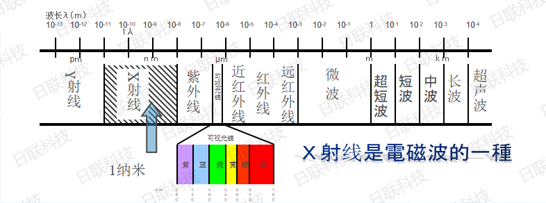
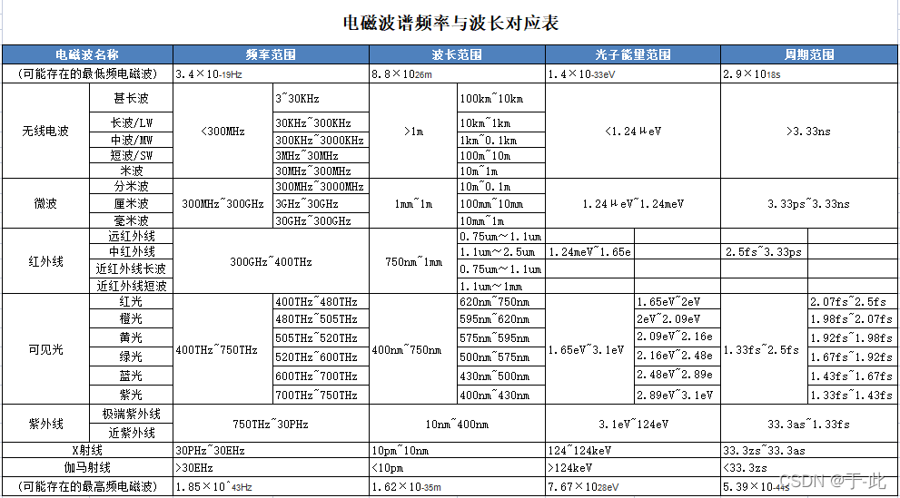
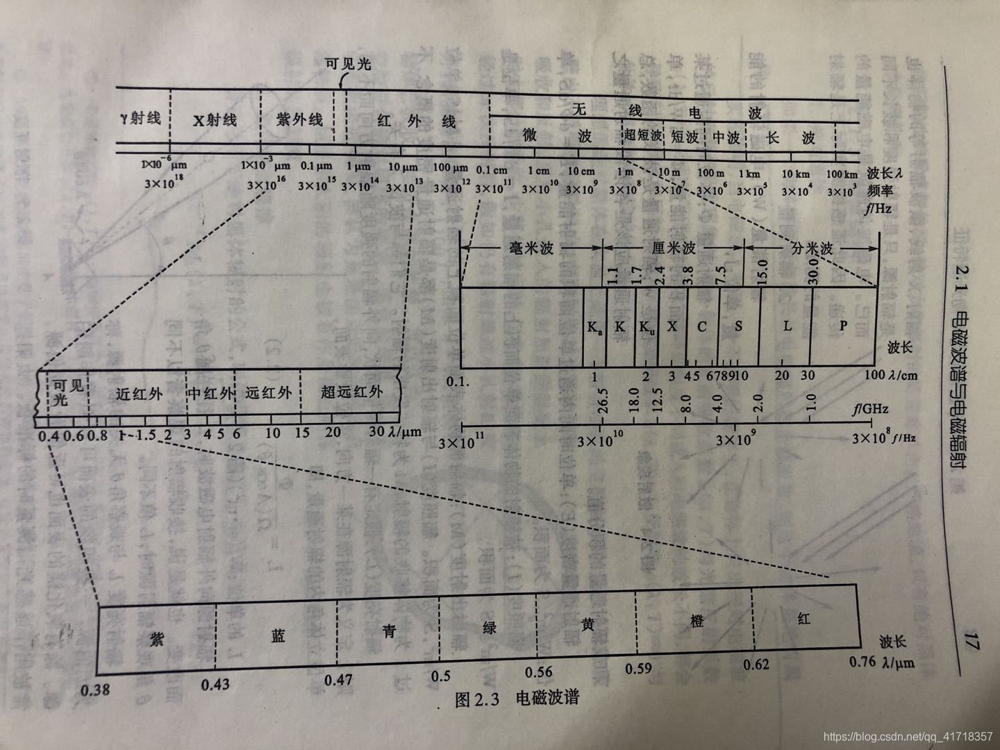

带电粒子在加速（或减速）时，必定伴随着辐射。
而，当带电粒子与原子（原子核）相碰撞，发生骤然减速时，也就会发生一定的辐射。而由此产生的辐射就是韧致辐射，又称为刹车辐射

α射线来源是原子核放出由2个中子,2个质子组成的小核
β射线来源是中子衰变为质子,同时放出1个电子
γ射线来源是上述两种射线放出时伴随着质量的亏损,因此放出能量以γ射线散射
波长只在电磁波中讨论.即α,β射线没有讨论波长的意义.

光波：波长为10nm—10^-6^nm的电磁波

**宇宙射线**也叫**电磁波**，其中包含γ射线、X射线、紫外线、可见光、红外线、近红外、远红外，还有无线电和超声波。  
  
无线电波是振荡电路中自由电子作周期性的运动产生的．  
红外线、可见光、紫外线是原子外层电子受激发产生的．  
X射线是原子内层电子受激发产生的．  
γ射线是原子核受激发产生的．

声波和电磁波有什么异同  
声波是振动波, 波本身不是物质而是能量. 需要以物质(空气、物体、液体）为载体传播.  
电磁波既是能量也是物质,无需载体即可传播。  
声波为机械波，通过周期性压迫弹性介质传播能量，是纵波。  
电磁波通过电场和磁场互相自激传播，不需要介质，是横波。

带电粒子在加速（或减速）时，必定伴随着辐射。而，当带电粒子与原子（原子核）相碰撞，发生骤然减速时，也就会发生一定的辐射。而由此产生的辐射就是韧致辐射，又称为刹车辐射

α射线来源是原子核放出由2个中子,2个质子组成的小核  
β射线来源是中子衰变为质子,同时放出1个电子  
γ射线来源是上述两种射线放出时伴随着质量的亏损,因此放出能量以γ射线散射  
波长只在电磁波中讨论.即α,β射线没有讨论波长的意义.

## 电磁波波长

**可见光光波**：波长为10nm—106nm的电磁波

*   γ射线波长0.01pm 10pm
*   X射线波长10pm~ 10nm，频率范围30PHz~ 300EHz，能量为124eV~1.24MeV
*   紫外线波长10纳米～0.38微
*   可见光波长0.38微米～0.78微
    *   紫（Violet）| 380–420
    *   蓝（Blue）420–470
    *   青（Cyan）470–500
    *   绿 （Green）500–570 nm
    *   黄 （Yellow）570–600 nm
    *   橙（Orange）600–630 nm
    *   红（Red） 630–780 nm
*   红外线波长0.78微米～1毫米
*   微波1毫米~1米
*   超短波1米 10米
*   短波 10米 100米
*   中波 100 1000
*   长波 1000 3000
*   无线电波波长0.1毫米～3000米，

  

**速度**  
α射线的速度为光速的十分之一  
β射线的速度接近于光速（99.9999%）  
γ射线的速度为光速.（光速C=3x108m/s）

## 离子、粒子、射线区别

离子射线这个概念可以从离子和射线两个概念去理解。射线有质子射线、电子射线、离子射线、中子射线等称呼，都可以分开来理解。这些射线都是粒子射线，区别于光子束流（电磁波）。所谓的离子射线就是带电的某种元素的离子流，常见的有氦、碳、氖等，后二者又称为重离子射线。注意，氢离子射线是质子射线。  
**离子是带正电荷或负电荷的原子或原子团。**

**离子和粒子有什么区别：**

1、从定义上区别，**离子是带电的原子或原子团**，它是由原子或原子团经过电离而产生的。粒子指能够以自由状态存在的最小物质组成部分。  
2、从范围上看，离子只不过是粒子大家庭中的一小部分。  
3、离子一定带电，粒子可以带电，也可以不带。

离子与电子的区别有：  
1、含义不同  
离子是指原子或原子基团失去或得到一个或几个电子而形成的带电荷的粒子。这一过程称为电离。电离过程所需或放出的能量称为电离能。  
电子（electron）是带负电的亚原子粒子。它可以是自由的(不属于任何原子)，也可以被原子核束缚。原子中的电子在各种各样的半径和描述能量级别的球形壳里存在。球形壳越大，包含在电子里的能量越高。  
2、电性不同  
离子是带正电荷或负电荷的原子或原子团。  
电子是带负电荷的微粒。  
3、结构不同  
原子的核内质子数等于核外电子数,最外层电子数没有达到稳定结构（稀有气体除外）。  
离子的核内质子数大于或小于核外电子数,最外层电子数大多达到8电子稳定结构。

## 长度单位

*   1nm=1×10^(-9）m（纳米）
*   *1A=1×10^(-10）m（埃米）*
*   1pm=1×10^(-12）m（皮米）
*   1fm=1×10^(-15）m（飞米）
*   1am=1×10^(-18）m（阿米）
*   1zm=1×10^(-21）m（仄米）
*   1ym=1×10^(-24）m（幺米）
*   X射线属于电磁波的一种，它波长短、频率高。它的波长在0.001纳米到10纳米之间，频率在3*10的16次赫兹到3*10的24次赫兹之间。X射线主要分为极软射线、软射线、硬射线和极硬射线。  
    这是从波长上来划分：  
    极软射线的波长在0.25纳米到0.062纳米之间；  
    软射线是0.062纳米到0.012纳米之间；  
    硬X射线0.012纳米以下；  
    极硬X线0.005纳米以下  
    管电压在50伏到20千伏之间激发出来的射线，属于极软射线，它的波长一般都在0.25到0.062纳米之间；  
    管电压在20千伏到100千伏之间产生的就是软射线，波长在0.062到0.012纳米之间；  
    管电压在100千伏到250千伏之间产生的波长在0.012到0.005纳米之间，它就是硬射线；  
    高于250千伏以上，它的波长最短，就是极硬射线。
    
    光子是电磁波,电子是实物粒子与电磁波是两回事 电子与光子这两种粒子的根本区别—光子没有自旋,电子有自旋. 电子与正电子相遇时将湮灭而转化为光子，即转化为电磁场；反之，在核场中光子的能量足够大时，光子也可以转化为正负电子对。电子与正电子都是实物，而光子却是电磁场，即真空。