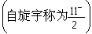
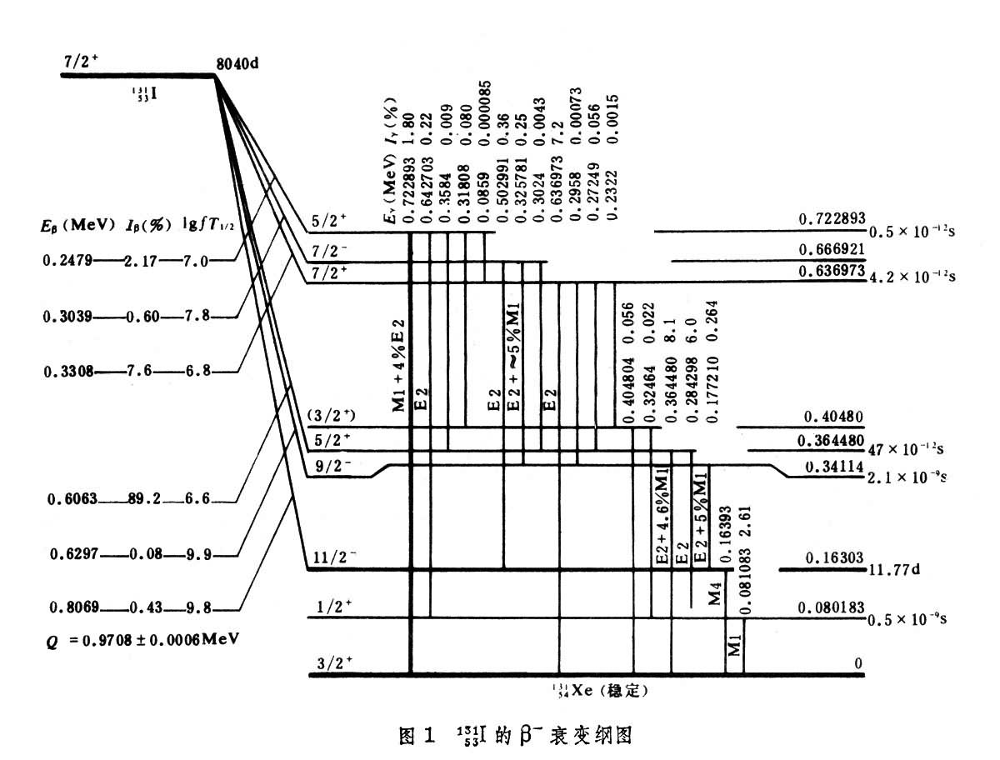
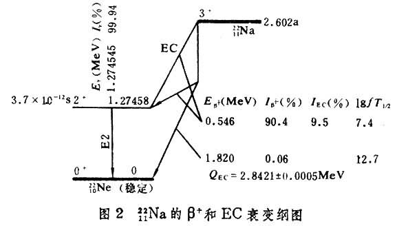
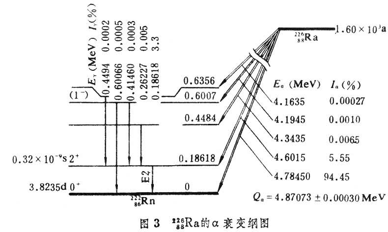
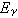
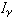
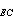

\[拼音\]：shuaibian gangtu

\[外文\]：decay scheme

用以综合反映某核素放射性衰变的主要特征和数据的示意图。任何一种不稳定核素，都会自发地通过发射或吸收粒子（又称射线）而转变为另一种核素，这种由一种核素向另一种核素的自发转变，叫做[原子核](http://www.baiven.com/baike/220/250167.html)的衰变，简称核衰变。由于衰变过程通常都伴随着射线的发射，所以不稳定核素的衰变也叫做放射性衰变。衰变前的原子核称为母核，衰变后的原子核称为子核。

[衰变纲图](http://www.baiven.com/baike/220/256654.html)中包含了在研究原子核衰变中积累起来的关于核低[激发态](http://www.baiven.com/baike/220/262573.html)性质的大量实验数据，为[核结构](http://www.baiven.com/baike/220/252176.html)理论的发展提供了重要的资料，这些数据是通过 σ射线能谱学、[β射线能谱学](http://www.baiven.com/baike/220/254453.html)和[γ射线能谱学](http://www.baiven.com/baike/220/253930.html)的研究得到的。此外，衰变纲图上给出的半衰期和射线能量及强度的数据，也是发展放射性[同位素](http://www.baiven.com/baike/220/262095.html)应用的基础。

典型的衰变纲图，通常包括以下三个方面的内容：

（1）衰变时发射出的粒子（或射线）的种类及其能量和强度；

（2）γ跃迁的多极性；

（3）从对衰变过程的研究中获得的关于母核和子核结构的知识，即衰变所涉及的各能级的能量、自旋和宇称（见原子核的能级）。

衰变纲图中一般以横线表示核能级，最上的粗横线表示母核的基态，最下的粗横线表示子核的基态，中间的横线表示子核的激发态，其中一条中等粗细的线（自旋宇称为表示半衰期较长的激发态，即同质异能态（如图1，并见[同质异能素](http://www.baiven.com/baike/220/251103.html)）。以向右斜的箭头表示β\-衰变，向左斜的箭头表示β+衰变或轨道[电子俘获](http://www.baiven.com/baike/220/257747.html)(图2)；以向左斜的双线箭头表示α衰变（图3);以竖直的箭头表示从子核较高的激发态到较低的激发态或子核基态的γ跃迁。把能量、半衰期、γ跃迁的多极性、自旋、宇称等数据记在相应的位置。下面以几个具体的例子说明各种衰变的衰变纲图。衰变纲图的具体画法在不同的书上略有差异，但基本内容是一样的。

**β\-衰变**

图1是β\-衰变纲图的例子。左上方的水平粗线代表母核岅I的基态，右下方水平粗线代表子核岆Xe的基态。各组可能发射的β\-射线的最大能量*E*β\-、强度Iβ\-(％)和比较半衰期的对数值lg*fT*½;(见β衰变)分别表示在同图上斜线相应的位置上。γ跃迁时发射的γ射线的能量和强度，用斜写的数字标在相应垂线的始端。表示γ跃迁多极性的符号E2和M1等标在垂线的一侧，例如图中的M1+4％E2表示该γ 跃迁是96％的磁偶极辐射(M1)和4％的电四极辐射(E2)的混合。水平线左端上面的数字表示该能级的自旋，数字右上角的“+”号或“－”号分别表示该能级的宇称为“偶”或“奇”。水平线右端上面的数字表示激发态的能量，单位是兆电子伏(MeV)，水平线右端的数字表示该能级的半衰期，单位是秒 (s)。右下方的Qβ\- 称为β\-衰变的Q 值，它代表母核基态和子核基态之间的能量差。lg*fT*½;值用来确定β跃迁的禁戒类型。如果知道了β跃迁的禁戒类型和母核的自旋和宇称，就可以根据β跃迁的选择定则，对β跃迁后直接到达的子核激发态的自旋和宇称做出推测。同样，知道了γ跃迁的多极性和该跃迁所联系的两个能级之一的自旋和宇称，就可以推测另一个能级的自旋和宇称。从图1中可以看出，母核到子核基态的衰变，可以通过许多种途径实现，例如，可以先经过β\-跃迁到子核的0.722893MeV激发态，然后再经0.722893MeV的γ跃迁到达子核基态；也可以在β\-跃迁后先经过0.642703MeV 的γ跃迁到达子核的第一激发态，然后再经过0.080183MeV的γ跃迁到达子核基态。

**其他衰变**

α衰变、 β\-衰变、β+衰变和轨道电子俘获(记作EC)衰变的纲图，就其内容而言是大体相似的，只是表示方法稍有不同。图2是β+衰变和电子俘获(EC)衰变的纲图的例子。母核 崐Na位于纲图的右上角，从母核发出的带箭头的斜线表示电子俘获跃迁，用长度为1.022MeV(正负电子对的静止能量)的垂线再加上带箭头的斜线表示β+跃迁，以此来反映这样的事实：即只有当母核同子核能级之间的能量差大于1.022MeV时，从母核向这个能级的β+跃迁才是可能的；否则二者之间的跃迁只能通过电子俘获进行。图2中从母核向子核第一激发态跃迁的lg*fT*½;值是电子俘获和β+跃迁lg*fT*½;值的平均值。Q是母核基态和子核基态之间的能量差。图3是 α衰变纲图的例子，图中用带箭头的双线表示α衰变，右侧的*E*α及*I*α是所发射的 α粒子的动能和强度(％)。Qα为母核基态和子核基态之间的能量差，是母核基态衰变到子核基态的σ粒子动能和子核反冲能量之和。

参考书目

1.  梅镇岳著:《β和γ放射性》，[科学](http://www.baiven.com/baike/224/280217.html)[出版社](http://www.baiven.com/baike/224/300551.html)，北京，1964。
2.  K. Siegbahn， ed.， *Alpha-， Beta-and Gamma-Ray Spectroscopy，*North-Holland， Amsterdam，1965.