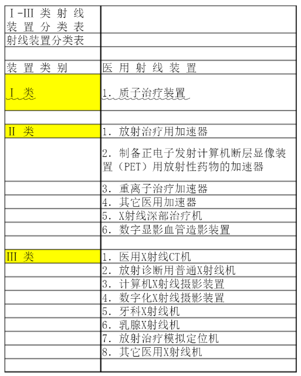
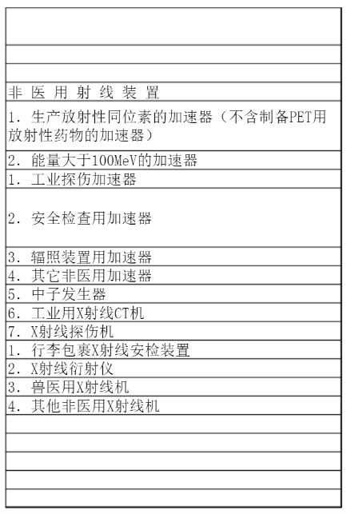

## 电离辐射
电离辐射是由直接或间接电离粒子或二者混合组成的辐射。能使受作用物质发生电离现象的辐射，即波长小于100nm的电磁辐射。 
电离辐射的特点是波长短、频率高、能量高的射线。电离辐射可以从原子、分子或其他束缚状态放出（ionize）一个或几个电子的过程。电离辐射是一切能引起物质电离的辐射总称，其种类很多

## 吸收和慢化
首先吸收剂和慢化剂是两个不同的概念,吸收剂是将中子吸收掉,是控制反映速度的,慢化剂是用来使裂变时候产生的快中子减速的,以便达到能够使裂变继续下去的最适速度,这时候的中子叫做热中子或慢中子! 硼、镉、铪都可以

## 射线装置分类表

## X Y射线
原子核跃迁退激放出y射线
电子撞击原子核，韧致辐射，x射线

中子和X射线的波长比较接近

产生的机理不同，特征X射线是由电子撞击金属靶，使金属原子中的K层L层M层等等层的核外电子被激发形成空位，外层电子跃入该空位，多余的能量产生X射线，荧光X射线则是由X射线或其他电磁波照射原子使原子核外电子激发形成空位，外层电子跃入空位产生X射线，二者都可以表示元素种类，但是产生一个是由电子引起，一个是由电磁波引起

电焊会产生电弧光辐射的危害，在焊接过程中，弧柱区域是有电磁、各种射线（α射线、γ射线、x射线等）、紫外线、红外线等辐射的。特别是大电流焊接时，辐射更大。钨极氩弧焊的辐射比手工焊条电弧焊的各方面辐射更大一些。两者之间，电焊的辐射是比较大的。焊接产生的电弧光主要包括红外线、可见光和紫外线。这些均属于电磁辐射，其中紫外线主要通过光化学作用对人体产生危害，它损伤眼睛及裸露的皮肤，引起角膜结膜炎(电光性眼炎)和皮肤胆红斑症。
    各种射线属于电离辐射。放射形物质会引发严重回造成中枢神经、造血器官
第 2 页
和消化系统疾病。高磁场会引起头晕、乏力、记忆衰减、血压波动、心悸、胸闷、消瘦、轻度贫血等。
    因此，作业人员必须使用相应的防护眼镜、面罩、口罩、手套，穿白色防护服、绝缘鞋，决不能穿短袖衣或卷起袖子，若在通风条件差的封闭容器内工作，还要佩戴使用有送风性能的防护头盔。如果您想了解更多的常见的电离辐射有哪些的相关辐射污染小知识，可以到来查询搜索呦！
第 3 页
百度文库 
搜索

电焊会有电离辐射吗

工频，射频 http://www.extreme-technic.com/news/detail.php/id-193.html
射频 300k到30g 工频50也就是国内的交流电频率

以向右斜的箭头表示β-衰变，向左斜的箭头表示β+衰变或轨道电子俘获(图2)；以向左斜的双线箭头表示α衰变（图3);以竖直的箭头表示从子核较高的激发态到较低的激发态或子核基态的γ跃迁。

电焊弧光，不属于电离辐射。
电焊弧光，属于非电离辐射。

焊接中焊工常受到的辐射危害，主要有强光、红外线、紫外线等。
焊接中的电子束产生的X射线，会影响焊工的身体健康

航头图书馆Wifi hangtou 68221361

稳定的核素，核内的质子和中子数近似相同，分布在核素图的狭长范围内，被称为β稳定线。处于稳定线左侧的放射性核素称为丰质子核素，处于稳定线右侧的放射性核素ch称eng为丰中子核素。如果继续远离稳定线，原子核会因为无法束缚住更多的中子或质子而产生破裂，这个极限被称为质子或中子滴线。靠近质子或中子滴线的核素，由于距离稳定线较远，又被称为远离核素。距离稳定线越远的核素，衰变半衰期越短。

相同质子数（又称原子序数）Z，中子数N不同的核素，称为同位素，相同质子数的同位素因其化学性质相同又统称元素；相同中子数N，质子数Z不同的核素，称为同中子素；相同质量数A（A=Z+N），质子数Z不同的核素，称为同量异位素。

原子核的稳定性有其规律。由于核力的原因，原子核的质子和中子数在2、8、20、28、50和82等数值时最为稳定，称为幻数。质子数处于幻数的稳定同位素的个数最多。处于幻数的稳定或放射性核素，相对来说，最不易通过核反应或衰变变成其他核素。

http://adminc.yywsb.com/m/list-18312.html

https://m.wenda.so.com/q/1638555080213858?src=180

辐射工作场所的分区包括控制区和监督区。

辐射工作场所中需要和可能需要专门防护手段或安全措施的区域定为控制区；通常不需要专门的防护手段或安全措施，但需要经常对职业照射条件进行监督和评价的区域为监督区。

1、控制区

注册者和许可证持有者应把需要和可能需要专门防护手段或安全措施的区域定为控制区，以便控制正常工作条件下的正常照射或防止污染扩散，并预防潜在照射或限制潜在照射的范围。

2、监督区

注册者和许可证持有者应将下述区域定为监督区：这种区域未被定为控制区，在其中通常不需要专门的防护手段或安全措施，但需要经常对职业照射条件进行监督和评价。

https://cdn.eztest.org/clients_installer/eztest-1.2.14.exe

许可证相关都是30天 变更审查收回20天

放射源与射线装置有什么区别
本质区别为源的定义不同。射线装置是指能产生预定水平χ、γ电子束、中子射线等的电器设备或内含放射源的装置（高能加速器除外）。
可以说，射线装置包含放射源一类。放射源只是射线装置中，源的一种。
例如，工业常用的Cs137 Co60 等。都属于放射源，该类又可以分为天然、人工源。
有如，医院X光机 ，不通电是没有辐射的。该类装置就是射线装置。