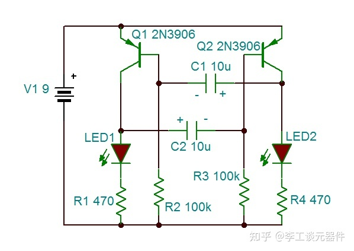

## BJT晶体管原理

BJT晶体管分为两种，一种是PNP晶体管，另一种是NPN晶体管。这两种BJT晶体管工作原理如下图所示，**需要好好注意图中的箭头**。

晶体管（BJT）的本质是至少需要0.7V才能将其打开，通过基极的电流是性能的决定性因素。随着基极电流增加，集电极电流也增加。晶体管（BJT）和MOSFET不同，MOSFET是在栅极电压上的作用比在电流上的作用更大。

NPN晶体管工作原理图

NPN晶体管工作：基极电压 (Vb) 必须比发射极电压 (Ve) 高。并且集电极电压 (Vc) 必须比 Vb 高。

PNP晶体管工作原理图

PNP晶体管工作：发射极电压 (Ve) 必须比基极电压 (Vb)高。并且基极电压 (Vb)必须比 集电极电压 (Vc)高。

这里可以总结一个小技巧。**NPN需要正电压和电流，PNP需要负电压和电流。**

晶体管（BJT）和其他很多电子元器件一样，一定要防止电流过大，因此发射极和集电极引脚不能直接接在电源和GND之间，一定要有具有电阻的组件串联起来。

## 晶体管（BJT）的作用以及BJT在电路中的用途

### 1、用作电子开关

晶体管（BJT）最基本的功能就是开关，通过在基极施加小电流，可以获得更大的电流在集电极/发射极之间通过。

因为晶体管通常不会消耗太多的电流，因此可以制作出很好的电子开关，而不需要机械开关。

下图用 2N3904 NPN晶体管制作了一个简单的LED驱动原理图，按下开关，在基极引脚上有一个正电压和电流，关闭了发射极和集电极之间的连接，这样电流就可以在它们之间流动，同时LED也被打开。

NPN晶体管电路原理图

现在换成PNP晶体管，因为PNP晶体管需要一个相对负的电压才能工作，因此将开关连接到GND。具体如下图所示。

NPN晶体管电路原理图

在这个过程中，R2不是说一定要存在的，只需要在集电极和发射极之间驱动更高的电流就可以。如下图所示。

NPN晶体管电路图

### **2、放大作用---晶体管一级放大器**

晶体管（BJT）是一种电流放大器件，如下图所示，为晶体管（BJT）电流放大功能图。

晶体管（BJT）电流放大功能

## **晶体管（BJT）放大作用原理**

晶体管（BJT）的放大作用可以理解为一个水闸。

水闸上方储存有水，存在水压，相当于集电极上的电压。水闸侧面流入的水流称为基极电流Ib。当Ib有水流流过，冲击闸门时，闸门便会开启，这样水闸侧面很小的水流流量（相当于电流Ib）与水闸上方的大水流流量（相当于电流Ic）就汇集到一起流下（相当于发射极e的电流Ie），发射极便产生放大的电流。这就相当于三极管的放大作用，如下图所示。

BJT放大原理示意图
该图可以很好的展现截至、放大、饱和

下面用NPN晶体管作为简单的单晶体管放大器。

一级放大器电路图

麦克风在声波撞击时产生非常小的电压，这种变化的电压允许电容根据电位器建立的RC时间常数非常快速的充电/再充电，然后可以转化为NPN基极引脚上的电流，电流就会在发射极和集电极之间流动，然后变压器将+9V降低，增加足够高的电流宜驱动扬声器的振膜，这样当对它吹气时，麦克风就会做出响应。

### **3、放大作用---晶体管二级放大器**

通常情况下，如果一个好，那么两个更好，再添加一个晶体管（BJT），可以提高放大器的性能。如下图所示。

  

二级放大器

### **4、晶体管（BJT）用作功率放大器**

在设计电路时，经常会遇到需要更多的功率，因此用晶体管（BJT）作一个B类放大器。

B类功率放大器

在对电路进行仿真时会存在一些失真，因此把运算放大器连接为电压跟随器，这样的话确保从输入到输出的电压保持不变，晶体管（BJT）为扬声器会提供更多的电流，如下图所示。

B类功率放大器

### **5、晶体管（BJT）用作振荡器**

晶体管（BJT）非常适合振荡器，因为它可以根据基极引脚上的电压/电流打开和关闭。如下图所示。

振荡器

上面是晶体管（BJT）的几个简单用途，实际应用还有很多，大家有可以自己去构建555定时器和运算放大器。