# 一口气从零读懂CAN总线

## **概要**

上世纪八十年代以来，汽车ECU越来越多，如ABS，电控门窗，电子燃油喷射装置。如果仍然采用常规的点对点布线方式，即电线一段与开关相接，另一端与用电设备相通，将会导致车上电线数目的急剧增加，从而带来线束的冗余及维修成本的提高。这就对汽车的线束分布及信息通讯提出了更高的要求。总线技术可以实现信息的实时共享，解决了传统布线方式中线束多，布线难，成本高等问题，CAN（Controller Area Network）总线技术应运而生。

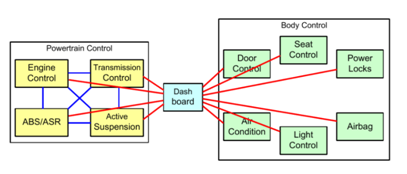

点对点通信

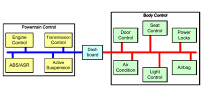

总线通信

CAN总线是由德国研发和生产汽车电子产品著称的BOSCH公司开发的，并最终成为国际标准（ISO11519），是国际上应用最广泛的现场总线之一。CAN总线是一种多主控（Multi-Master）的总线系统。传统总线系统如USB或以太网等是在总线控制器的协调下，实现从A节点到B节点大量数据的传输。CAN网络的消息是广播式的，即在同一时刻网络上所有节点侦测的数据是一致的，它是一种基于消息广播模式的串行通信总线。

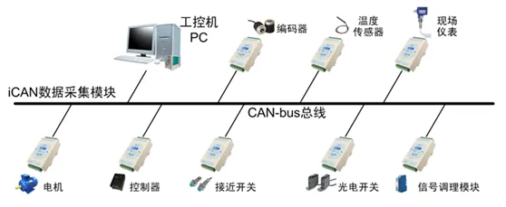

  

CAN总线的很多优点，使得它得到了广泛的应用，如传输速度最高到1Mbps, 通信距离最远到10km，无损位仲裁机制，多主结构。

  

**CAN总线标准**

CAN总线标准之规定了物理层和数据链路层，至于应用层需要用户自定义。不同的CAN标准仅物理层不同。物理层和数据链路层：ISO11898；应用层：不同的应用领域使用不同的应用层标准。

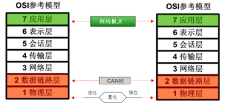

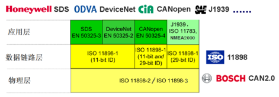

  

  

## **CAN物理层**

**CAN拓扑网络**

连接在CAN总线上的设备叫做节点设备（CAN Node），CAN网络的拓扑一般为线型。线束最常用的是双绞线，线上传输为对称的差分电平信号。下图为CAN总线网络示意图，节点主要包括Host、控制器和收发器。Host常集成有CAN控制器，CAN控制器负责处理协议相关功能，以减轻Host的负担。CAN收发器将控制器连接到传输媒介。通常控制器和总线收发器通过光耦或磁耦隔离，这样即使总线上过压损坏收发器，控制器和Host设备也可以得到保护。

在发送数据时，CAN控制器把要发送的二进制编码通过CAN\_Tx线发送到CAN收发器，然后由收发器把这个普通的逻辑电平信号转化成差分信号，通过差分线CAN\_High和CAN\_Low输出到CAN总线网络。接收数据过程，相反。采用差分信号，可以取得更好的电磁兼容效果。因此，CAN总线物理传输媒介只需要两根线。

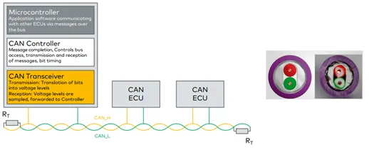

高速CAN总线最高信号传输速率为1Mbps，支持最长距离40m。ISO11898-2要求在高速CAN总线两段安装**端接电阻**RL（端接电阻一般为120Ω，因为电缆的特性阻抗为120 Ω，为了模拟无限远的传输线。）以消除反射。低速CAN最高速度只有125Kbps，所以ISO11898-3没有端接要求。

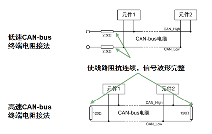

因为传输距离越大，信号时延也越大，为了保证消息的正确采样，总线上的信号速率相应也要下降。下图是推荐的信号速率与距离的关系。

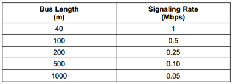

**CAN收发器**

CAN总线分高速CAN和低速CAN，收发器也分为高速CAN收发器（1Mbps）和低速CAN收发器（125Kbps）。低速CAN也叫Fault  
Tolerance CAN，指的是即使总线上一根线失效，总线依然可以通信。如同串口中的MAX3232用作电平转换，**CAN收发器的作用则是把逻辑信号转换为差分信号**。

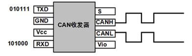

**差分信号**

CAN总线采用差分信号传输，通常情况下只需要两根信号线就可以进行正常的通信。在差分信号中，逻辑0和逻辑1是用两根差分信号线的电压差来表示。当处于逻辑1，CAN\_High和CAN\_Low的电压差小于0.5V时，称为隐性电平（Recessive）；当处于逻辑0，CAN\_High和CAN\_Low的电压差大于0.9V，称为显性电平（Dominant）。

高速CAN

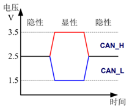

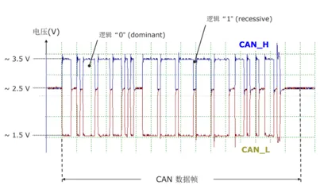

低速容错CAN （Fault Tolerance CAN）

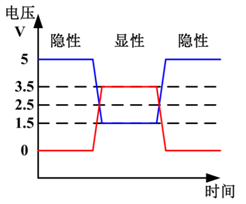

CAN总线遵从“线与”机制：“显性”位可以覆 盖“隐性”位；只有所有节点都发 送“隐性”位， 总线才处于“隐性” 状态。这种“线与”机制使CAN总线呈现显性优先的特性。

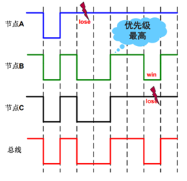

**CAN总线连接器**

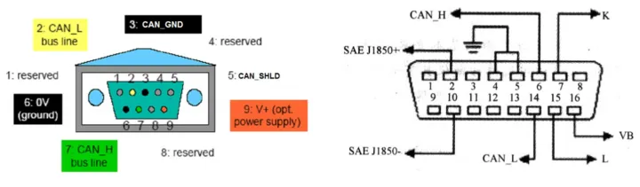

## **CAN数据链路层**

在SPI通信中，片选、时钟信号、数据输入及数据输出这四个信号都有单独的信号线。而CAN使用的是两条差分信号线，只能表达一个信号。简洁的物理层决定了CAN必然要配上一套更为复杂的协议。如何用一个信号通道实现同样甚至更强大的功能，答案就是对数据或操作命令进行打包。

**通信机制**

多主机（Multi-Master）

安全敏感的应用（如汽车动力）对通信系统的可靠性要求很高。将总线能否正常工作归结到单一节点是非常危险的，比较合理的方案是对总线接入的去中心化，即每个节点都有接入总线的能力。这也是CAN总线采用多主控（Multi-Master）线性拓扑结构的原因。

在CAN总线上，每个节点都有往总线上发送消息的能力，而消息的发送不必遵从任何预先设定的时序，通信是事件驱动的。只有当有新的信息传递时，CAN总线才处于忙碌的状态，这使得节点接入总线速度非常快。CAN总线理论最高数据传输速率为1Mbps，对于异步事件反应迅速，基本对于ms级别的实时应用没有任何问题。

  

寻址机制

不同于其它类型的总线，CAN总线不设定节点的地址，而是通过消息的标识符（Identifier）来区别消息。这种机制虽然会增加消息的复杂度（增加标识符），但是节点在此情况下可以无需了解其他节点的状况，而相互间独立工作。在总线上增加节点时仅需关注消息类型，而非系统上其他节点的状况。这种以消息标识符寻址的方式，让总线上增加节点变得更加灵活。

总线访问CSMA/CD+AMP

CAN总线通信原理可简单描述为多路载波侦听+基于消息优先级的冲突检测和非破坏性的仲裁机制（CSMA/CD+AMP）。CSMA（Carrie  
Sense Multiple Access）指的是所有节点必须都等到总线处于空闲状态时才能往总线上发送消息；CD+AMP（Collision  
Detection + Arbitration on Message Priority）指的是如果多个节点往总线上发送消息时，具备最高优先级的消息获得总线。

*   多路载波侦听：网络上所有节点以多点接入的方式连接在同一根总线上，且发送数据是广播式的。网络上各个节点在发送数据前都要检测总线上是否有数据传输：若网络上有数据，暂时不发送数据，等待网络空闲时再发；若网络上无数据，立即发送已经准备好的数据。
*   冲突检测：节点在发送数据时，要不停的检测发送的数据，确定是否与其他节点数据发送冲突，如果有冲突，则保证优先级高的报文先发送。
*   非破坏性仲裁机制：通过ID仲裁，ID数值越小，报文优先级越高。

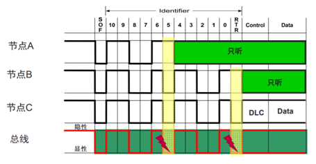

  

发送低优先级报文的节点退出仲裁后，在下次总线空闲时自动重发报文。

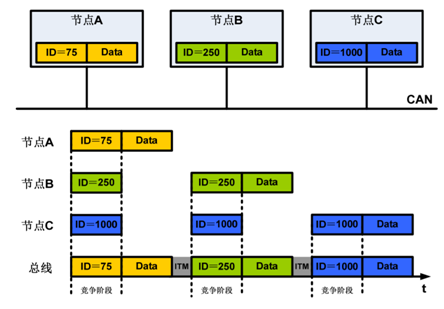

高优先级的报文不能中断低优先级报文的发送。

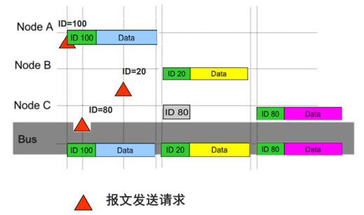

报文接收过滤

CAN控制器大多具有根据ID过滤报文的功能，即只接收某些ID的报文。节点对接收到的报文进行过滤：比较消息ID与选择器（Accepter）中和接受过滤相关位是否相同。如果相同，接收；如果不相同，则过滤。

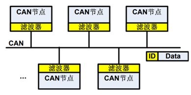

**CAN的报文种类及结构**

报文的种类

在原始数据段的前面加上传输起始标签、片选（识别）标签、控制标签，在数据的尾段加上CRC校验标签、应答标签和传输结束标签。把这些内容按特定的格式打包好，就可以用一个通道表达各种信号了。各种各样的标签，起到了协同传输的作用。当整个数据包被传输到其他设备时，只要这些设备按格式去解读，就能还原出原始数据。类似这样的数据包就被称为CAN的数据帧。

为了更有效的控制通信，CAN一共规定了5中类型的帧，帧也称为报文。

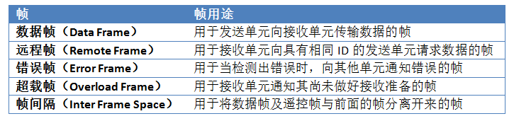

数据帧

数据帧在CAN通信中最主要，也最复杂。数据帧以一个显性位（逻辑0）开始，以7个连续的隐性位（逻辑1）结束。CAN总线的数据帧有标准格式（Standard  
Format）和扩展格式（Extended  
Format）的区分。

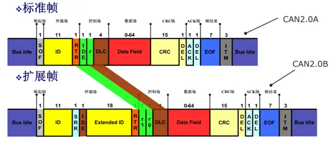

数据帧可以分为七段：

*   帧起始（SOF）

标识一个数据帧的开始，固定一个显性位。

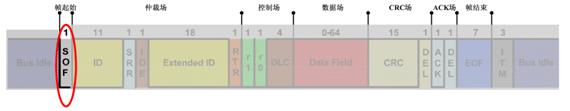

用于同步， 总线空闲期间的任何隐性到显性的跳变都将引起节点进行 硬同步。只有总线在空闲期间节点才能够发送SOF。

*   仲裁段（Arbitration Field）

仲裁段的内容主要为本数据帧的ID信息。数据帧分为标准格式和扩展格式两种，区别就在于ID信息的长度：标准格式的ID为11位；扩展格式为29位。在CAN协议中，ID决定着数据帧发送的优先级，也决定着其他设备是否会接收这个数据帧。

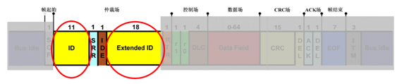

仲裁段除了报文ID外，还有RTR, IDE, SRR位。

*   控制段

在控制段，r1（reserved1）和r0（reserved0）为保留位，默认设置为显性位。最主要的是DLC（Data Length Code）段，它是用二进制编码表示本报文中的数据段包含多少个字节。DLC段由4位组成，DLC3−DLC0，表示的数字为0-8.

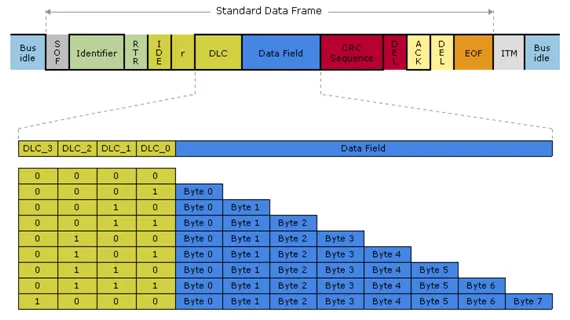

*   数据段

数据帧的核心内容，有0-8个字节长度，由DLC确定。

*   CRC段

为了保证报文的正确传输，CAN的报文包含了一段15位的CRC校验码，一旦接收端计算出的CRC码跟接收到的CRC码不同，就会向发送端反馈出错信息以及重新发送。CRC部分的计算和出错处理一般由CAN控制器硬件完成，或由软件控制最大重发数。

在CRC校验码之后，有一个CRC界定符，它为隐性位，主要作用是把CRC校验码与后面的ACK段隔开。

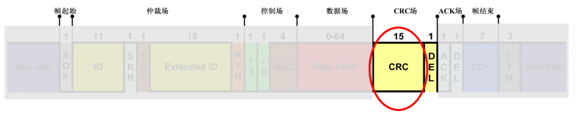

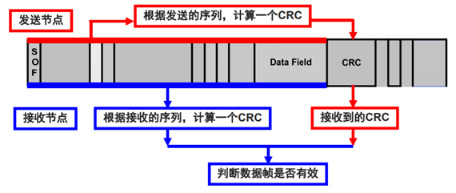

*   ACK段

包含确认位（ACK slot）和界定符（Delimiter,  
DEL）。ACK在发送节点发送时，为隐性位。当接收节点正确接收到报文时，对其用显性位覆盖。DEL界定符同样为隐性位，用于隔开。

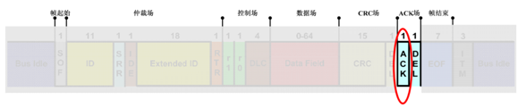

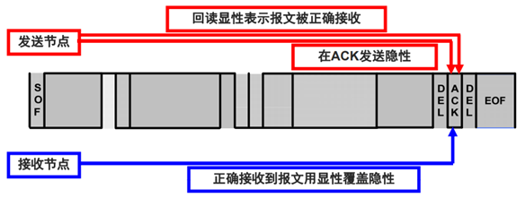

*   帧结束段（End-of-Frame, EOF）

帧结束段由发送端发送7个隐性位表示结束。

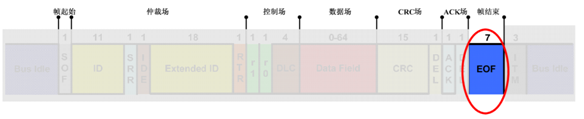

## **同步**

CAN总线使用位同步的方式来确保通信时序，以及对总线的电平进行正确采样。

**位时序**

在讲位时序之前，先介绍几个基本概念。

Time Quantum 时间份额tQ ：CAN控制器工作的最小时间单位，通常对系统时钟分频得到。

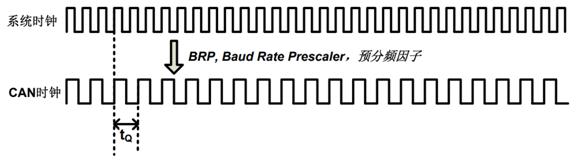

波特率：单位时间内（1s）传输的数据位，公式：1/位时间。举个栗子，系统时钟频率36MHz，预分频因子为4，则CAN时钟频率9MHz，则Tq=1/9M。假设一个CAN位包含10个Tq，则一个位周期T=10Tq，从而波特率为1/T=0.9MHz.

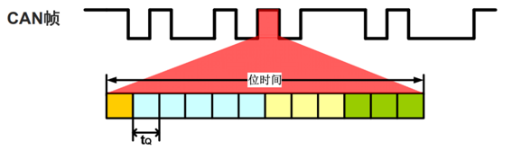

为了实现位同步，CAN协议把每一位的时序分解成下图所示的四段。这四段的长度加起来即为一个CAN数据位的长度。一个完整的位由8-25个Tq组成。

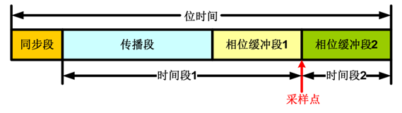

*   同步端（SS，Synchronization Segment）

一个位的输出从同步段开始。若总线的跳变沿被包含在SS段的范围之内，则表示节点与总线的时序同步。节点与总线同步时，采样点采集到的总线电平即可被确定为该电平的电位。SS段的大小为1Tq.

*   ·传播段（PTS，Propagation Time Segment）

用于补偿信号在网络和节点传播的物理延时时间，是总线上输入比较器延时和输出驱动器延时总和的两倍。通常1-8Tq

*   ·相位缓冲段1（PBS1， Phase Buffer Segment 1）

主要用于补偿边沿阶段的误差，其时间长度在重新同步时可以加长。初始大小1-8Tq.

*   相位缓冲段2（PBS2，Phase Buffer Segment 2）

也是用于补偿边沿阶段的误差，其时间长度在重新同步时可以缩短。初始大小2-8Tq.

  

**同步**

CAN同步分为硬同步和重新同步。

同步规则：

*   一个位时间内只允许一种同步方式
*   任何一个“隐性”到“显性”的跳变都可用于同步
*   硬同步发生在SOF阶段，所有接收节点调整各自当前位的同步段，使其位于发送的SOF位内。
*   ·重新同步发生在一个帧的其他阶段，即当跳变沿落在同步段之外。

硬同步

当总线上出现帧起始信号（SOF，即隐性到显性的边沿）时，其他节点的控制器根据总线上的这个下降沿对自己的位时序进行调整，把该下降沿包含到SS段内。这样根据起始帧来进行的同步称为硬同步。

可以看到在总线出现帧起始信号时，该节点原来的位时序与总线时序不同步，因而这个状态的采样点采集到的数据是不正确的。所以节点以硬同步的方式调整，把自己的位时序中的SS段平移至总线出现下降沿的部分，获得同步，这时采样点采集到的数据是正确数据。

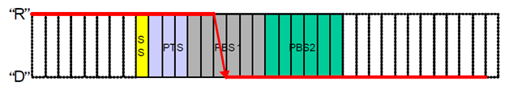

同步前

同步后

  

重新同步

因为硬同步时只是在有帧起始信号时起作用，无法确保后续一连串的位时序都是同步的，所以CAN引入了重新同步的方式。在检测到总线上的时序与节点使用的时序有相位差时（即总线上的跳变沿不在节点时序的SS段范围），通过延长PBS1段或缩短PBS2段来获得同步，这样的方式称为重新同步。

分两种情况：第一种， 节点从总线的边沿跳变中，检测到它的时序比总线的时序相对滞后2个Tq，这是控制器在下一个时序中的PBS1段增加2Tq的时间长度，使得节点与总线时序重新同步。

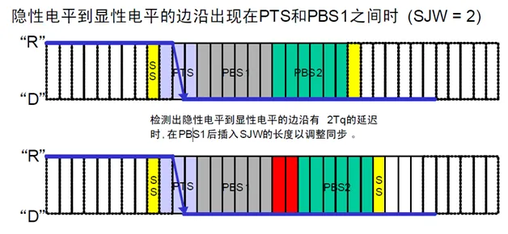

第二种，节点从总线的边沿跳变中，检测到它的时序相对超前2Tq，这时控制器在前一个位时序中的PBS2段减少2Tq的时间长度，获得同步。

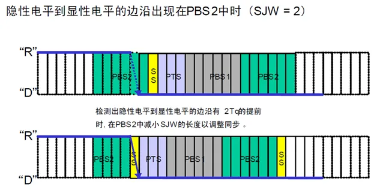

在重新同步的时候，PBS1和PBS2段的允许加长或缩短的时间长度定义为，重新同步补偿宽度（SJW，reSynchronization Jump Width）。这里设置的PBS1和PBS2能够增减的最大时间长度SJW=2Tq，若SJW设置的太小则重新同步的调整速度慢，若太大，则影响传输速率。