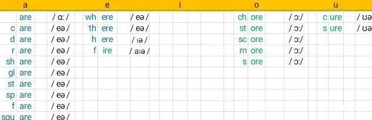

# 听力强化_李旭
## 口诀
错口连变：错音、口音、连音、变音
## 错音
+ 元错 e、æ、aɪ
+ 辅错 w/v、l、u/u:
## 口音
+ 元口 ɒ->ʌ->ə 、 a: -> æ、ɒ:>ɒʌ
+ 辅口  元加r 共九个(前面元 后面辅音)、wh、d->t 前面是元音，位于中间非重读
ai ear air
ere
ir
or
ure sure
鼻祖 

## 连音
+ 辅辅 失爆 击穿 叠音
+ 辅元 l r n
+ 元元 w j

## 变音
T th 时 t y
D dj 智 d y
 sy

S f th
Ask half bath

# 元音组合2 -r组合
01 r组合包括三小组

这三小组是：

① 五个单个的元音字母分别加r；

② 真组合加r；

③ 单个元音字母分别加re（只有e才可以，其他元音字母不行）。

即（左列下面两行及右列下面一行）：

（左列下边两行，及右列下边两行）

其中，右列中，真组合加r组成的这类元音组合，只取了常用的14种中的8种。理论上，25种真组合都是可以加r而成为组合的。

02 r组合的读音

元音字母加上r，实际就是对元音字母（无论是单个还是真组合）的强化。

（1）\*r组合中

我们中国人老有个错觉，认为字母a读「阿」，实际上，它极少读「阿」。它正常的读音（即它开音节开心时的大音）就是它的字母音/ei/（音标中应该是小号的大写的i，打字打不出来）。

反倒是ar才正宗地读「阿」，即音标中的「大阿」，或「长阿」：/ ɑ: /。当然，是卷舌的/ ɑ: /，早期英语是保留着卷舌音的，凡是带r的地方都是卷舌音，无论它在词头还是词尾。

r是一个神奇的字母。它代表旋转。它开头的词，都或远或近地与「旋转」有关。而当它处于尾端时，它强化前面的元音。

与ar的读音/ɑ:/同样，or的读音/:/也是强化的读音。/ɑ:/和/:/都是很重的读音。而er、ir、ur三者的共同读音都是/:/，是「呃」音最重的读法，「呃」天生就不是重读音，/:/已经是它最重的读法，无法更重了。

音标都是r组合的读音

阴影部分，在圆唇音w后会发生音变。

上面\*r组合的读音，固定性和唯一性都很强。（当它们在双音节、多音节词中非重读时，它们五个统一弱化为//，即「呃」音的弱读形式。）后面要谈的\*\*r组合、\*re组合，其读音的唯一性和固定性都开始减弱，多样性增强。

（2）\*\*r组合中

音标都是r组合的读音

（3）\*re组合中

后面这两小类组合（\*\*r和\*re），基于前面文章中说的真组合的特点，不记忆组合读哪几个音，而是反过来熟悉具体的词，具体的词熟悉了，这些组合的读音也就会了。会了就行了，并不一定需要梳理，除非是教师。

03 双音节中的r组合

讲到元辅构成的组合（r组合、n组合、l组合、gh组合），就需要暂时跳跃一步，进入双音节词的领域中探讨元音组合。而双音节词的根本原理（包括这里的表头、阴影背景的含义），到后面双音节阶段再专门说。

音标都是该音节中元音字母/组合的读音

04 辅音字母的「元音性」

为啥只有r、n、l、gh这四个辅音字母才能参与构成元音组合呢？因为这四个辅音字母有「元音性」。t、s、p、f、d这类辅音，永远不能跟元音字母组合为元音。因为他们没有元音性。

r本身就发元音；n是鼻音，放在元音后面起归音作用；l本身就发元音；gh（跟ph、th、qu一样，看作一个字母）在元音组合中不发音，只起标示作用。所以这四个字母可以和元音一起组成组合。也就是说，天下没有元音加辅音组成的元音组合。凡是元音组合，必是元音一性。后面讲到w和y时，会看到他俩的元音性更强，他俩其实就是元音，是卧底或半卧底的元音。