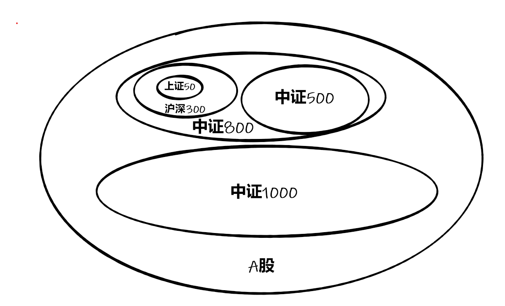
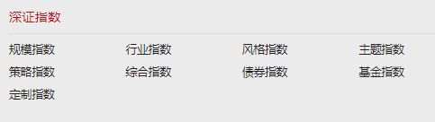

# 深证、上证、国证、中证
说到指数投资，很多新入场的小伙伴或许会有这样的疑问：我们经常见到上证50、中证500，还有小夏跟大家介绍过的国证半导体芯片等指数，这些指数中的“证”都是什么意思？是如何区分的，又对咱们投资指数有什么影响呢？

## 四大系列与两大指数开发公司

其实就像基金是分基金公司的一样，指数也是分系列的，国内常见的指数共有四大系列，包括中证系列、上证系列、深证系列、国证系列。这四大系列又是由两家指数公司进行研发：中证指数公司和深证证券信息有限公司。

其中，中证指数有限公司于2005年8月由沪深证券交易所共同出资成立，目前管理各类指数5000多条，中证系列和上证系列都是由其研发的。那么这两者有何区别呢？答案其实就在名字中，上证系列指数的选股范围是仅在上交所上市的股票，比如上证50指数就是由沪市中规模大、流动性好的最具代表性的50只股票组成，是沪市代表指数；而中证系列指数的选股范围更广，比如沪深300指数就是由沪市和深市中市值大、流动性好的300只股票组成，是整个A股市场的代表指数，除此之外，中证系列指数还有一些跨境指数和美股中国内地这样的境外指数等。

深圳证券信息有限公司则是深交所的全资子公司，成立于1994年，深证系列指数和国证系列都是由它研发的。和中证、上证系列的区分类似，深证和国证系列的区别主要也在于选股范围的不同，深证系列选股范围仅限于深圳市场，而国证系列则是跨市场体系，不仅覆盖了A股市场，还辐射了境外的香港、欧洲等股票市场。（上述参考：中证指数有限公司官网，深圳证券信息有限公司官网，国证指数官网）

除了这四大系列指数之外，咱们平时经常接触的还有一些境外指数或全球指数，比如港股的恒生系列指数，由恒生指数有限公司开发，包括恒生指数、恒生国企指数、恒生科技指数等；由富时指数有限公司开发的富时系列指数，如富时中国A50指数等。
~~~mermaid
flowchart LR
上交所--出资-->中证指数公司
深交所--出资-->中证指数公司

中证指数公司--沪深两市-->中证系列
中证系列-->沪深300-->中证800
中证系列--剔除沪深300-->中证500-->中证800
中证系列-->沪深1000
中证指数公司--沪市-->上证系列
上证系列-->上证50

深交所--全资-->深证证券信息有限公司
深证证券信息有限公司-->国证系列
深证证券信息有限公司-->深证系列
~~~

~~~ puml
@startmindmap
* 公司
** 沪、深证券交易所共同出资
*** 中证
*** 上证 
** 深交所
*** 国证
*** 深证
@endmindmap
~~~

## 细分指数与代表

这四大系列指数再往下细分，还可以分为规模指数、行业指数、风格指数、主题指数、策略指数、综合指数等等，每个系列指数的具体划分都有不同。就以中证系列为例，旗下就有11个类别，包括规模、行业、风格、主题、策略、海外、债券、基金、期货、定制和其它。今天重点说说和A股有关的5个：

一是规模指数，这可以说是指数体系中最为重要的一个指数类别，主要是以成分股的市值和流动性作为筛选标准，比如大家十分熟悉的沪深300指数、中证500指数都属于中证规模指数；

二是行业指数，先把股票按照一定的行业分类规则划分为不同的行业，再把这些股票按照一定的规则编制成指数，比如中证全指证券公司指数、中证银行指数等；

三是风格指数，是按照股票的风格划分为成长、价值等不同类型，比如300成长、300价值等；

四是主题指数，市场从不缺热点，比如非常火热的碳中和等等，主题指数就是发现这些热点趋势并将能够受惠的相关产业和上市公司对应个股编制成指数。比如中证内地低碳指数、中证新材料指数等。

五是策略指数，相较于前几类指数来说要复杂一些，指的是根据不同投资策略挑选出符合要求的成分股，然后将这些成分股编制成指数，通俗来看就是在被动投资的基础上融入了部分主动投资理念，比如红利低波指数就是比较常见的策略指数。

  

截图来源：中证指数有限公司官网

不同系列指数在分类上也有些微不同，比如上证系列指数就分为10个类别，深证系列指数则分为9个类别，大家如果想要进一步了解，可以去中证指数有限公司官网，深圳证券信息有限公司官网查询相关信息。（上述参考：中证指数有限公司官网，深圳证券信息有限公司官网，国证指数官网）

  

  

截图来源：中证指数有限公司官网，深圳证券信息有限公司官网

## 对投资有哪些帮助？

指数基金严格跟踪指数，指数的表现基本就决定了基金的表现，所以在投资指数基金之前，你得先了解指数。因此了解指数的这些分别，对咱们投资也有很大帮助。小夏就为大家总结了两点方法：

首先，选择大类基金。如果没有明显看好的行业，可以选择规模指数，跟着大势走；如果明确看好某个行业或主题，可以选择行业或主题指数，更有针对性。

甄选同类基金。其中又包括两种：一种是覆盖市场的不同。同样是消费指数，上证消费、深证消费只投资一个市场，中证消费、国证消费则是全市场选股，如果不了解指数分类，很可能会出现你看好深市某只股票、最后却选择了上证系列指数的“乌龙”。另一种是行业主题的不同，即使是投资同样主题的指数，它们的覆盖面和聚焦点也可能不一样。只有充分了解了指数的不同，才能在类似主题的产品中精准找到自己想要的那只。