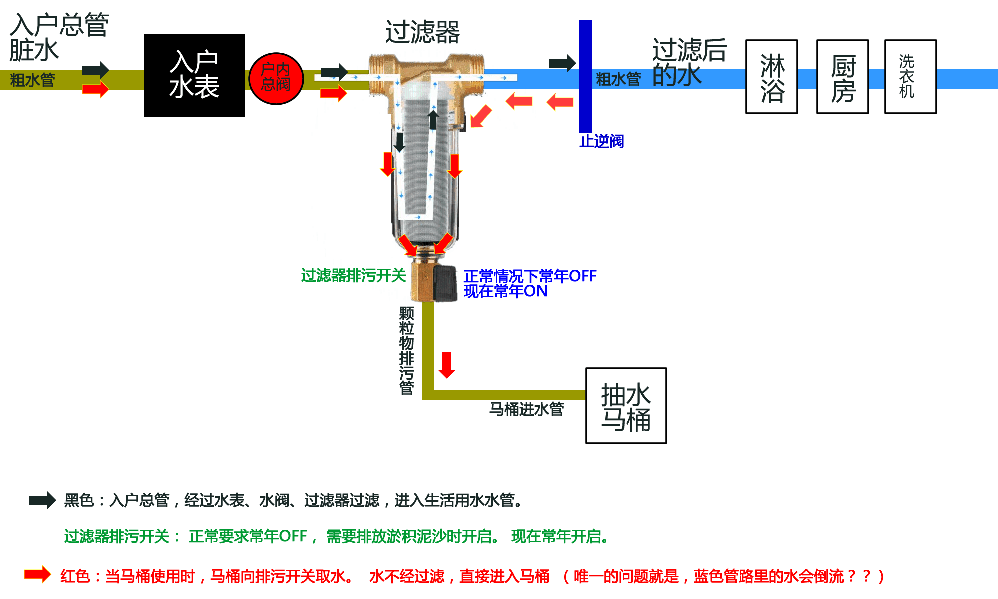

MOS管
源极（source
栅极（gate electrode
漏极（drain
基极（Bulk或是Body

DJ表示英式音标，KK表示美式音标。
AHD是The American Heritage Dictionary of the English Language缩写；
DJ是Daniel Jones（1881 – 1967 英国语音学家）的缩写；
KK是John S. Kenyon 与Thomas A.Knott（二人同为美国语言学家）的缩写。

A（Address）记录是用来指定域名所对应的IP地址的记录。
MX（Mail Exchanger）记录是邮件交换记录，它指向一个邮件服务器，用于电子邮件系统发邮件时根据收信人的地址后缀来定位邮件服务器。例如，当Internet上的某用户要发一封信给 webmaster@meibu.com 时，该用户的计算机将通过DNS查找meibu.com这个域名的MX记录，如果MX记录存在，用户计算机就将邮件发送到MX记录所指定的邮件服务器上。
CNAME（Canonical/kenonicel/ Name）记录，通常称别名指向。用户可以定义一个主机别名，比如ftp.meibu.com，用来指向一个主机，比如www.meibu.com，那么访问ftp.meibu.com，将转向到www.meibu.com
NS（Name Server）记录是域名服务器记录，用来指定该域名由哪个DNS服务器来进行解析。如果您在每步申请了顶级域名或独立域名的动态解析服务，需要到您的域名注册商那里，将您的域名的NS记录设为每步的DNS服务器。我们的DNS服务器是：dns1.meibu.com和dns2.meibu.com，IP地址分别是202.104.237.179和61.129.47.188。NS设置后需要一、两天后才能生效，您可以用下面的办法查询是否已经生效。
泛域名是指一个域名下的所有子域名都被解析到同一个IP地址上。例如：*.meibu.com都解析到meibu.com
电压电流定律
KCL基尔霍夫电流定律，集总电路节点电流流量和为零。 
KVL基尔霍夫电压定律，集总电路环路电压压降和为零。 
VCR电压、电流、阻抗关系，即I=U/R。 
K——基尔霍夫 
C——电流 
V——电压 
L——定律 
R——电阻 
电路的运行规则由电路的结构和元件的特性共同决定，KCL和KVL描述电路结构，VCR描述元件特性。 
另外，集总（参数）电路指的是电路参数在空间上集合在一点中，与之对应的是分布参数电路，举例说，将电源两极接入平面导体，研究此导体电流、电压分布就不能用KCL和KVL，而要用具体的电磁场理论。

BSS段 可执行程序包括BSS段、数据段、代码段（也称文本段）。 
BSS（Block Started by Symbol）通常是指用来存放程序中未初始化的全局变量和静态变量的一块内存区域。 　　注意和数据段的区别，BSS存放的是未初始化的全局变量和静态变量，数据段存放的是初始化后的全局变量和静态变量。 　　UNIX下可使用size命令查看可执行文件的段大小信息。如size a.out。

谋胜芯片命名规则
大体上是  MC32 这几个代表了 MCU的核类型， P 代表OTP，如果是F那就是FLASH，后面的4位 分前两位和后两位。前两位是MCU的分类，如GPIO型，ADC型，LCD型，触摸类型，遥控器类型等。 后两位代表ROM空间
再往后的就是芯片版本和封装信息

雅典、古希腊和古罗马的关系
世界史学习对初三学生来说难度较大，尤其是世界古代史。笔者在教学的时候发现，很多同学搞不清楚雅典、古希腊和古罗马三者之间的关系，或者弄清楚了很快就忘记了，没有留下深刻印象，其中原因，在于没有真正理解。下面笔者对这一知识点进行一个系统的归纳梳理。

雅典和希腊的关系
一、现在的希腊是一个主权国家，古希腊是一个地区，包括今巴尔干半岛南部、小亚细亚半岛西岸和爱琴海中的许多小岛。古希腊地区有100多个大大小小的城邦国家，雅典是其中之一，这些城邦国家的典型特征是“小国寡民”。
二、雅典和斯巴达是古希腊最重要的两个城邦国家，雅典是古希腊文明的代表。笔者听一位老教师上课时这样讲：古希腊地区有100多个城邦，好比草地上有100多只羊，雅典和斯巴达是个头最大的两个，是羊群里的两头牛。这么一解释，化难为易，攻克了一个教学难点，收到了意想不到的效果

希腊和罗马的关系

现在的罗马是一座城市，是今天意大利的首都，古罗马是一个国家。他先后经历了王政时代、共和时代和帝国时代，从意大利半岛中部台伯河畔的一个城邦国家发展成横跨欧、亚、非三洲的大帝国。人们常常将古希腊和古罗马相提并论，初三学生学习的时候也容易发生混淆，二者的区别，我们可以从以下两点来掌握：
一、古希腊是一个地区，古罗马是一个国家。古希腊地区包括巴尔半岛南部、小亚细亚半岛西岸和爱琴海中的许多小岛，地理范围相对固定。古罗马的版图随着罗马国家的军事扩张处于不断变动之中。最初，古罗马的地理范围仅限于台伯河畔的罗马城，后来扩展到整个意大利半岛，最终成为横跨欧、亚、非三洲的大帝国，但意大利半岛始终是罗马国家的统治重心。
二、从时间顺序来看，古希腊文明出现在前，古罗马文明发展在后，希腊人是罗马人的老师，古罗马文明是在向古希腊人学习的基础上发展起来的。具体来说，古希腊文明存在的时间是公元前20世纪到公元前4世纪，先后经历了爱琴文明时代（公元前20世纪到公元前12世纪）、黑暗时代（公元前12到公元前8纪）和城邦时代（公元前8纪到公元前4纪）。古罗马文明存在的时间是公元前8纪到公元4世纪，先后经历了王政时代(公元前753～前509)、共和时代(公元前509～前27)和帝国时代（公元前27～公元476）。(半亩历史19期用)

华东理工大学 电子信息工程 信息工程-应用电子方向 机电一体化 
上海大学                    电子信息工程 微电子 机械自动化
上海机电学院             电气工程及自动化                                  金钟路 987-Metro 2
上海理工大学             电子信息工程  专升本                             军工路 上川-991 上川教学点 上川线 12800元
上海应用技术学院      专升本                                                     995公交车
上海工程技术大学      电子信息工程                                          普陀新村路 上川-4号线 上海工程大学 

电子应用技术 主要课程
电工原理、电子技术、微机原理、高频电路、电子线路CAD，电子线路设计与工艺，PCB设计与制作、工业电视、检测技术、单片机技术
PLC、计算机网络技术、家电维修、通信原理、机械制图等
电子电工（大专及本科叫电气工程及自动化或电气自动化)

电子应用技术 函授本科
电路基础、电工基础、电子工艺、低频电子电路、高频电子电路、数字电子电路、微机原理及应用、单片机原理及应用、自动化控制技术、通信技术基础、电子设计自动化、仪器原理与电测技术
数字音频技术、数字信号处理、单片机、微机原理等

## 衣服
衬衣 185/100A/XXL
肩宽48 腰96 臀100 袖长63 宽55

办社保
学费3万
计算机学费 3万
医药费1万
海信 db726c1-b 二手

## 辈分
关于咱老徐排的辈是，仲，久，英，显，志， 祖，禄，连，学，明，继，守，传，先，培，成，广，孝，师，一共十九辈，再往后就不知道啦，也没人往下再找字啦，社会也变啦，范的字也没有用啦，谁爱范什么学都行，守良家老卫他儿子也不范啦就两字叫徐展，你徐明利小老爷爷的儿子也是两字，大儿叫徐军，二儿子叫徐平，三儿子叫徐文，这些事都不照过去老一辈的规矩走啦，现在南方人还是照老规矩办，人家有祠堂，有家谱，有家规，有祖长〈管事的)一切都得照着祖辈留传下来的家训办，现在国家也提倡家训，家规啦。不范辈啦以后就不知道谁是爷爷，谁是孙子啦

## 床位按日出租，
9.9～15一天，一天一交，一天也行，
有热水，洗衣机，无额外费用，
联系电话17147232133

## GSK3228836
https://db.yaozh.com/linchuangshiyan?comprehensivesearchcontent=GSK3228836

## 联系人

龙口后诸留王晶 龙口南曲村邢兆程
邹黎明 家庭地址 浦东川沙新德西路511弄70号201室
龙口市港城大道1001号交通运输局 赵忠凯

## 竞业协议
1. 一般以最近12个月收入平均的30%作为最低补偿金
2. 若第一个月未发，则视为不启动竞业协议
3. 若连续3个月未发，则可以申请解除竞业协议

## 仓库
乐：玩具，鞋          徐：书，焊台
车：玻璃水    纸：抽纸湿巾纸
厨：贴纸等

## 四团
燃气管40\*40\*69
卫生间 下水道高14 橱柜33
抽湿机小  cs10z高23 大cs10e高37
手电钻
电源线
插排
绝缘胶带
木工据
卫生间水龙头
钢锯，钢锯条
三头 两头插头
一平方软线20米
802981
水龙龙头阀芯 阀体35*27

## 10寸屏幕
屏幕对角线的长度为10英寸，等于25.4cm。
16：09，长宽约为22.14cm12.45cm
16：10，长宽约为21.54cm12.12cm
04：03，长宽约为19.70cm14.80cm

## 海尔售后
光华路18号晶森商务大厦
七宝五号口虹桥南江线  颛桥  虹桥枢四路 沪闵路贵都路两元
186七莘路转虹桥枢纽五号线颛桥三元

海尔进BIOS F2 引导盘列表F7

## 华师大档案室电话
62322348
62232348 王老师

## 推荐电影
燃情克利夫兰
江湖奸杀令，追杀令
希特勒死了
多力特的奇幻冒險
惊声尖笑 四部
笑破铁幕

一夜惊喜

太空运输
深空失忆
宇宙战舰大和号
太空旅客

中国的让子弹飞
韩国的五共
英国的是大臣
都是神作

## 推荐歌曲
千纸鹤
大海
斑鸠调
下山

C++考试？
留个联系方式？18629296094

工会
周浦工会68114013
上海总工会12351
50879104  50879091

## 高考专业选择
高分段专业
  专业＞学校＞城市，
   比如武大计算机和川大计算机出来并没有什么区别，
中等分段
   学校＞专业＞城市
   比如四川农大这种211就是比一些强双非好，
低分段
   城市＞专业＞学校，
   学校就这样了还是选个好地方吧

## 硬件

### 前置滤水器

### 宏基笔记本
笔记本信息 Acer 4930G-741G32Mn SNID:91219963216
内存型号 kac-memh/2g

基本参数	
上市时间2009年01月
产品类型家用
产品定位游戏影音本
操作系统预装Windows Vista Home Basic
主板芯片组Intel PM45+ICH9M
处理器	
CPU系列英特尔 低功耗版系列
CPU型号Intel 酷睿2双核 P7450
CPU主频2.13GHz
总线规格1066
二级缓存3MB
核心架构Penryn
存储设备	
内存容量1GB
内存类型DDRII
最大内存容量4GB
硬盘容量320GB
硬盘描述5400转
光驱类型内置DVD刻录机
光驱描述支持DVD-SuperMulti双层刻录
显示屏	
屏幕尺寸14.1英寸
显示比例16:10
屏幕分辨率1280x800
显卡	
显卡类型中高端独立显卡
显卡芯片NVIDIA GeForce 9600M GS
显存容量512MB
显存类型DDRII
显存位宽128bit
流处理器数量32
DirectX10

20091231
### 路由器-黑色商务领航
wlan a181ae8d81
useradmin admin!@#$%^
192.168.1.254

设备型号 商务领航定制网关1-2 
设备标识号 CTC 0C4C39-0C4C393D6275 
软件版本 V0200_1.01(BRH.1)D1_20120206 
固体版本 1.16.0-102.9 
硬件版本 A1B 
指超级用户吗？telecomadmin   密码  nE7jA%5m
超级用户名和密码应该是：telecomadmin密码nE7jA%5m.

超级密码可以再192.168.1.1的登录界面查到！具体办法是用ie的第3方浏览器登192.168.1.1，要求输入用户名密码的时候，鼠标右击 会出现 查看源代码 然后再仔细看看 用户名 telecomadmin 密码是telecomadmin+8位数，基本是明文，不加密，进到界面后可以恢复到出厂设置！恢复出厂设置后的用户名密码都是telecomadmin，这猫的唯一好处是3种方式接入！cpu是阉割的！好像是6358的阉割货！第3方固件没有！只能破超级用户！

## 各类WIFI
CMCC-7v6C;P:sxyd6ndr
琴行无线密码 68505715

WIFI:ChinaNet-Xh6T;P:xcdb3ps7

WIFI:S:switch_B8984301001;T:WPA;P:73ixrwna@

金桥国际
华为专卖店 huawei888.

微信账号wxid_kiaer9ofkj9x22 bz

辟蹊
annidave2000
饭店
Tenda_2AE338;P::zhu219328.
S:万家正宗淮南牛肉汤;P:66668888;
6号面馆;P:666666..;
东北小馆 987654321
蓝天368弄13号
无善无恶心之体，

有善有恶意之动。

知善知恶是良知，

为善去恶是格物。

4008856616
京东方艺云“类纸护眼屏”系列产品包括BOE画屏、拾光纪、Funbook等

尚德老师联系方式，微信
https://jinshuju.net/f/HfQNyO

## 公司信息
### 新亚炉料(青岛)有限公司
公司性质：	外商独资
公司规模：	20-99人
公司网站：	http://www.aseanshipping.cn
公司行业：	贸易/进出口,交通/运输,能源/矿产/采掘/冶炼
公司地址：	山东省青岛市市南区东海西路5号华银大厦3202

单位编号	1100233024
单位名称	新亚国际货运代理(青岛)有限公司
单位地址	香港中路10号颐和国际A座33A07
经办部门	
所在市区	市南
成立日期	2007-05-11
组织机构代码	66126584-X
单位性质	外商投资企业
营业执照编号	370200400158570
法人资格	具备法人资格
法人代表	吴纯昌
发薪日	        2
主管单位	
单位传真	66777226
单位邮编	266071

上海宜硕网络科技有限公司 
91310104MA1FR7G512 
上海市徐汇区桂箐路65号1幢4层402-113单元
02154281588
 中国银行股份有限公司上海市漕河泾开发区支行
452073163446

上海赛迩福电力技术有限公司
91310114782417109W
上海真南路4268号A区2396号
021-52371181
中国工商银行上海市曹家渡支行
1001261809206992134
285435656@qq.com
