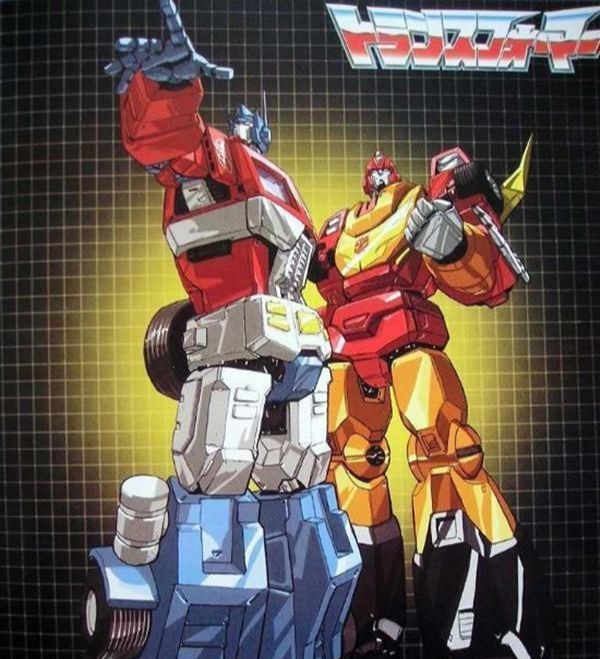

# 变形金刚：G1人物
变形金刚是承载80.90后回忆的桥梁，而经典的G1动画更是每一位80后心目中最为美好的童年过往。而今，伴随着各种高科技3D甚至4D影片的发展，如今一代的孩童，已然是与那个年代完全隔阂的。尽管我们在追求时代发展，永远难忘的却是在并不发达的年代所带来的趣味。作为一名90后，G1动画播出的时候我还没有出生，自然不能完全体会到当时的乐趣，作为一名TF迷，又对变形金刚有着前所未有的喜爱，翻看过去的动画影片，也能从中找寻些当时的影子，幻想着那时的儿童每天放学回家打开电视机观看动画的场景，也有着自己心目中的偶像。

  

在没有真正入坑之前，只知道擎天柱一个名字，后来才明白大哥的原名叫奥利安 派克斯，额……每每听到这个名字，总会稍稍邪恶一番，那不是，不是我最爱的饼干吗？奥利奥~~ 柱子座右铭是：万物都有生存和自由的权利。

  

当然，小编也只是在繁忙的工作中，小小放松一下。回到主题，奥利安 派克斯是一个热爱和平与劳动的年轻人，并有位漂亮的女友叫爱丽塔（此时又想起了爱丽丝，呼呼~~我是多么幻想自己也能梦游仙境啊！）有一次偶然遇见了会飞的威震天。。。他觉得威震天好强大，威震天于是和他交了朋友（当然是有目的的）。然后奥利安就被欺负了，威震天开炮射中了他并且发动了战争。（原谅小编文采太过平凡，就连组织语言也需要许久功夫，不过迷友还是很强大的，感谢资料的提供）

  

幸亏奥利安被穿越回去的飞行太保所救（我居然感觉好像没什么不对），送到了钛师傅那里，钛师傅修好了他，并把他改造成了一个战士（戴上口罩换个马甲）然后柱子哥就去虐威总了，虐的过程很奇葩，威震天连续开了几炮打在柱子哥身上一点反应没有。。。然后柱子哥就出了第一滴血战胜威震天。。。（可能还有别的版本的故事，但我目前就觉得这个版本还是很有意思的）

  

擎天柱英明勇敢，霸气侧漏，解救斯派克和他老爸的时候真的特别感人（g1第一天），柱子是一个强大的战士，激光炮可以精确打击飞来飞去的霸天虎。柱子在第一季度带领汽车人在地球和霸天虎展开较量，一次又一次拯救了世界和人们在大电影中，柱子在和威震天的双雄较量中不幸伤重不治而死，但在第二季度复活（2次，一次是被五面怪利用的）并且释放领导模块的力量拯救了受到狂热瘟疫袭击的地球人和大家。头领战士中，柱子再一次死掉，原因好像是为了阻止赛博坦被出了故障的魔力神球毁灭，用自己的能量换取了安全，自己又牺牲了，后来就没有再活过来过（如果编剧是小编，一定会让柱子哥再次苏醒，拯救星球，并与相恋已久的恋人终成眷属。咳咳~~，原谅我又跑偏了）。

  

补天士的前身是热破，这点大家都知道。热破是一个可敬可配，勇敢感性的高贵战士，在大电影中大战鲨鱼精，单挑惊破天等等都体现了他惊人的战斗能力与天赋。热破后来被模块选中，成为补天士，借助模块的力量把惊总扔了出去（但是没有完全死掉）并且摧毁了宇宙大帝。补天士后来一直作为汽车人的新领袖，带领汽车人斩妖除魔，很多人认为他的贡献其实高于擎天柱，第二季度（大电影之后出的动画）中，补天士联合宇宙各处的人物或力量，建立和平的新时代。

  

补天士却一直觉得不开心，他觉得自己处处不如擎天柱，并且对当年无意害死了擎天柱感到伤心（见擎天柱的复活，上）他很期待过去的自由的生活，但是意识到自己责任的他还是继续地领导汽车人（见肩负重任）肩负重任那一集里，有人怀疑补天士的战斗力，毕竟一个领袖级别的人物居然被两飞虎队员草虐实在不能让人接受，我倒是觉得这和补天士当时的心情有关，毕竟没有斗志了。

  

警车是汽车人的参谋，高官，是个成熟的好好先生，他的脾气非常好，逻辑思维又十分灵敏，总是做出最正确的判断，是柱子哥的左膀右臂加好伙伴，同时他也是汽车人中的神枪手。在大电影中被突袭的霸天虎中的清扫机击穿胸部牺牲（小编哭了……）

  

铁皮是拥有很高的知名度和影响力，这使得他有幸在真人电影版中再度亮相。他有着非常强大的装甲（防护力），铁皮的手腕上有一个储存化学物质的地方，这使得铁皮可以在战斗中随意地应用化学物质（这个在真人电影中也有延用）铁皮是个柱子哥的保镖，虽然性格粗犷但是内心善良而细腻。在86大电影中，被突袭飞船的霸天虎枪杀，最后还被威震天补了一炮，死的很惨……真人电影里死在叛变的御天敌手里。铁皮是个忠诚的卫士，柱子哥的左膀右臂。无奈，为何好男人都死得这么惨，啊呀！！！

  

救护车座右铭：你破坏，我来修复。

救护车同样有着较高知名度，同样出现在变形金刚真人电影及领袖之争里。是一名高级医官，动手术的能力非常强，第一季度里那个人受伤了他拿扳手弄一弄就好了。救护车非常善良，但是看似脆弱的他也会在必要时刻投入战斗中。武器通常会是一把激光手术刀。救护车在86大电影中遭遇了和铁皮一样的下场，被突袭的霸天虎开枪射死。有人说大电影的时候要是救护车还活着，柱子也许就不会死了。只是没有如果，小编在此继续哭会吧…………

  

（哎呦，小编，你是不是傻，这么个大帅哥，来的什么图片，毁坏人家形象了…………哎呀，对不了，人家不是故意的了，没有找到您的靓照，只好委屈你了）哈哈，这张图片着实不太漂亮啊，没着，咱就凑合继续往下讲吧！

通二哥和柱子哥有着几乎同等的战斗力和地位，作为一名博派指挥高官，他负责而坚定。影响力和欢迎度使他后来出现在变形金刚领袖之证中，在变形金刚g1第二季度插播的资料片中甚至专门有一段介绍通天晓。二哥是个老实人，很忠诚。通天晓十分强壮，肩部有两颗追踪导弹必要时可以发射，后来的一些版本中通天晓使用天骄之锤之类的武器。在86大电影中，擎天柱死后把领导模块传授给他，但是他未被领导模块选中，打不开模块装逼失败被打死了，要不是垃圾星人帮助修好了他，他可能就酱油了。在g1的第二季度，时常可以看见补天士和通天晓并肩战斗，丹尼尔和转轮还曾去宇宙各处奔波调查二哥的生日，可见其地位和受欢迎程度。在g1头领战士中，二哥在和六面兽的决斗中不幸牺牲，被海葬了（呜呜~~这么个英俊小生，小编更要多哭会啊……）

  

嘻嘻，最喜欢爵士了，萌萌哒，好想摸摸这小脑瓜啊！（喂，什么意思啊，把人家帅气的形象都给玩坏了，讨厌。）哈哈

爵士同样以其知名度参演了变形金刚真人版，然而第一季就酱油了。他是个热情阳光的好小子，也是柱子哥的高效小助手，和他的名字一样，桀骜不失风度。爵士是特别行动的指挥官，勇敢无畏的他总是能给霸天虎出其不意的打击。

爵士动画片里常常会使用高分贝的摇滚乐来控制或者吓退敌人（没错录音机和他是好基友）爵士在86大电影中结局美好，虽被大帝吞下但是后被丹尼尔救下，跟随补天士迈入新的时代。爵士在第二季度里参加比赛并且赢得冠军，后来就没看见他出来过，嘿嘿i，就当他退休了吧！

  

飞毛腿：个性张扬就是好

横炮：我不破坏规则，我绕开他们。

横炮为人谨慎，通常喜欢绕开敌人伺机展开攻击，飞毛腿很鲁莽，非常张扬，在“汽车大奖赛”一集中，飞毛腿挑战一个特技导致出丑。。。（…夷…是这样吗，小编你搞错了吧！ Sorry，你们这各种版本的介绍，小编也给搞混了呢，暂且以这个版本来吧！）

横炮其实是第一个会飞的汽车人，这多亏了他的火箭背包（虽然只要两分钟能飞。。。）g1里后来借给柱子哥用了。在战斗中拥有这优势真的很重要呢。飞毛腿肩部也有两颗精确制导导弹，而横炮则有一个肩炮，相比飞毛腿，横炮的作战能力和它不相上下。横炮死于大电影中的汽车人城防御战，角落里躺着镜头给的不是很清楚。飞毛腿最后一次出场和柱子哥在一起，也死了，虽然镜头没给但是第二季度就再没出现过。两人是汽车人中数一数二的战士，横炮在游戏变形金刚毁灭中出现过。两人都变形为兰博基尼的一款旧超跑（诶g1那个年代嘛）不过细节上略有不同。

  

哎呀，小编最爱的大黄蜂，终于出来了，爱你爱你。额……鄙视你，你不是最爱爵士吗？没有了，我爱你们两个，都是萌萌哒！嘿嘿……

大黄蜂绝对的人类好伙伴，小小的体型和友善的脸还有头上独特的两角让他的亲和力爆棚。在g1中是斯派克和斯派克爸爸的好朋友，镜头一切三人总是出现在一起。大黄蜂的亲和力以及知名度使得他在真人电影和领袖之争里亮相，并且最早和人类接触，一直活到第四部还没死。。。（一直在装逼，从未被打死）大黄蜂真的很可爱，体型小的大黄蜂是一位优秀的侦察兵，g1时常看到斯派克坐进大黄蜂变成的甲壳虫车里。不论g1还是真人电影，大黄蜂真的是个很棒的助手和搭档，g1里大黄蜂一直常伴斯派克身边。。。体型小使得大黄蜂非常善于潜入敌人的内部打探消息（g1有一集炸矿洞）86大电影中同样被宇宙大帝吞噬但后被斯派克的儿子丹尼尔救下。更随补天士迈入新时代。在擎天柱的复活那一集中，大黄蜂不幸被感染瘟疫发了飙的大无畏打成重伤，不过被五面怪改造成金飞虫，金飞虫比过去的大黄蜂更加机灵，聪明，更能快速适应多种不良的环境。

  

探长给大家印象最深刻的莫过于他的全息投影技术，探长先曾和斯派克在沙漠里飙车，后来又用全息投影仪和斯派克开玩笑，斯派克惊呼：那又是谁！探长牛逼的全息投影曾经骗过大力神，全息投影投射的一个巨大博派汽车人让大力神吓出了一裤子翔，被擎天柱成功一炮解体。探长也是给大家印象很深刻的汽车人战士，同时他也参与过不少的侦查，变形为吉普车，肩部的炮可以制造投影也可以发射炮弹。

  

飞过山是爵士的好基友，两人常常一起出任务。飞过山和大黄蜂长的很像，脑袋上同样有犄角，不过是红色的而且细节上也有不同。出现在领袖之争中，还是阿尔西的男友，不过死得很早还死的很惨。大大咧咧的话痨形象无论g1还是领证都有完整的体现。飞过山是一名勇敢的战士，不过有点小鲁莽，g1里早期就差点把威震天给办了，然而人家威总哪有那么容易被你弄死，后来被激光鸟追砍了八条街。他体型小，“汽车大奖赛”中和千斤顶合作使用那炮感觉好好玩，骑在人家头上。。。飞过山和爵士同样一起参观宇宙大帝的消化系统后被丹尼尔救下，不过后来很少露面。

  

杯子是一个经验丰富的老战士，他的经验曾经救过汽车人好几次，他似乎什么都经历过，包括大电影里被鲨鱼精抓起来都让他想起了过去的事情。在86大电影中杯子的表现十分出色，是个勇敢成熟的老战士，是热破的好伙计，好导师，和热破在一起时很有喜剧色彩。杯子很喜欢和机器恐龙们呆在一起，原因是机器恐龙最喜欢听杯子扯淡。（我钢索要听石油兔子的故事。。。）

杯子在第二季度里担当了非常重要的参谋与战斗职能。有次又被五面怪抓住，审问时，五面怪问他干什么的，他回答：“洗碗总管”笑死我了。虽然有点老，但是依旧是个很厉害的好老伙计，像个老牛仔。杯子变形为老式卡车，虽然有点老但是大家包括杯子本人都不介意，杯子很受尊重。结局是杯子伴随补天士离开去流浪。啧啧，，这个倒是我风格，抛下所有，流浪去，有没有，结伴而行的。。

  

千斤顶是一个非常聪明的发明家，他的特点是说话耳朵会发光。g1中千斤顶携手切普（轮椅天才少年）斯派克的爸爸一起改造出了机器恐龙的身体。丰富的科学知识和经验总是带来不少好点子，几次他的发明都救过汽车人，他还曾利用发明控制了大力神使大力神投向汽车人阵营。千斤顶和救护车一样有时也会帮战士们修修补补。在g1中死于汽车人城防卫战，镜头有清楚地给到。他也出现在真人电影第三部的月黑之时中，可惜出场时间非常短，被霸天虎直接枪毙了。千斤顶也以一个战士和隔板好友的身份出现在了领袖之争中。

  

  

吊车和滑车（两人好基友一起说）

两位是建筑师，一心向往着更好的设计，曾经快乐的他们因为自己的心血毁在战争中而投靠汽车人。吊车很坚信自己的设计和判断，不过有时也会出差错，有次不听大哥劝阻结果不当心放屋顶没放好把房子给弄烂了。滑车则主要负责拖吊等，曾靠自己擅长拖吊的好本领救了出事故的人。在g1一集建筑大师中，两人设计出了能量塔，希望擎天柱支持他们的设计，擎天柱却没有同意，二人又遇到了同为建筑大师的挖地虎，两组人马居然开始合作，挖地虎欺骗他们造好了能量塔为霸天虎所用，幸亏柱子带大家及时赶到化解危机，这下两人终于服气了，知道了大哥的心思。二人属于第三梯队，战斗中不常上场，作为配角两人除了建筑大师之外没有特殊的出场了。在大电影汽车人城防卫战中，吊车有个模糊的镜头在还击，滑车的命运不清楚，两人希望都没死啊。

  

  

红色警报和消防车（两人基友加同事一起说）

两人是汽车人的消防与安全总管。消防车那肯定是救火来的，红色警报那就是报警的喽。消防车有一颗救人的勇敢和善良之心，虽然主要职责是救人救火，你还是会在战场上看到他。红色警报可能略显暴躁，不是很受同伴欢迎，在超级武器一集中居然和红蜘蛛合作，最后多亏大部队搭救否则后果不堪设想。（虽然如此红色警报出色的预警能力还是收到大家的赏识的）红色警报当时可能由于被消防车抛下而感到难过和失望。后来会好点，红色警报也一直做好着自己救人平息骚乱的工作。消防车和吊车两人的人型除了颜色几乎一模一样，孩之宝表示是时候出重涂了。。。红色警报和横炮长得很像，变形同为兰博基尼超跑，不过红色警报装了警灯。两人结局下场不明。

  

幻影的隐形能力想必大家印象深刻，几次通过这个骗过霸天虎从而能够进入霸天虎内部打探消息。幻影曾用自己的能力和斯派克开玩笑。他在“叛徒”一集中深入机器昆虫的巢穴，不过可惜被发现还被控制了精神，差点被飞过山当叛徒。有一次利用隐形偷走了威震天的大炮，他肩部的炮可以发射弹无虚发的炮弹。幻影变形为f1法拉利赛车，幻影对汽车人缺乏自信，使得大家有时不相信他，擎天柱大哥一直劝导他继续加油。

  

大汉，飞过山，大黄蜂，变速箱，宇宙飞碟五人是绝对的好朋友，哈哈，原因是他们都很矮。

大汉是个强壮的战士，小拳头的威力非常大，可以轻易摧毁小型的建筑。建筑大师一集中，是大汉帮助救出被废墟所困的吊车和滑车的。大汉虽然小，但是有着惊人的耐力和力量，也喜欢说大话。汽车人中勇敢的，具有不小潜力的战士。在86大电影中，大汉是第一个牺牲的汽车人，被突袭飞船的霸天虎击中而死。

  

蓝霹雳是个大大咧咧爱说屁话的汽车人战士，而他喜欢说废话的原因是自己家乡遭到破坏的记忆使他一直很难过。虽然蓝霹雳拥有不少的武器装备，但他不是很喜欢打仗，而且胆子也有点小。不过据说他已经开始在进步了。蓝霹雳和警车，烟幕有着几乎一样的人型形态。。。和变形形态。

  

烟幕（长得太像放一起说）

烟幕在g1战斗中的表现和他的名字一样，他最擅长的就是放屁来干扰敌人，这招居然还非常有效，一次困住了威震天，一次困住了大力神。g1中是个值得信赖的有计谋和机动性的优良战士。烟幕有时和蔼可亲，有时也会打小算盘。在领袖之证中烟幕居然以重要角色的身份出现，帅气和勇敢博得了不少的人青睐。（感觉性格是从热破哪里抄来的。。。）烟幕车门上那38一直没变过，可以说是他的标志了。

  

宇宙飞碟长得很可爱。宇宙飞碟是汽车人早期为数不多的会飞的。他是小矮人一只。宇宙飞碟主要的职能是采集外太空的物质，有时也会做做谍报工作。在大力金刚的秘密一集中捡石头结果摔了一个跟头好萌。宇宙飞碟人缘不错，大家总是喜欢和他发讯息聊天。对了他的存在解释了为什么地球人一直说有看见ufo。

  

变速箱，小矮子一只。变速箱最大的特点就是他略惊悚的脸。他的耐力非常强，变速箱也喜欢唠叨，可是说的话不中听，原因是说的全是在抱怨这个那个。。。在“换变速箱”一集中，变速箱给大家的印象深刻，包括最后大家都变形跑路和他开玩笑，他还在唠叨结果回头一看大家都不见了（真实逗哈~~）

天火是早期为数不多可以飞行的汽车人。天火曾经是红蜘蛛的好友，两人同以科学家的身份来地球（未知星球）上勘察，天火不幸遭遇寒流侵袭被冻在了北极，一次偶然使得他被霸天虎发现并被救醒，天火理所当然加入了霸天虎阵营。在随后与汽车人的较量中，天火渐渐发现汽车人仁慈有爱，霸天虎嗜杀劫掠成性，遂转投汽车人。天火作为一个书生虽然有着大块头但是却讨厌战争。

天火也因为受欢迎程度在变形金刚真人电影中以一个老的不行的机器人形象出场，后和柱子哥合体，场面壮观。虽然作为配角但是给广大迷友留下了深刻印象，可惜的是除了“天火”一集外，别的基本上是客串，在头领战士中，天火也曾有短暂的出场。天火主要担任运输，也会参与适量的的战斗。据说天火喜欢和钢鞭（神风队队员）一起战斗，本来和天火要好的红蜘蛛后来变成了天火的敌人。天火变形为大型运输机，后期常常执行投放等任务。

  

录音机是个热爱摇滚乐的好少年，和声波一样，他可以缩小自己变成一个手提式的那种老式录音机，这个在80年代貌似很受欢迎。录音机除了做情报参谋和通讯员之外也会参加战斗。录音机喜欢使用高分贝音波弄敌人，这点和爵士很有得一拼。录音机和轮胎是好搭档，g1有一集里两人合伙抓坏人。大大咧咧喜欢热闹，汽车人城防御战中录音机像玩似的。不过好在他最后叫来了大哥。汽车人城防御战中录音机第一次展现了他所拥有的磁带部队，这使得录音机的战力渐渐向声波靠拢。在头领战士中为了掩护有重要任务的热破而和声波展开了一场你死我活的较量，导致两败具伤，不过两人后来都被修复换喷漆重新出场，录音机改名双履带。

下面那个是双履带。

  

录音机的小伙伴们：

发条：发条是个资料管理员，喜欢把各种各样数据往自己肚里塞进去。发条有着丰富的知识，知识总归是重要的，发条很受同伴欢迎，因为他比百科全书懂得多。

  

弹射：弹射主要担任电子监控一职，有破译或者监听敌人对话的能力。弹射很喜欢地球人的体育赛事。弹射很容易变得兴奋。

  

钢钳：钢钳应该是出场比较多的人物了，在第二季度一直担任着侦查或者战斗的职能，钢钳的主要武器是屁股上两把机关枪和它的大嘴。

  

犀牛：犀牛对伙伴非常要好，对敌人非常凶残，和钢钳是好搭档，第二季度一直看到两人出任务。犀牛的利器是屁股上那几发导弹和犀牛角。

  

机器恐龙变形成恐龙时实力非常强，但是变形成人型防御力会变的非常垃圾，有过被集体秒杀的一次。g1中机器恐龙并不能合体为修罗王机器恐龙的：我，谁谁，什么什么很好玩，大家相比印象深刻

钢索：钢索作为机器恐龙的领导，5个恐龙里最强壮也最聪明（呵呵），虽然机器恐龙在刚出场时给汽车人带来了不小的麻烦，钢索对力量和战斗的憧憬让大家对他敬而远之，不过钢索依然是非常受大家尊重和赏识的强大战士。

钢索在“聪明的钢索”一集中，粉碎霸天虎的阴谋并且还创造出了计算王（神风队）。在g1里是被千斤顶救护车等人创造出来的。开始恐龙们真的很难搞，又是破坏又是被教唆了加入霸天虎的。机器恐龙在变形金刚86大电影中战斗表现不佳，但是却成功解救了被鲨鱼精所围困的热破和杯子，驱赶了五面怪。在86大电影中，钢索和全体恐龙都表现略萌。钢索在变形金刚4中作为柱子哥的战骑出场变形为雷克斯暴龙。弄坏了重要的导航仪。钢索：没关系你有我钢索呢！补天士：你有屁用。钢索后来的出现常常用以调节气氛了。

铁渣

铁渣是个脾气暴躁的恐龙，最大的本领是喷火。铁渣不喜欢动脑子，铁渣喜欢和钢索一起互相骂骂人（你脑子里是钵腊肠）。。。变形为三角龙，头上的角曾在86大电影中将大力神顶入墙中，也能发射火球。铁渣的脾气性格使他不大受欢迎。（铁渣在变4中也有出场，为漂移的座驾）

淤泥

淤泥的绝技是制造地震波，轰隆隆和他互拼地震的时候是淤泥完胜的。防御能力非常高，皮糙肉厚型，不过可惜智商不大高，淤泥出场永远不知道什么叫小点声前面有霸天虎。。。巨大的体型也让淤泥的行动变得有些迟缓。淤泥变形为雷龙

嚎叫

嚎叫和飞标是后来两个创造出来的机器恐龙。绝技是神龙摆尾，他背部的鳞片还能反弹敌人的攻击。鼻孔能喷火。嚎叫不喜欢说话使得他总是被孤立。嚎叫变形为剑龙。

飞标

飞标是机器恐龙里最友善的一个，这使得它非常受欢迎。g1有一集飞标和斯派克，还有个姑娘去寻找一种能维持变形金刚生命的物质。（飞标作为一集的主角出场，何等的殊荣）也是早期会飞的汽车人之一。变形为翼龙飞标在恐龙中略显脆弱。它的大翅膀容易被打到。绝技是俯冲攻击和投弹。在变4中出场，为大黄蜂的座驾，变形同为翼龙。斯派克：我的胃都要被我吐出来了！飞标：我飞标没有胃。

  

开路先锋的特技是他神奇的防御力场，虽然这么做不是长久之计而且很累，防御力场依旧非常有用，曾抵御过霸天虎酸雨制造的酸雨的侵蚀（这句话怪怪的）和机器恐龙愤怒的炮火。又是广大汽车人战士中的又一个好苗子，会鼓舞士气。开路先锋常常耗油过多。。。不过战斗中时常看到他的身影。他貌似在真人电影里出现过，这就不清楚了好像没看到。。。

  

鲁莽是个建筑师，变形成牵引车。

鲁莽是个爱抱怨的家伙，干什么事情都要唠叨几句博同情。性格和大汉相似，不过力量不及大汉那么强。也会难得有好点子出来，哦对了鲁莽也是小矮子之一和大黄蜂关系不错。鲁莽在“双雄大战”一集中曾帮输掉了的柱子拖箱子减轻柱子的负担。总体来说，鲁莽也是个优秀的汽车人。

  

飞行太保躯体来自于塞伯坦废弃的飞船，灵魂来自于魔力神球。在魔力神球一集最初登场，在回到过去一集中穿越回黄金年代的塞伯坦救了柱子哥，飞行太保的诞生为汽车人带来了强大的空中火力，可以组合成大无畏。

  

大无畏作为第一个登场的博派组合金刚必须隆重介绍。

大无畏的力量非常强大，手臂上的大炮的压力加农炮非常厉害。本身设计时就是为对付霸天虎的飞天虎所用的，柱子哥：给他们点颜色看看！一直到第二季度还是战斗于第一线，曾经和五面怪的飞船对垒，虽然最后不敌五面怪的高科技武器但是这个地动山摇的能力还是吓了飞船里的五面怪一裤子翔大无畏飞行太保在g1夜间盗贼一集中先是抓小偷，后来和霸天虎组合金刚混天豹对垒，大无畏完胜。他本来看不起大力金刚，后来第一次对决飞天虎时占了下风被大力金刚所帮助所以和好了。大无畏在回到过去一集中准时穿越回现代和一只近卫金刚较量，开始不断被摔，后来大无畏把人家直接丢上了天。大无畏有点害羞，低沉的声音是大家对他最深刻的印象，大无畏的智商不够高，但是他很努力。是影响力和战斗力相当高的优秀超级战士。

  

大力金刚是赛博坦上的一种叫机器卫兵的机器人，但是非常优秀的他被赋予了自主的意识，成为特别的一位机器卫兵。

大力金刚的秘密一集中向我们讲述了他辛酸的故事，作为水晶城的守护者他很敬业，同时他还是挖地虎的朋友。挖地虎还不是坏人。挖地虎后来不幸遭遇威震天的改造，变成了坏人，支开大力金刚毁灭了水晶城。大力金刚绝望地看着自己守护的城市被摧毁，难过的他展开行动，试图挽回自己的朋友，可是他的朋友们没有领情，反而组合成了大力神试图控制大力金刚的意志。

大力金刚变了，他后来一直在寻仇。擎天柱找到他后听完他讲述这段故事，劝他往前看，被仇恨蒙蔽了双眼的的大力金刚不慎释放了一颗小行星上的怪物。。。

大力金刚最后终于意识到了还有比复仇更重要的东西。赶走怪物拯救了地球。作为长途运输力量对汽车人来说非常重要。强大力量可以暴揍大力神，大力神欺负小个子的辉煌时代结束了。他的双手可以组合成火箭，也可以发射离子炮。

大力金刚的头和胸部变形为一个防御炮塔，背后两根辫子变成炮塔的运行轨道（曾用这个救过一个外星星球的人们的命），腿部则变形成发射架。他沉默寡言，力大无穷，忠厚老实，是汽车人的最后一道防线。因为年纪太大了而且无法完成太远程的运输后来逐渐退出了舞台。大力金刚的名字英文直译的话就是给奥米伽打广告。。。