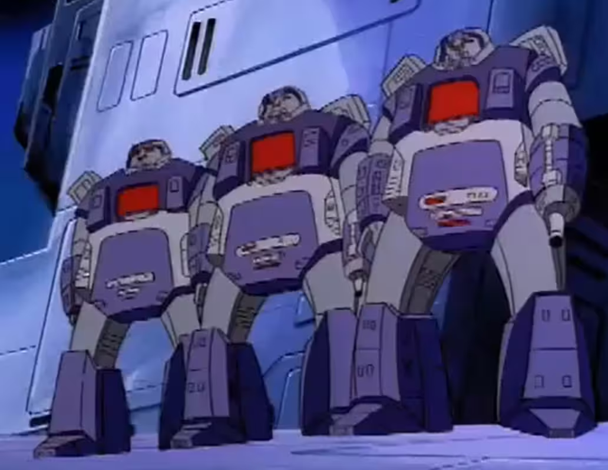

# 变形金刚：G1简史
作者的话

本文章只叙述了1984-1987年变形金刚G1动画片（G1全四季共98集+大电影）里面所拥有的故事情节。由于其中的第一、二季拥有过多优秀的故事内容，所以编者选了一部分其中的比较重要故事内容。至于十三元老和原始天尊变成塞伯坦等设定并不属于G1动画片的内容，所以本人并没有把上述内容列入文中。

目录

远古时期

五面怪统治塞伯坦时期

黄金时代

第三次塞伯坦战争

补天士-惊破天时代

第四季

1. 远古时期
在很久很久以前，有一个叫至尊太君（Primacron）的人，他创造了许多东西，其中一个就是宇宙大帝（Unicron）（因为独角兽的英文是unicorn，所以有些粗心的翻译人员也将其译作“独角兽”）。

至尊太君在G1里面的形象

宇宙大帝的人形模式
宇宙大帝开始变得贪婪和邪恶，他想要更多的力量，最后企图反噬他的主人至尊太君，于是至尊太君不得不与宇宙大帝对抗，并削弱他的力量，把他变成了一颗星球。

宇宙大帝的星球模式
最后至尊太君把唯一能消灭宇宙大帝的东西扔进了宇宙中，并希望有人有朝一日能找到它，那就是后来汽车人的圣物领导模块（Matrix of Leadership）。

被至尊太君释出的领导模块
魔力神球（Vector Sigma）自称在塞伯坦（Cybertron）出现以前自己就出现了，后来成为了塞伯坦核心计算机。

2. 五面怪统治塞伯坦时期
五面怪（Quintesson）在塞伯坦上建立工厂。

远古时期的塞伯坦星

五面怪是一群流浪在太空中的疯狂科学家，拥有五张不同的脸，依靠身体底部的激光束和触手移动。

从左到右五张脸分别代表
死亡、智慧、愤怒、审判、战争
五面怪在塞伯坦设立的工厂用来生产机器人，分为两条生产线，一套用来生产工用机器人，另一条用来生产武装机器人。后来工用机器人取代了他们的工作，可以自己生产机器人了，五面怪便开始变得懒惰与贪婪，对机器人任意销毁、观看武装机器人自相残杀，变成了机器人眼中的暴君。

工用机器人生产线（左）与武装机器人生产线（右）
而在五面怪统治下被压迫的奴隶都佩戴上了当时的奴隶标志。

五面怪统治时期的奴隶标志
在五面怪的暴政下，一小部分的机器人奴隶发动革命，而五面怪则放出了哨兵来试图压迫奴隶起义。

古代塞伯坦哨兵
最后奴隶起义在全球爆发，五面怪在奴隶的攻击下被迫离开塞伯坦，逃到了昆塔莎（Quintessa）星球。

昆塔莎星

3. 黄金时代
起义成功后，原本的工用机器人奴隶自称为汽车人（Autobots），他们推动了塞伯坦的科技发展，各种资源被发掘出来，塞伯坦达到有史以来的发展巅峰，被称为黄金时代（Golden Age）。然而五面怪时期的武装机器人渴望权力，想要统治塞伯坦，成立了霸天虎（Decepticons）。霸天虎与汽车人发生了多场战争。后来汽车人发明了变形齿轮（Transformation Cog），获得了形态转换的能力，之后的战斗里霸天虎也进化出变形能力。在战争热烈进行的同时，历代的汽车人领袖也因在战争中受伤而死亡，而领导模块也被汽车人一代代的传了下来，最后传到了钛师傅的手中。

钛师傅获得领导模块

在至少九百万年前，威震天（Megatron）被创造出来

威震天诞生

同时期，挖地虎建成水晶城（Crystal City），终极哨兵大力金刚（Omega Supreme）被创造，以用来保护水晶城。

准备出厂的大力金刚

后来威震天发明了一个改造机，成功把挖地虎（Constructicons）变成了霸天虎的一支分队，挖地虎摧毁了塞伯坦水晶城。

水晶城被毁

在九百万年前，威震天率领霸天虎进攻其中一个能量储存库，奥利安派克斯（Orion Pax）和其女友艾莉儿（Ariel）被威震天杀死。

> 被击穿胸膛的奥利安

后来飞行太保（Aerialbots）误入震荡波（Shockwave）的计时器导致穿越时空到过去，把奥利安送到了钛师父的工厂，奥利安被改造成擎天柱（Optimus Prime）而艾莉儿被改造成了艾丽塔（Elita One）。擎天柱被授予领导模块，第三次塞伯坦战争爆发，黄金时代结束。

奥利安被改造成擎天柱
在大战之中，有部分汽车人为了远离战争，乘坐飞船逃离了塞伯坦，穿越了一个旋风来到了派拉穹（Paradron）星球建立了殖民地。

派拉穹星系

4. 第三次塞伯坦战争
大约在四百万年前，汽车人飞船方舟（The Ark）被建造，目的是为了寻找新的能源，发射场在汽车人首都铁堡（Iacon）

铁堡（普通模式）（左）、铁堡（发射模式）（右）

方舟发射
霸天虎发射了另一艘飞船跟踪汽车人，霸天虎飞船被发现后威震天决定登船作战。

霸天虎飞船用牵引光束与方舟链接

P.S.：由于G1动画里面没有比较好的图，所以放一张同人图，以下是原版霸天虎飞船的图片

霸天虎飞船

霸天虎登上了方舟与汽车人展开了一场小战斗，过程中导致了方舟失控，坠毁在地球（Earth）现今美国南部的一座山上，船上无人生还。

坠毁的方舟

后来因地壳活动，那座山变成了火山。1984年，该火山爆发了，所产生的能量激活了方舟的计算机显像一号（Teletran One），显像一号把汽车人和霸天虎复活了，双方在地球上展开了新的战斗，汽车人与斯派克普拉（Spike plug）和斯派克（Spike）父子成为朋友。

显像一号计算机

P.S.：由于G1第一、二季优秀故事过多，此处列出几个重要情节

1984年，汽车人创造出机器恐龙（Dinobots）；

1985年，汽车人和霸天虎双方发现女汽车人仍然存活；飞行太保（Aerialbots）和飞虎队（Stunticons）被魔力神球创造出来；汽车人建立纽约秘密基地；霸天虎在未知行星上的汽车人哨站里发现宇宙锈病；第一批霸天虎三变战士（Triple Changer）——大火车（Astrotrain）和闪电（Blizwing）首次登场……

5. 补天士-惊破天时代
1986年-2005年间因未知原因霸天虎占领塞伯坦星球，汽车人在塞伯坦两个卫星上建立基地以监视霸天虎活动，并在地球建立汽车人城（Autobot City）。

2005年，汽车人准备从地球带回能量块以对塞伯坦发起大规模进攻，霸天虎趁机劫机进攻汽车人城，多名汽车人和霸天虎重伤甚至死亡，其中包括擎天柱和威震天。

重伤的擎天柱

擎天柱死前把领导模块传给通天晓（Ultra Maguns），但因手滑掉落导致热破（Hot Rod）接触到领导模块，令模块把热破误认为下一任汽车人领袖，热破成长为补天士（Rodimus Prime）。

热破获得领导模块

被贪图权力的红蜘蛛（Starscream）抛弃的威震天和其他受重伤的霸天虎遇到了宇宙大帝，威震天被改造成惊破天（Galvatron），其他人也被宇宙大帝改造。

威震天被改造成惊破天
惊破天带领霸天虎再次进攻汽车人，汽车人城的幸存者被迫离开地球避难，最后来到了垃圾星（Junkion），与垃圾星人首领营救车（Wreck-Gar）建立友谊，一同前往讨伐宇宙大帝。

热破与营救车初次见面互相打招呼
P.S.：宇宙通用问候语（Universal Greeting）通常被英文音译为Bah-Weep-Graaaaagnah Wheep Ni Ni Bong，中文常被音译为巴维古拉那为尼尼邦。

热破在宇宙大帝体内打开领导模块，宇宙大帝因领导模块所发出的能量死亡，汽车人回到家乡塞伯坦，而热破成为了新一代汽车人领袖补天士。

P.S.：由于G1第三季独立故事过多，此处列出几个重要情节

2006年泰坦金刚猛大帅（Metroplex）和铁甲龙（Trypticon）出场，铁甲龙摧毁了方舟；机器恐龙首领钢锁（Grimlock）利用宇宙大帝的残骸创造了神风队（Echnobots）；五面怪设置陷阱使擎天柱复活，一擎天柱为诱饵想要消灭汽车人，但最后擎天柱用仅存的意识牺牲自己拯救了汽车人；后来人类科学家在擎天柱的尸体身上发现一种疯狂症*（Hate Plague），病毒很快在银河系里传播，后来五面怪复活了擎天柱后，擎天柱打败被感染的补天士夺回领导模块，拯救了银河系……

铁甲龙摧毁方舟

擎天柱使用领导模块治疗疯狂症
P.S.：根据“https://tfwiki.net”，狂疯病的正式名称为Hate Plague，中文有多种翻译，在B站上的G1前三季95共集里的翻译是“疯狂症”

6. 第四季
汽车人和霸天虎因一场追逐战误入星云星*（Nebulos）。

星云星
P.S.：游戏《变形金刚：地球之战》音译为那不勒斯星

在星云星人的帮助下，塞伯坦人先后进化出头领战士（Headmaster）和目标战士（Targetmaster）。

头领战士概念图

目标战士概念图
霸天虎计划把塞伯坦的部分能量转到太阳，令太阳迅速变成红巨星吞噬太阳系以毁灭地球。汽车人最后把太阳过多的能量吸收到塞伯坦中，因能力过多而复苏了塞伯坦，迎来了塞伯坦第二个黄金时代。

新的黄金时代来临

资料来源：

G1前三季共95集

变形金刚大电影

百度百科

https://tfwiki.net/ 作者：Autob_Lader https://www.bilibili.com/read/cv10077126 出处：bilibili