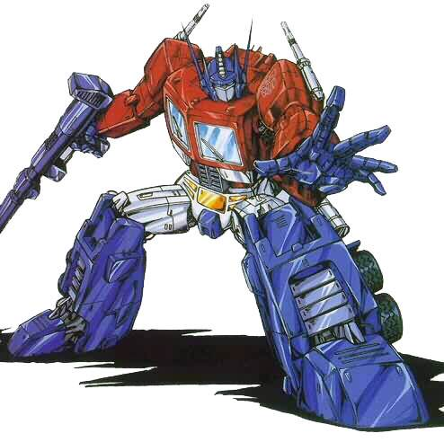
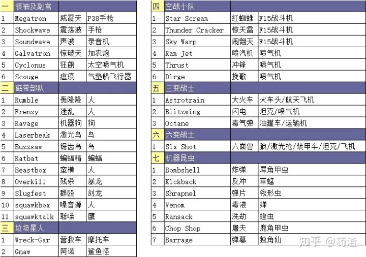
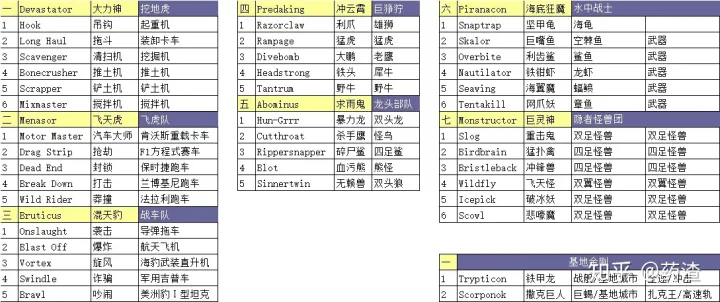
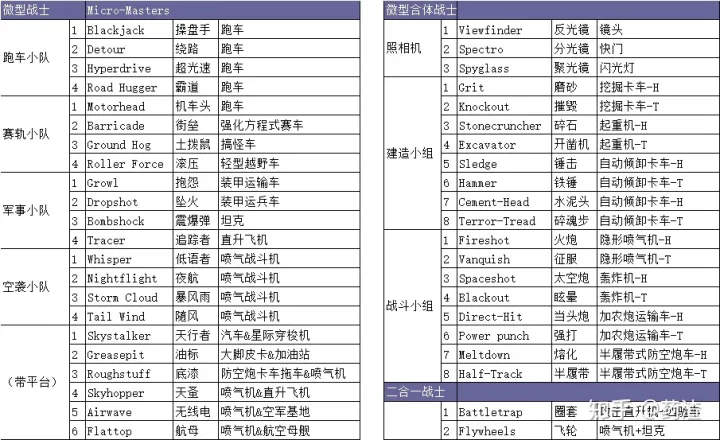
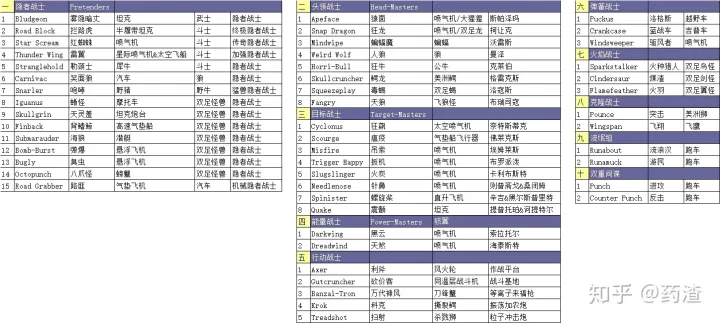
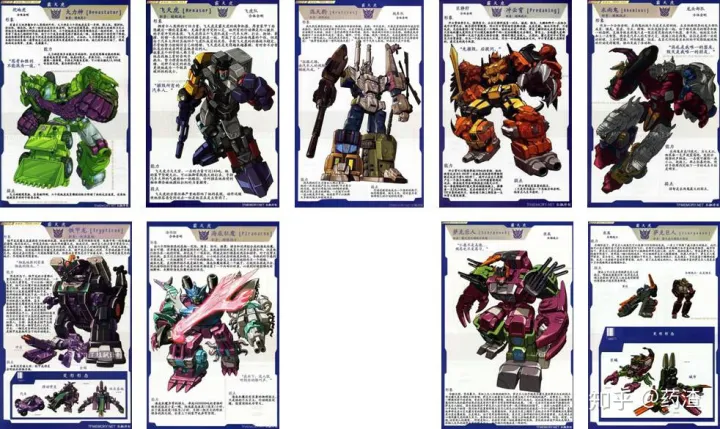

# 变形金刚英文名：G1英文名
## 简介

博派（Autobots）是长篇动画《变形金刚》系列中的重要派别，其他译名为“汽车人”。博派是《变形金刚》系列中的正面角色，是地球人的朋友，胸怀保卫生命、追求和平的理想。\[1\]

博派是动画《变形金刚》系列中的“汽车人”

## 角色背景

博派（Autobots）又称“汽车人”。\[2\]因Autobot的尾音节bot和“博”音近，故有此名（之前普遍以为是Automobile+Robot合成而来，而《变形金刚》1电影官方设定指出是Autonomous+Robotic+Organism合成而来。博派是《变形金刚》系列中的正面角色。在不同世界观设定中，关于博派的身份起源有多种说法，例如在美版G1电视动画系列的设定中，他们的前身和狂派一样，都是五面怪统治塞伯坦时被生产出来的，不过与身为军品的狂派不同，博派的身份是民用机器人。其它的，包括自然进化说和普莱姆斯神创生说，等等。

在美版G1电视动画中，在博派与狂派联手放逐了五面怪之后，因为民品与军品的不同政见，使得塞伯坦陷入长期内战，很快星球的能源被耗尽。博派爱好和平，被迫乘坐飞船方舟号（与圣经中挪亚乘坐的大船同名）逃离塞伯坦，结果在宇宙中和追击而来的威震天率领的狂派飞船——报应号发生激战，双双坠毁在史前地球之上。大约400万年后（1984年），一次火山爆发引起的震动启动了方舟内的显像一号，修复了双方机器人。狂派战士离开方舟，找到狂派飞船建立基地，并与留守在塞伯坦的狂派战士——震荡波取得了联系。狂派发现地球上富含能量，于是开始抢夺。

为了阻止狂派的野心，保护地球和地球上的人类，博派挺身而出，与狂派对抗。博派与狂派之间的战争翻开了全新的一页。

## 角色社会关系

“汽车人”的死敌是以威震天、惊破天、为首的狂派（即霸天虎）。观众熟知的“汽车人”角色主要有擎天柱（Optimus Prime）、大黄蜂(Bumblebee)、铁皮（Ironhide）等。

真人电影

##  博派成员

领导人/汽车人/博派领导人（Primes/Autobot Leaders）

驭天途 Routemaster Prime - 设定为御天敌的前辈，变形机体为大型铰接车辆

擎天柱 Optimus Prime –G1动画版集装箱卡车，电影为彼得比尔特Peterbilt 389 牵引卡车头（变形金刚3中挂上了经典的车厢），《变形金刚4：绝迹重生》中改为西部之星4900卡车。

威震天Megatron Prime - 塞伯坦战斗机/塞星坦克/MACK“冲飞”装甲半挂车（内战前的他严格来说算是塞伯坦的“共主”，所以算在博派里）

自由人/博派战士（Autobot Soldiers）

铁皮 Ironhide – Modified GMC Topkick C4500 皮卡

大汉 Brawn – HX悍马概念车

犀皮 Armorhide – 重装越野车

救护车 Ratchet – Hummer H2 Fire Search and Rescue救护车

大黄蜂 Bumblebee – 1976 Chevrolet Camaro/2006 Chevrolet Camaro Concept/2010 Chevrolet Camaro

雪佛兰卡梅罗跑车

飞过山 Cliffjumper – 塞星跑车 / 雪佛兰卡梅罗跑车

啰嗦Blur – 塞伯坦赛车

巨浪 Beachcomber - 第七区突击越野车/运货叉车

开路先锋 Trailbreaker – SUV

横炮 Sideswipe – 雪佛兰“考维特黄貂鱼百年”概念跑车

恐龙/暴龙/浪客 Dino - 红色法拉利-458跑车

克星 QUE – 梅赛德斯-奔驰 W212跑车

变速箱 Gears – SUV

宽载 Wideload - 能量提炼/探测车

刹车 Skids – 雪佛兰迷你概念车

挡泥板 Mudflap – 雪佛兰迷你概念车

夜击 Night Beat – 未来派跑车

摇摆 Jolt - 蓝色雪佛兰沃尔特电动车

长臂 Longarm – Towing-Truck那辆米凯拉驾驶过的蓝白色拖车

碾核 Grindcore – 重型矿能冶炼车-铲车

信号弹 Signal Flare – 深层坑道挖掘机/军用激光制导战车

吊车 Grappel – 轮式大型起重机

滑车 Hoist –大型牵引卡车

防滚架 Rollbar – 厢式送货车

滑膛炮 Bombard - 轮式车载火炮

机关炮 Scattorshot – 装甲卡车

破门手 Breacher – 装甲运兵车

准星 Crosshairs – 轻型起重机/装有重炮与来复枪的越野车/塞伯坦蜘蛛状战车/四足爬行步兵火炮平台

流星 Comettor – 和地雷的机体类似

凸轮轴 Camshaft – Chevrolet Cobalt SS跑车

背离 Swerve – 雪佛兰“考维特黄貂鱼百年”概念跑车

计时器 Clocker – 自动敞篷赛车

吹风管 Blowpipe – 雪佛兰西维拉多跑车

小粗芯/急促 Slap Dash - 黄色兰博基尼跑车

沙行者 Dune Runner – 第七区沙漠巡逻车

大腕 Big Daddy – 雪佛兰蒙地卡罗跑车/1970道奇挑战者跑车/1974道奇摩纳哥跑车/1970博思福特野马跑车

金飞虫 Hubcap – 老爷车

弧光/阿尔西 Arcee – Ducati 848 摩托车

菁英/艾丽塔 Elita-One - MV Agusta F4 series摩托车

铿锵蓝瑰/克劳莉娅 Chromia – 铃木摩托

转轮 Wheelie – RC Ford F-Series monster truck “大脚怪”玩具车

智多星/脑单元 Brains – 联想电脑/Ipad

精准 Pinpoint – 黑匣子

滚筒 Roller –探月车

天爆 Skyblast – 塞伯坦轰炸机

烟火大师 Blazemaster – 多用途直升机/新闻媒体的直升机

撤离 Evac – MH-53M铺路鹰直升机

同温层 Stratosphere – Antonov An-225运输机

火线勇士 Frontier - 扫雪机/“海王”某型号的多用途直升机

旋刃 Whirl – MH53-M铺路鹰直升机/某类攻击直升机

夜袭 Night Ops - 某类喷气式战斗机

奇材 Highbrow –P-38闪电式战斗机

战斧 Tomahawk – 虎式攻击直升机

翼刃 Wingblade – 塞伯坦战斗机

深水炸弹 Depth Charge –“长弓”炮艇机

飞行太保（Aerialbots）

银箭 Silverbolt –F-16“战隼”战斗机

俯冲 Skydive –F-22“猛禽”战斗机

分离 Breakaway – F-35 闪电II战斗机

空袭 Air Raid – F/A-18“超级大黄蜂”战斗机/AEW&C波音E-767客机

浪花 Sea Spray – 气垫船/航空母舰

游猎/探星者（Sakers）

迷你金刚（Mini-con）

远望 Longview –双倍望远镜

谍照 Spy Shot 6 – 照相机

快拨 Speed Dial 800 – 手机

高分 High Score 100 – 游戏机手柄

高架索 Highline – 手机

骇客 Hacker X-3 – 掌上游戏装置

远视 Farsight T-20 – 双倍望远镜

雷霆拯救队（The Wreckers）

弹簧 Springer/Ospery - V-22“鱼鹰”倾斜旋翼直升机

路霸 Roadbuster – Dale Earnhardt, Jr. NASCAR #88 AMP Energy/National Guard武装纳斯卡赛车

上旋 Topspin – Jimmie Johnson NASCAR #48 Lowe's/Kobalt武装纳斯卡赛车

神行太保 Leadfoot – Juan Pablo Montoya NASCAR #42 Target武装纳斯卡赛车

空锤 Skyhammer – 米-24“雌鹿”武装直升机的改版（大改）

高射炮 Flak -高射炮

打捞 Salvage – 雪佛兰西维拉多跑车

逆火 Backfire – 全地形越野车

沙暴 Sandstorm – 重型吉普

排气管 Tailpipe –摩托车

## 女汽车人

远古的塞伯坦反抗五面怪的战争中，汽车人的祖先民用机器人分离出了一种身体娇小，行动灵活的机器人，称之为女汽车人（Female Autobots），其中最著名的是由钛师傅亲手制造的艾丽塔以及阿尔茜。

在之后的IDW玩具系列中，增加女汽车人合体金刚。

## 狂派 霸天虎
*（资料来源于《变形金刚机密档案》上海人民美术出版社）*

1.狂派为军国主义，组织结构清晰，变形载具以军用武器为主。

2.惊破天由威震天改造升级而来，狂飙及瘟疫扫荡队由惊天雷、闹翻天、炸弹、反冲、弹片改造升级而来。（狂飙为闹翻天、炸弹，此乃Bug）

3.噪声源与聒噪可合体为人形。

4.垃圾星人严格意义上不属于博派或狂派。

5.合体金刚包括三类七组。

6.微型战士为小个子机器人；微型合体战士为两个微型战士一组，分别组合变形某载具的前后各半。

7.二合一战士为两个载具，变形合体为一个机器人。

8.隐者战士具有机甲外壳。

9.头领战士为人类驾驶机甲变形为机器人的头部。

10.目标战士为人类驾驶机甲变形为机器人的武器。

11.能量战士的黑云与天煞，载具形态可合体为骇翼喷气机。

12.行动战士具有平台附件。

13.克隆战士为同一火种分裂而成的具有亲缘性的两个机器人。

14.双重间谍为一体两态的双派系机器人。

编辑于 2020-10-10 12:47