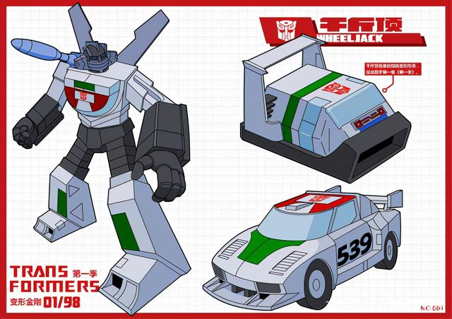
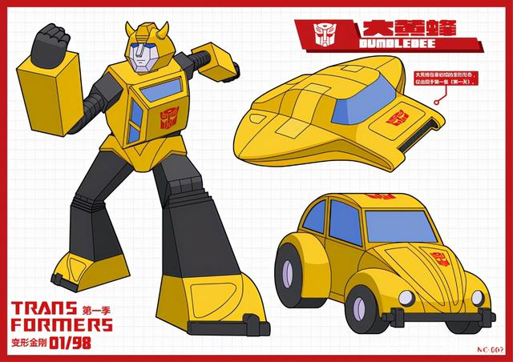
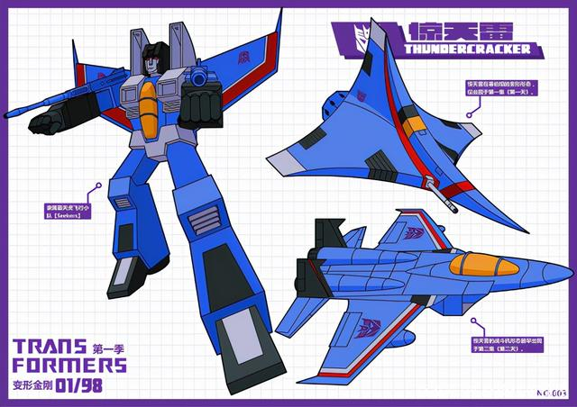
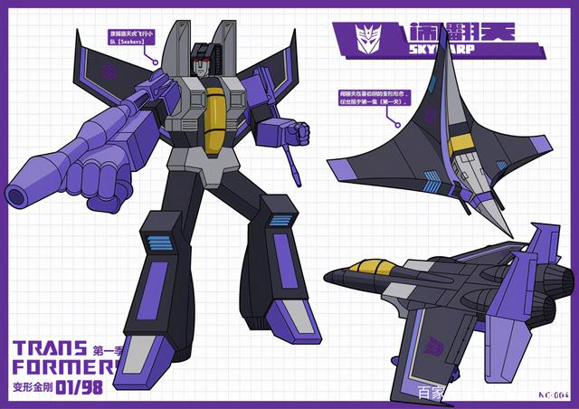
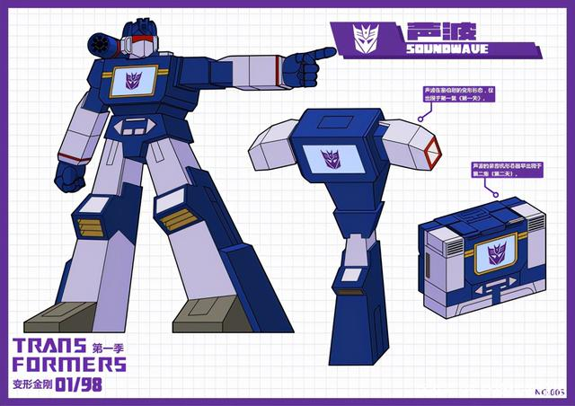
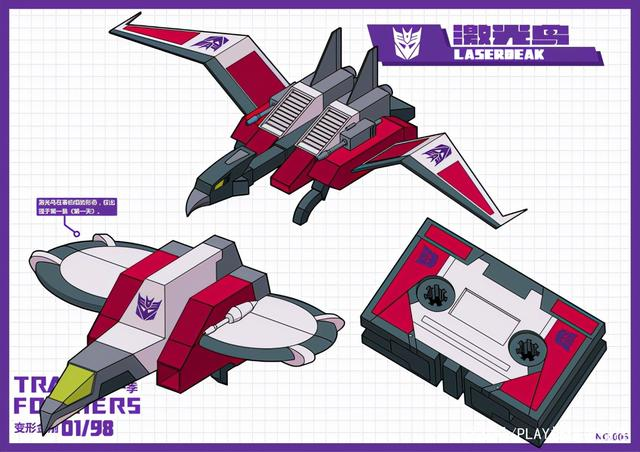
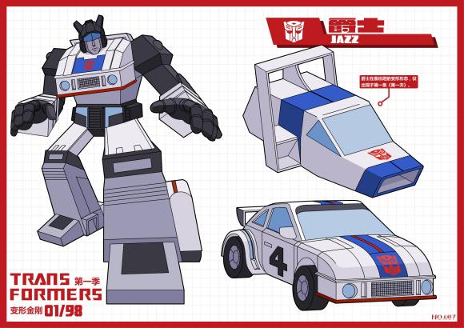
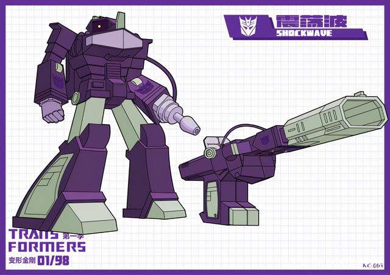
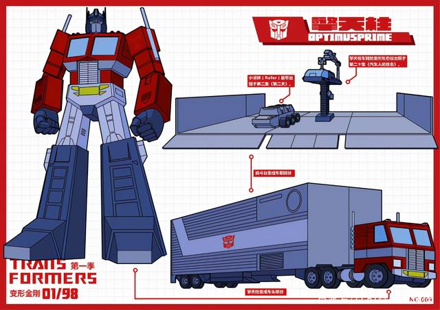
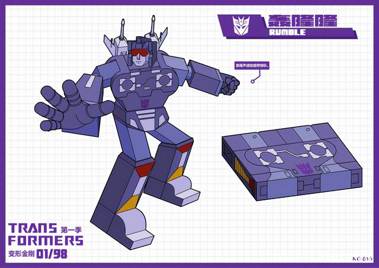

# 变形金刚：G1角色图鉴（变形金刚终极手册）

《The Ark》：全是G1人物的线稿，包括了大家一直很有疑问的所有变形金刚的身高比例图，这个G1是狭义的，只是最初的那四季动画。
《变形金刚大百科》：包括了G1的玩具和人物线稿，这个G1是广义的，因为包含了隐者战士这些。
《变形金刚终极手册》：类似上述大百科，但是增加了一些赛星的设定等内容。
《学画TF》：就是教你画TF啦，里面有一些有趣的东西，尤其是对想画变形金刚的同学来说就很有用了。

G1动画可以说是目前为止变形金刚最经典的系列，无论是之后的续作还是游戏、电影系列都有对它的借鉴。其中为大家塑造了很多经典的角色，大家还能记着它们都是谁吗？接下来为大家带来的是模友第九门徒制作的变形金刚G1角色图鉴，大家一起来重温变形金刚G1动画中的经典角色吧。

01号是千斤顶，满满的复古风，千斤顶无论在之后的哪个系列造型都没有什么太大的变化，比较经典的是头部的造型。图鉴中展示了千斤顶的两种载具形态，大家喜欢哪种载具形态呢？

02号是大黄蜂，人气仅次于擎天柱的角色，同样图鉴中展示了两种载具形态，赛星飞船和汽车人甲壳虫。

03和04是红蜘蛛飞机小队的惊天雷和闹翻天，载具和人形都差不多，属于同模换色。

05和06是声波与激光鸟，同样每个角色模友都制作出了赛星和正常的载具形态，声波算是变形金刚中人气非常高的角色了。

07是爵士，也是两种载具形态。角色无论是在哪个系列中造型都差不多，因为G1太经典了。

08是霸天虎的指挥官震荡波，足智多谋的军师。

09是我们的大哥擎天柱，G1造型早已深入人心，没有货柜的大哥不算完整的大哥！

010是磁带小队的轰隆隆，虽然体积小但是也很厉害，是声波的好帮手。以上是模友制作的前10位变形金刚角色插画，模友还在陆续更新，喜欢的模友可以关注一下哦！