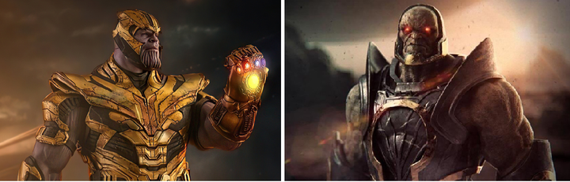
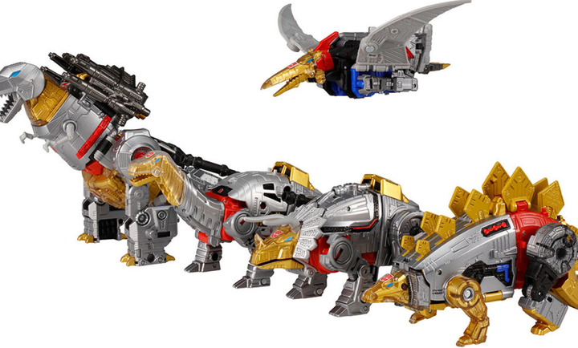
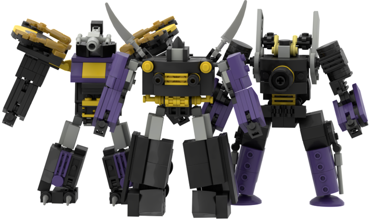
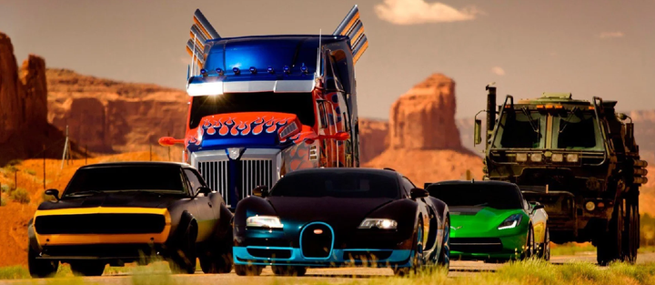
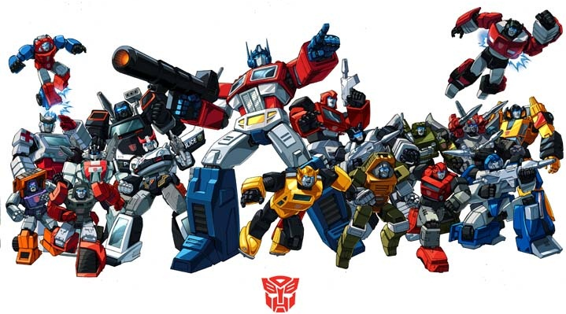
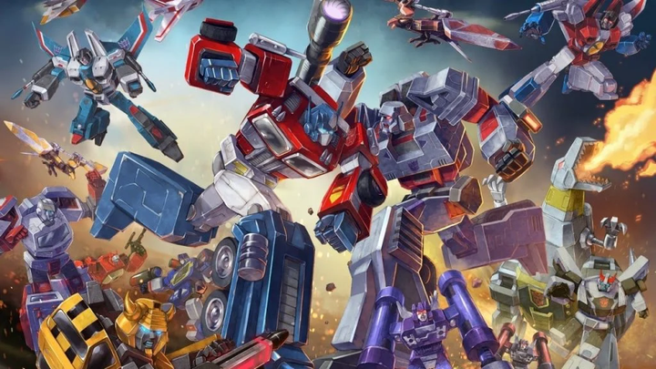

# 变形金刚：含义
作者：多邻国Duolingo  
链接：https://www.zhihu.com/question/525016723/answer/3062714717  
来源：知乎  
著作权归作者所有。商业转载请联系作者获得授权，非商业转载请注明出处。  
  

英语 Autobot 原本也没有霸气的意味。

汽车人和[霸天虎](https://www.zhihu.com/search?q=%E9%9C%B8%E5%A4%A9%E8%99%8E&search_source=Entity&hybrid_search_source=Entity&hybrid_search_extra=%7B%22sourceType%22%3A%22answer%22%2C%22sourceId%22%3A3062714717%7D)从源头上就不是正邪的差别，而是**民用机械**和**军工机械**的差别。

前者只体现性能，后者才凸显杀伤力。

*   Autobot 祖先是民用机械体，原本职能与战斗无关，属于各类技术工种。
*   Decepticon 祖先是军工机械体，专为战斗而生，初期拥有压倒性的火力。

最初亮相的 Autobot 绝大部分会变形为汽车。相比 Decepticon 变形的各种装备，汽车是最贴近日常生活的机器。

在大多数幻想作品中，主角团和反派的对立，从来就不是「我要打败你，你要打败我」，而是「我想维系原本的正常生活，你要灭掉我、让世界按你的规则运转」。

因此，正派命名突显攻击性的相对较少（当然也有），而反派命名更常强调破坏性和威力。

## 「博派」和「狂派」的名字是怎么来的？

这两个词源自港译。

*   「博」是 bot 的音译，粤语发音为 bok3。
*   「狂」是 con 的音译，粤语发音为 kong4。

在英语里，Autobot 各支系名号多以 bot 为后缀。例如

*   Throttlebot - 调节车，整组都能变身为汽车，以大黄蜂为代表
*   Protectobot - 机器卫兵，大部分能变身为汽车，刀刃的变身形态是直升机
*   Aerialbot - [飞行太保](https://www.zhihu.com/search?q=%E9%A3%9E%E8%A1%8C%E5%A4%AA%E4%BF%9D&search_source=Entity&hybrid_search_source=Entity&hybrid_search_extra=%7B%22sourceType%22%3A%22answer%22%2C%22sourceId%22%3A3062714717%7D)，整组都可变身为飞机
*   Trainbot - 飞车队，日版设计，变身为各种列车头
*   Technobot - 神风队，变身为各不相同的超级机器
*   Dinobot - [机器恐龙](https://www.zhihu.com/search?q=%E6%9C%BA%E5%99%A8%E6%81%90%E9%BE%99&search_source=Entity&hybrid_search_source=Entity&hybrid_search_extra=%7B%22sourceType%22%3A%22answer%22%2C%22sourceId%22%3A3062714717%7D)，变身为恐龙形态

Decepticon 各支系名号多以 con 为后缀。例如

*   Combaticon - 战车队，变身为战斗机、战车、坦克等军用载具
*   Stunticon - 飞虎队，变身为各种汽车
*   Constructicon - [挖地虎](https://www.zhihu.com/search?q=%E6%8C%96%E5%9C%B0%E8%99%8E&search_source=Entity&hybrid_search_source=Entity&hybrid_search_extra=%7B%22sourceType%22%3A%22answer%22%2C%22sourceId%22%3A3062714717%7D)，变身为各种建造工程机器
*   Terrorcon - 龙头部队，变身为以[鸟兽](https://www.zhihu.com/search?q=%E9%B8%9F%E5%85%BD&search_source=Entity&hybrid_search_source=Entity&hybrid_search_extra=%7B%22sourceType%22%3A%22answer%22%2C%22sourceId%22%3A3062714717%7D)为原型的各种机械怪物
*   Predacon - 巨狰狞，可变身为以野兽为原型的机械
*   Seacon - 海怪组，可变身为以海洋生物为原型的机械
*   Vehicon - 机械兵，主要变身形态为跑车或战斗机
*   Insecticon - [机器昆虫](https://www.zhihu.com/search?q=%E6%9C%BA%E5%99%A8%E6%98%86%E8%99%AB&search_source=Entity&hybrid_search_source=Entity&hybrid_search_extra=%7B%22sourceType%22%3A%22answer%22%2C%22sourceId%22%3A3062714717%7D)，可变身为昆虫形态的武装机器

## 英语 Autobot 和 Decepticon 的含义

Autobot 来源于 Autonomous Robotic Organism，也就是「自主机械生命体」，原本是[赛博坦星球](https://www.zhihu.com/search?q=%E8%B5%9B%E5%8D%9A%E5%9D%A6%E6%98%9F%E7%90%83&search_source=Entity&hybrid_search_source=Entity&hybrid_search_extra=%7B%22sourceType%22%3A%22answer%22%2C%22sourceId%22%3A3062714717%7D)觉醒的「平民」总称。

这些机械体的祖先，最初是作为无生命的工具被创造出来的，后来才产生了自我意识。

英语里 auto- 前缀的根源是[古希腊语](https://www.zhihu.com/search?q=%E5%8F%A4%E5%B8%8C%E8%85%8A%E8%AF%AD&search_source=Entity&hybrid_search_source=Entity&hybrid_search_extra=%7B%22sourceType%22%3A%22answer%22%2C%22sourceId%22%3A3062714717%7D) αὐτο-，表示「自发、自主地」。

至于作为 [automatic](https://www.zhihu.com/search?q=automatic&search_source=Entity&hybrid_search_source=Entity&hybrid_search_extra=%7B%22sourceType%22%3A%22answer%22%2C%22sourceId%22%3A3062714717%7D) 的缩略表示「自动」，作为 automobile 的缩略表示「(自动的)汽车」，都是衍生义项。

只不过（无论是初版G1动画还是后来爆炸贝的电影）变形金刚第一部出现的 Autobot，确实几乎都变成汽车，所以就将 autobot 当作「汽车机器人」来理解和翻译了，这里侧重描述特征，没有什么霸气不霸气的考虑。

日版动画角色的命名，Autobot 直接叫「サイバトロン」，相当于 Cybertron，也就是赛博坦星球机械体的普罗大众。

Decepticon 这个名字出现得很晚。这个群体曾经被称为 Ascenticon，取自表示「上升」的 [ascension](https://www.zhihu.com/search?q=ascension&search_source=Entity&hybrid_search_source=Entity&hybrid_search_extra=%7B%22sourceType%22%3A%22answer%22%2C%22sourceId%22%3A3062714717%7D)。当时议会将这些为了赛博坦不惜牺牲其它生命的机械体斥为 Decepticon，源自表示「欺骗」的 deception。于是就有了[威震天](https://www.zhihu.com/search?q=%E5%A8%81%E9%9C%87%E5%A4%A9&search_source=Entity&hybrid_search_source=Entity&hybrid_search_extra=%7B%22sourceType%22%3A%22answer%22%2C%22sourceId%22%3A3062714717%7D)这句话：

*   The name was meant to demonize us. Instead, we wear it as a badge of honor, for if speaking the truth is deception, then we are gladly guilty.
*   这名字原本是为了妖魔化我们。然而，我们却将其当作荣誉勋章带上，因为倘若说实话是欺骗，那我们甘愿担此罪名。

> 出自《变形金刚》idw 漫画世界观。  
> G1暂未找到为何用“欺/诈”之类字眼来“自称”的解释（若没有特别缘由，自称似乎还是狂拽炫酷或者某种坚定使命感之类的符合人设）… 可能最初还没想这些吧……

中文「霸天虎」基本就属于另起的名字了，侧重强调反派的霸道与强悍。

日版「デストロン」也是另起的名字，相当于 Destron，缩略自 destroy+tron，同时谐音 deathtron，强调带来「毁灭」性的灾难。

后缀 -tron，来自古希腊语 -τρον，通常用于各种器械名称。

**延伸阅读：**

[如何评价《蜘蛛侠：纵横宇宙》？](https://www.zhihu.com/answer/3054472015)

[“美人鱼”算是一种“鱼”吗？](https://www.zhihu.com/question/514964271/answer/3050262454)

[为什么在日语中的英语词不直接写成英语？](https://www.zhihu.com/answer/3048492164)

[为什么字母S比字母ABC更高一级？](https://www.zhihu.com/answer/3034312525)

[《速度与激情 10》为何叫 Fast X？](https://www.zhihu.com/answer/3029301822)

[哪些语言星期几用数字命名？](https://www.zhihu.com/answer/3020610166)