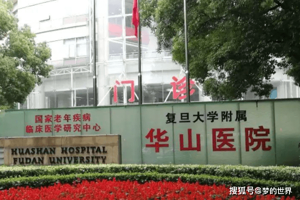
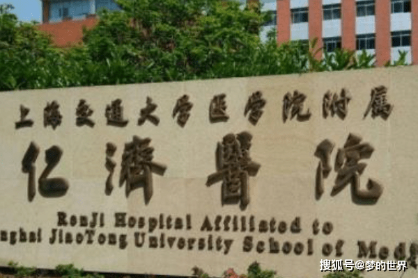
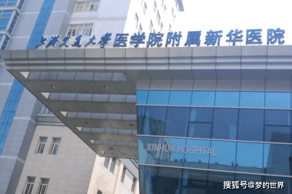
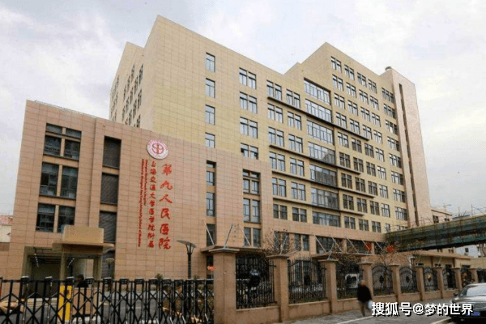
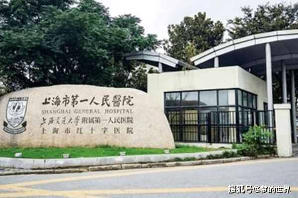

# 上海各大医院的专长
1、复旦大学附属中山医院

心脏、肝癌、肾脏和肺部疾病诊治是医院的重点和特色，诊治水平始终处于中国领先地位。其中心血管病和肝肿瘤为上海市临床医学中心。

2、上海交通大学医学院附属瑞金医院

上海交通大学医学院附属瑞金医院专长有血液科、烧伤科、内分泌科最强，肾脏科、消化科、感染科。

3、复旦大学附属华山医院

复旦大学附属华山医院以神经外科、神经内科、皮肤科、骨科（尤其是手外科）为特长，以第一批受国务院特殊津贴的皮肤病专家肖鹭白教授、赵书磊主任为首的皮肤科更是在全国享有盛誉。

4、上海长海医院

上海长海医院拥有肝胆外科、胸心外科、烧伤外科、血管外科、血液内科、消化内科等特色学科。

5、上海交通大学医学院附属仁济医院

上海交通大学医学院附属仁济医院以消化内科、风湿免疫科、神经外科、妇产科见长，也是上海人类精子库所在地。

6、上海交通大学医学院附属新华医院

上海交通大学医学院附属新华医院在《2007全国医院排名》中儿科排名名列第一，心血管病科排名名列第六。1993、1995年分别被国家卫生部授予三级甲等医院和爱婴医院称号。

7、上海交通大学附属第九人民医院

上海交通大学附属第九人民医院以口腔科、整复外科、关节外科为重点，是整形领域的领头羊。

8、上海市第六人民医院

上海市第六人民医院在糖尿病、断肢再植（骨显微外科）、超声医学等领域名扬全国。

9、复旦大学附属华东医药

华东医院是国内外享有盛誉的一所综合性医院，老年病特色疾病为专长。

10、上海市第一人民医院

上海市第一人民医院眼科、眼底病、中医消化病、泌尿外科、心外科、器官移植处于前列。

