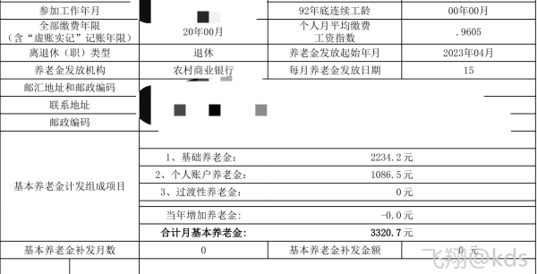
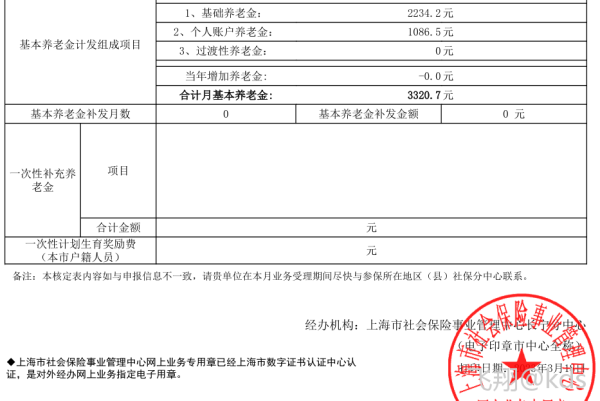
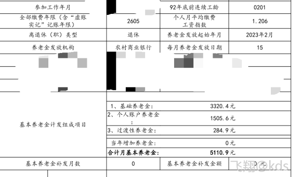

由于从事特殊工种人员的特殊付出，国家对于他们给予了政策上的特殊照顾，让他们享受比较优惠的退休条件和待遇。也正因为此，特殊工种人员的提前退休是一项政策性非常强的工作。为制止一些企业的违法操作，国家曾经明令一度暂停办理从事特殊工种人员的提前退休手续。1999年3月，国家劳动和社会保障部发布了《关于制止和纠正违反国家规定办理企业职工提前退休有关问题的通知》，规定恢复办理从事特殊工种人员的提前退休手续。为规范从事特殊工种人员办理退休手续，上海市劳动和社会保障局也制定了《关于本市从事特殊工种人员办理退休手续若干问题的通知》，对从事特殊工种人员的退休手续，作了具体的规定。本刊据此针对读者关心的问题作些介绍。

一、特殊工种的确认从事特殊工种人员的退休，首先应当明确职工从事的岗位是否属于国家认可的特殊工种。这是解决从事特殊工种人员退休的首要问题。
1、特殊工种的范围。从事哪些岗位工种的职工属于特殊工种职工的范围，根据国家现行规定，本市对从事井下、高空、高温、特殊繁重体力劳动、其他有害身体健康工作的职工，属于特殊工种的范围，可依照国家有关从事特殊工种人员的退休条件和待遇，办理退休手续。
2、特殊工种确认的原则。根据我国的习惯做法，特殊工种一般由劳动行政机关和行业主管部门批准。
3、特殊工种的确认程序。特殊工种的确认，一般按下列程序进行：一是确认的方法。市属企业，包括中央在沪企业，按原劳动部或本行业主管部门于1992年底前已确定的，并经原上海市劳动局或本行业主管局批准的特殊工种予以确认。这里要强调的是，行业特殊工种和适用范围确认后，只能适用于本行业所属的企业，其他行业和企业不能参照执行。区县属企业，按原上海市劳动局批准并经原市社会保险管理局认定的特殊工种予以确认；二是确认的申报和审核。凡符合设有特殊工种的企业，应当按规定将本单位特殊工种名称列出明细，提出申报。申报经行业主管部门确认后，报市劳动和社会保障局审核。审定后，由区县社保中心按规定负责办理。

全国特殊工种岗位人员信息系统 http://tsgz.12333.gov.cn/enterpriselogin/#/enterpriselogin

个人账户的钱，如果没领完就嗝屁了，家属可以继承，如果领完了再嗝屁，家属不继承。只要退休了，政府就会按照这个数一直给你发，不用管个人账户领完了养老金会变少了。这个缴费基数是0.96，就是社平工资的0.96，差不多就是每年按照社平工资0.96在缴金。最低标准是0.6，就是说即使你拿2590，但是单位也得按照0.6的社平工资给你缴金

Q：92年前工龄  0201 这是什么意思？
A：两年一个月 退休都是这种句式