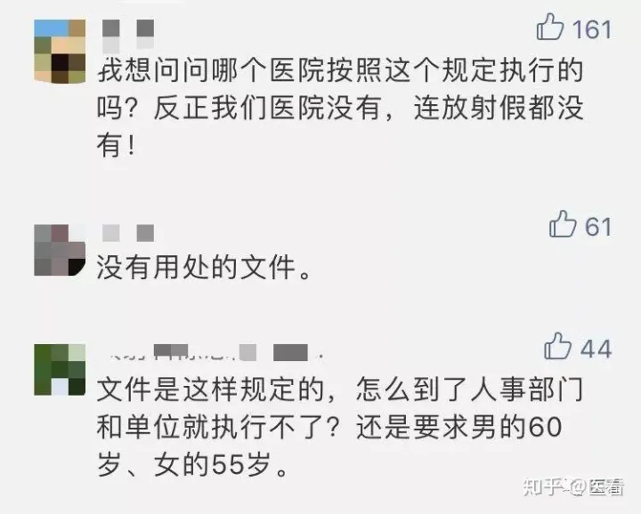
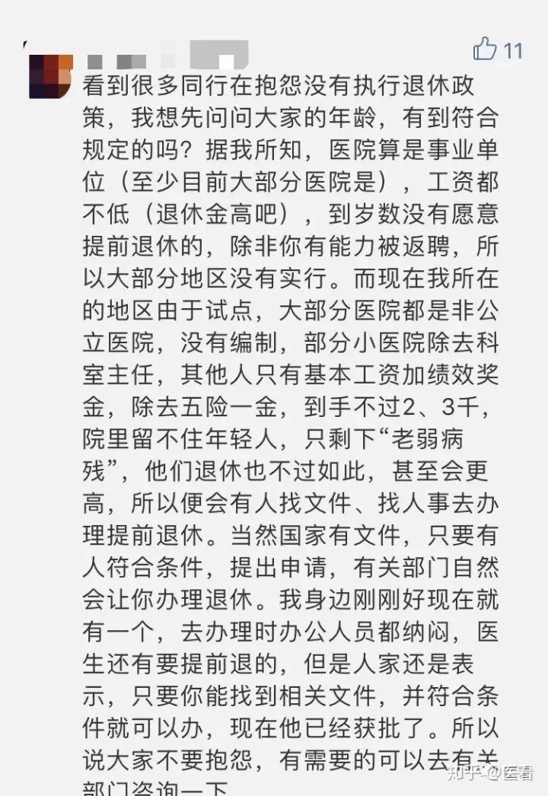
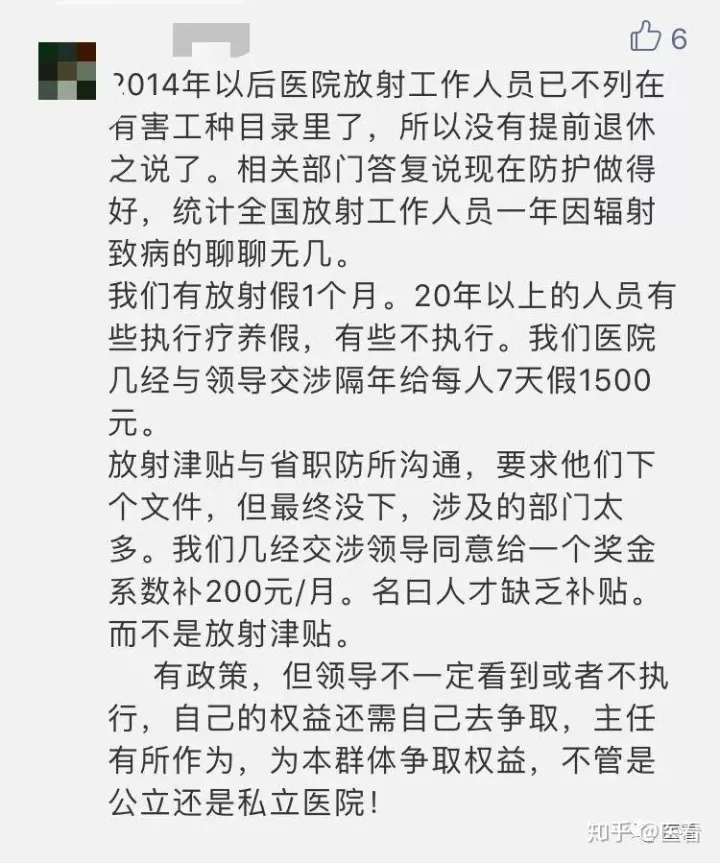

## **「医看」专注于打造影像医生多点执业签约服务平台！病例讨论、影像解剖、考试资料、视频课件...医学影像，应有尽有！欢迎在微信上关注我们：yikandoc**

法定退休年龄是指第五届全国人民代表大会常务委员会第二次会议批准，**《国务院关于安置老弱病残干部的暂行办法》和《国务院关于工人退休、退职的暂行办法》 （国发〔1978〕104号）文件**所规定的退休年龄。  

  

对全民所有制企业、事业单位和党政机关、群众团体的工人，符合下列条件之一的，应该退休。

  

> （一）男年满六十周岁，女年满五十周岁，并且累计工龄满十年的；  
>   
>   
> **（二）男年满五十五周岁、女年满四十五周岁，累计工龄满十年的，从事井下、高空、高温、特别繁重体力劳动或其他有害身体健康的工作；**  
>   
> （三）男年满五十周岁，女年满四十五周岁，累计工龄满十年，由医院证明，并经劳动鉴定委员会确认，完全丧失劳动能力的应当准予退休。

  

劳动部**《劳动部工资局关于可否把X射线工作列为有害身体健康工作问题的复函》（【65】中劳薪字第248号）**文中规定，“**可以暂时把从事X射线的工作列为从事有害身体健康的工作，每从事此种工作一年可以计算为一年零六个月的工龄”**。

  
**卫生部《放射工作人员健康管理规定》（1997年9月1日施行）第三十五条**规定：“**放射工作人员的工龄计算，按国家的有关规定执行。”**  
  
根据以上法律、法规、政策规定，放射工作人员作为从事“有害身体健康的工作”的人员，可以参照执行**国发【1978】104号通知下达的《工人办法》第一条规定**，即**男年满55周岁，女年满45周岁，连续从事放射工作满10年的，可以退休。**  
  

**具体到各省、直辖市、自治区具体如何执行，应按当地相关规定办理**。比如，湖北省人事厅在2004年8月25日鄂人薪函〔2004〕9号文《关于把X射线列为有害身体健康工作的复函》中，答复武汉市人事局：“经研究，同意你市在根据国发〔1978〕104号文件精神办理特殊工种提前退休手续中，按照【（65）中劳薪字第248号】中有关的规定，办理医疗卫生单位专职从事X射线工作的人员提前退休的审批工作。”

  

**据卫生部《放射工作人员健康管理规定》**：放射人员的保健待遇按照国家有关规定执行。放射工作人员的保健休假，应根据照射剂量的大小与工龄长短，每年除其他休假外，可享受保健休假2至4周。**从事放射工作25年以上的在职者，每年由所在单位安排利用休假时间享受2至4周的疗养待遇。**放射工作人员健康体检、休假、住院检查或患病治疗期照常享受保健津贴，医疗费用分别由公费医疗、劳保医疗或所在单位支付，在生活方面所在单位应给予适当照顾。**长期从事放射工作的人员，因患病不能胜任现职工作的**，经本规定第十二条规定的组织或机构诊断确认后，**可根据国家有关规定退休。放射工作人员因职业放射操作致残者，其退休后工资和医疗卫生津贴照发。因患放射疾病治疗无效死亡者，按因公牺牲处理。**  

  

> 来源：放射沙龙

  

***

  

关于这个政策，评论区却是一片吐槽声

  

  

  

  

  

  

  

  

关于放射科工作人员退休规定，你怎么看？

欢迎留言和大家讨论~

[医看-医生快速问答平台​community.kankanyisheng.com](https://link.zhihu.com/?target=https%3A//community.kankanyisheng.com)

广西放射医生能否按国家规定提前退休 已办理 政务 求助2022-01-22 11:25     

尊敬的书记：您好！首先为在您百忙之中打扰您表示深深的歉意，我是一个在医院工作的放射医生，今年55岁，根据1956年劳动部（65）中劳薪字第248号文规定，把从事X射线工作列为有害身体健康工作，每从事此种工作一年可以计算为一年零六个月工龄，另根据国发（1978）104号文件（第一条第二点）把从事有害职业的退休年龄男可提前在55岁退休（1998年3月3日《健康报》第二版有详细解读)，我为此提出申请，但是当地社保部门说根据不知哪年广西社保局的答复为由而拒绝办理。本来地方法规和国家法规有冲突时应该以国家法规为准，但现在自治区社保局对放射医生退休问题一个答复就把放射医生55岁退休给否定了。故此想麻烦书记过问一下，不尽感激，谢谢!

回复

广西壮族自治区人力资源与社会保障厅

网友您好！根据《人力资源社会保障部关于进一步加强企业特殊工种提前退休管理工作的通知》(人社部发〔2018〕73号）规定，各地要严格控制特殊工种提前退休政策实施范围，不得自行放宽，认定特殊工种范围仍按原劳动部和有关行业主管部门批准公布的特殊工种名录执行。放射医生不在原劳动部和有关行业主管部门批淮公布的特殊工种名录中，不能按特殊工种办理提前退休。

回复时间：2022-02-25 16:46

目前，卫计委明确发文规定的放射科工作人员可以享受到的福利主要为（在医学影像服务中心对话框回复法律法规，即可查看有关放射津贴及放射假的官方文件）

第三十一条 放射工作人员的保健津贴按照国家有关规定执行。

第三十二条 在国家统一规定的休假外，放射工作人员每年可以享受保健休假2～4周。享受寒、暑假的放射工作人员不再享受保健休假。从事放射工作满20年的在岗放射工作人员，可以由所在单位利用休假时间安排健康疗养。