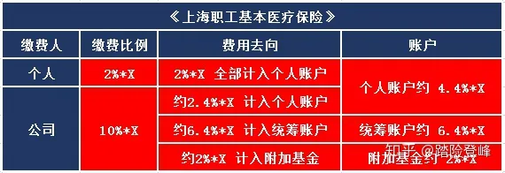

**对社保卡中的医保部分坊间流传着这样的两种传说：**

**1、医保万能论——“医保在手，看病不愁”有了医保，国家会帮我治病，自己掏不了几个钱。**

**2、医保无用论——认为医保就是披着国家的外衣骗钱的保险，每个月交医保的钱还不如还给我存银行。**

  

这两种想法都是**片面的**，医保也是一种**“保险”**与“商业保险”有许多的类似的地方，但也有很多的不同。

这篇文章，我们将从**医保的分类**、**医保的保费**、**医保的报销比例**以及**医保的优点**，4个角度来详细的拆解医保。

  

## **一、医保的分类：**

  

**不同性质的人员、享受的医保政策是不一样的。在上海主要分为：《上海职工基本医疗保险》、《上海城乡居民基本医疗保险》。**

**其中《上海职工基本医疗保险》主要适用于像我这样需要工作养活自己的苦命宝宝（退休职工也是享受的职工基本医疗保障）；**

**而《上海城乡居民基本医疗保险》则主要适用于在校学生、农民伯伯、失业人员等其他非在职人员。**

**这篇文章我们主要就是讲解《上海职工基本医疗保险》这部分。**

  

## **二、医保的保费：**

  

要享受保障自然先要**交保费**，医保虽然是普惠性质的基础保障，但也**不是免费的**。《上海职工基本医疗保险》的缴费基数是我们上一年个人的月均工资，假设基数为X。那么个人需要缴纳的保费就是2%\*X，公司需要帮我们缴纳的保费为10%\*X。

可以看到公司每个月给我们交的医保是去到三个地方的，**“个人账户”**就是我们的医保卡里每年会打进来的钱，虽然不能取出，但是可以用来看病买药，也**算作是我们自己的钱**。而进到**“统筹账户”**和**“附加基金”**里的钱则是注入到上海市医疗保险基金的大池子，**使用时候统筹统算，和个人没有直接的关联。**

**所以医保交多交少和我们的收入有关，和我们得到的保障无关。**医保面前**人人平等**，大家得到的保障是**一样的**。从某些方面来说社保是一种**“劫富济贫”**的保障政策。

  

## **三、医保报销比例：**

  

首先，医保哪些报销哪些不报销根据**《社保目录》**来定义的，**医保只报销《社保目录》内的内容**，**《社保目录》中不包含的项目需要靠商业保险去报销。**

在《医保目录》范围内，分为：**① 门、急诊**；**② 住院、留院观察**；**③ 门诊大病、家庭病床**，三种报销模式。**不同的年龄，去不同的医院就诊报销的比例也是不一样。**

**宗旨就是：收入高，交的多；门急诊花费少，报销少；住院花费多，报销多；在职人员报销比例低，退休人员报销比例高；高级别医院报销比例低，基层社区医院报销比例高。**

  

## 1、门、急诊报销手册：

**医保的门、急诊报销一共分为3个阶段：**

**① 当年余额：**（账户段）在门诊产生治疗费用时，先由医保个人账户当年计入的部分支付，就是上表格中4.4%\*X的那部分。只花当年的，历年的不算。花完这部分如果不够报销门、急诊费用的进入第二阶段。

**② 自负段：**（起付段、起付线）就是自己要先掏300-1500元（年龄不同，起付线不同）。如果还不能覆盖门、急诊费用，再进入第三阶段。

**③ 共负段：**在共负段不同级别的医院报销比率不同，医院等级越高，报销比率越低。

**举个例子**

顽皮的小王在家玩锤子砸伤了了手，去当地三甲医院挂急诊治疗，花费了2万元。

小王的医保卡里共有1万元，其中2千是当年计入的资金，8千是历年的积累资金。

那么小王此次急诊的治疗费2万元**第一阶段**，先由当年账户余额的支付：20000-2000=18000元。**第二阶段**，剩下这18000元再扣除掉起付线：18000-1500=16500元。**第三阶段**，小王不满45岁，且去的是三级医院治疗，所以报销比例是50%，16500\*50%=8250元（个人自负8250元）。

**其中需要自己承担的“起付线1500”和“个人自负部分8250”可以由医保账户历年余额抵扣。**

  

## 2、住院、留院观察报销手册：

住院治疗的费用也有起付线（起付段），但与门、急诊的**区别是**：不需要优先花完当年的个人账户里的钱，**只要住院费用超过了起付线就可以享受医保统筹基金的报销。**

**再举个例子**

年迈的老王陪儿子出去玩，不慎摔伤，需要住院治疗花费了10万。

老王的医保卡里共有8万元，其中3千是当年计入的资金，7万7千是历年的积累资金。

那么老王此次住院的治疗费10万元**先扣除起付线**，老王今年**已经退休了**，100000-1200=99800元。剩余这99800元**再由医保统筹基金按照92%的比例报销**，99800\*92%=91816元（个人自负7984元）。

**其中需要自己承担的“起付线1500”和“个人自负部分8250”可以由医保账户历年余额抵扣。**

  

## 3、门诊大病、家庭病床报销手册：

**门诊大病指的是：特定的重大疾病不需要住院治疗，但是费用非常昂贵的。**比如癌症的放疗、化疗费用、重症尿毒症的透析费用、部分精神病的治疗费用。

这部分报销方式**不用扣除当年个人账户计入资金**，也**不设起付线**，所产生的门诊费用，只要在社保范围内的，都可以直接按照住院的比例报销。

**家庭病床指的是：以家庭作为护理场所病人在家进行治疗。**同样**不用扣除当年个人账户计入资金**，也**不设起付线**。

  

## **四、医保的优点：**

  

**从医保的保费来看，如果我收入比较高月薪2万的话，我一个月医保要交400元了，一年下来保费要4800了，现在商业保险中比较便宜的百万医疗一年才几百元保费，还包社保外用药，报销比例也比医保要高。4800年我都够钱买中端医疗了还没有免赔额，“劫富济贫”“劫”的就是我，那我能不能不参加医保就单买商业保险？**

虽然**高收入人群**看似参加医保比**低收入人群**要“亏”，但还是**不建议不参加医保**。因为**医保还是值4800这个价的**。医保有以下**2个优点是商业保险所不具备的：**

  

## 1、医保可以带病投保：

单就这一条就秒杀了所有商业健康险，带病投保在商业健康险中可是属于“骗保”行为。因为商业保险是**一种“风险博弈”**，**风险发生了他“吃亏”，风险没有发生我们“吃亏”**。如果在投保前风险已经确定**“风险一定会发生”**，那对于保险公司来说就是一笔**100%“稳亏不赚”**的买卖，**自然会拒绝承保**。

**但是医保可以，即使已经发生了重大疾病，确定后续一定会有不菲的医药费支出，还是可以参加医保，医保不会拒绝任何人。**

  

## 2、医保的福利可以终生享受：

市场上**大部分商业医疗险，都是一年期产品，最长也不超过6年**。虽然很多商业医疗险都会承诺初此购买后不会因为健康原因拒绝第二年继续投保，但是**如果产品停售还是会存在断保的风险**。

而按照规定，只要**在职期间缴费满15年**（各地政策要求不同，上海15年、杭州20年、广州10年，北京男性要求满25年，女性满20年；湖北男性满30年，女性满25年），**退休后我们就不需要再缴纳医保保费，还可以终身享受医保福利。**

所以不管收入高低都不建议不参加医保，**医保是最基础的保障，商业健康险是医保的补充。**

  

  

**医保是白米饭，商业保险是菜。光吃饭没有菜，缺营养；光吃菜没有饭，吃不饱，有饭有菜才能算吃得好~**

  

**​**

**因为懂你，所以专业，做一个有温度的保险经纪人。**

**因为诚实，所以可靠，做一个卖保险的匹诺曹~**

