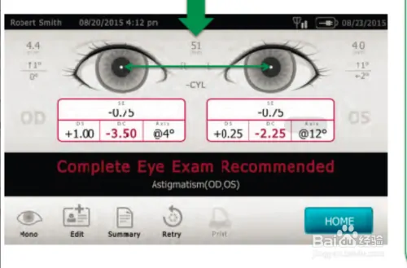
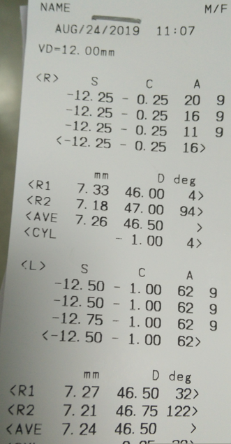
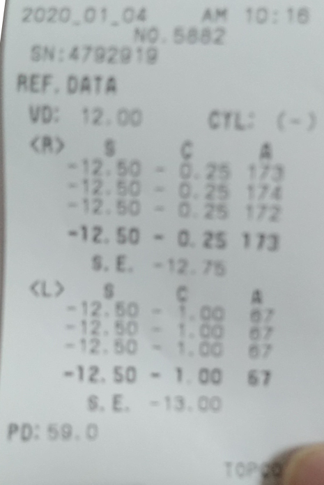
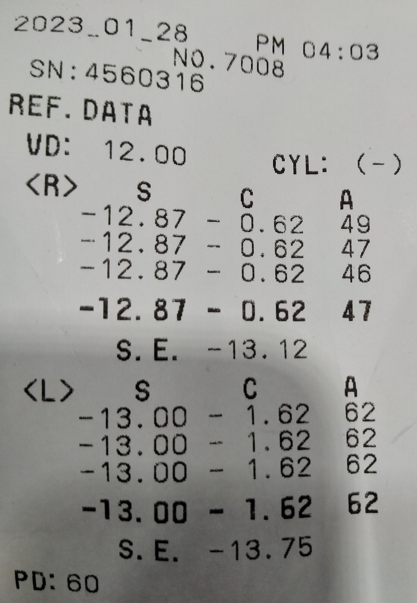

# 视力
|    Date    | Address |  R_S  | R_C  | R_A | R_S.E. |     |  L_S  | L_C  | L_A | L_S.E. | 瞳距PD |
| ---------- | ------- | ----- | ---- | --- | ------ | --- | ----- | ---- | --- | ------ | ------ |
| 2019.08.24 | 六院12   | 12.25 | 0.25 | 16  | -      |     | 12.50 | 1.00 | 62  | -      | -      |
| 2019.08.24 | 六院医生 | 11.50 | -    | -   | -      |     | 12.50 | 0.75 | 60  | -      | 61     |
| 2020.01.24 | 四团12   | 12.50 | 0.25 | 173 | 12.75  |     | 12.50 | 1.00 | 67  | 13.00  | 59     |
| 2023.01.28 | 四团12   | 12.87 | 0.62 | 47  | 13.12  |     | 13.00 | 1.62 | 62  | 13.75  | 60     |

2019.08.24  六院12 瞳孔 R 7.26 L7.24

眼镜 1075 散75 1050

左眼OS（左）Oculus sinister：右侧的眼睛
右眼OD（右）Oclus dexter：右侧的眼睛

 近视Sphere（S_SPH_DS）
  散光Cylinder（C_CYL_DC）：是眼球结构的测量值。完美的圆的角膜是0.00，当角膜变平，就像一个橄榄球的形状时，柱面增加。轴是橄榄球形状朝向的方向，在180度之内
  散光轴位Axis（A_AXI_X）
  矫正视力Vision（V_VA）
  球面相等值S.E. ：这是由100%的球面值和50%柱面值混合而成的数值，并且在柱面法则中提供同样的结果。当把测试结果和下列标准进行比较时，需要用到这个数字：近视、远视、两眼屈光不等。
  瞳距PD：瞳距是从两个瞳孔的中心开始测量的，针对这一测量值不会给出任何建议，但是测量结果会帮助眼科护理专业人员如何配置眼镜
  

