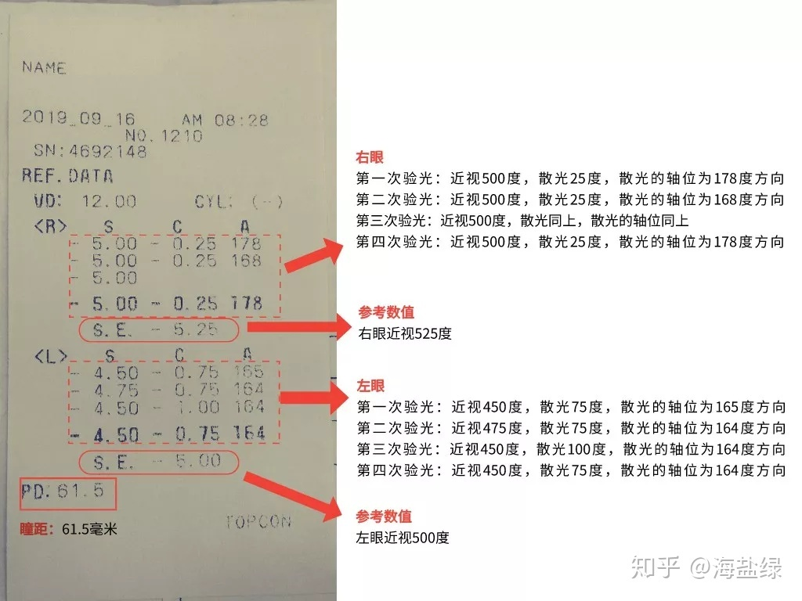
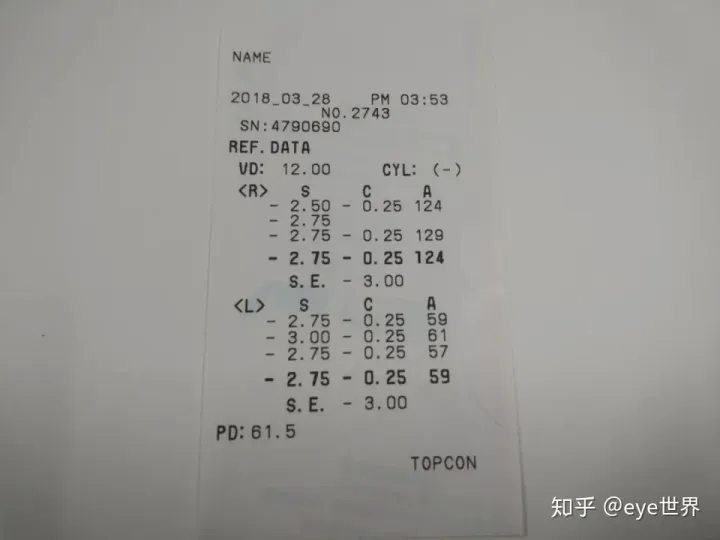
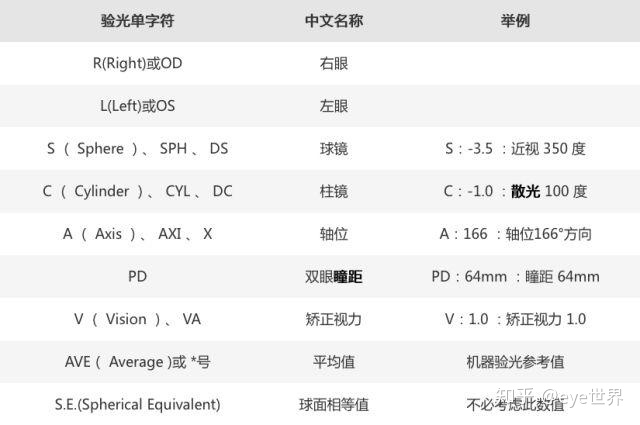
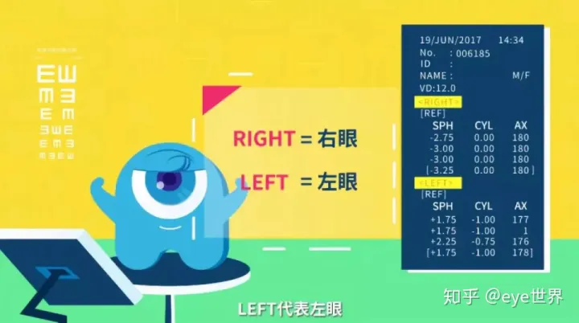
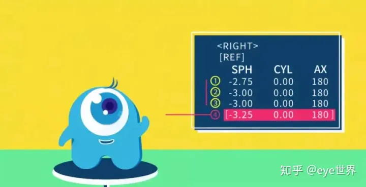
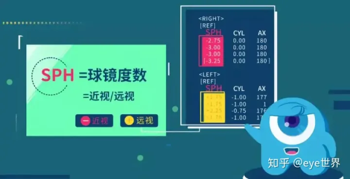
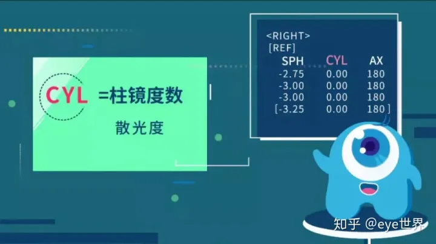
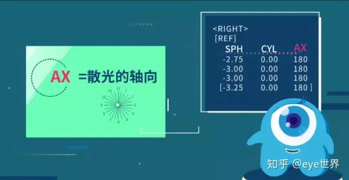
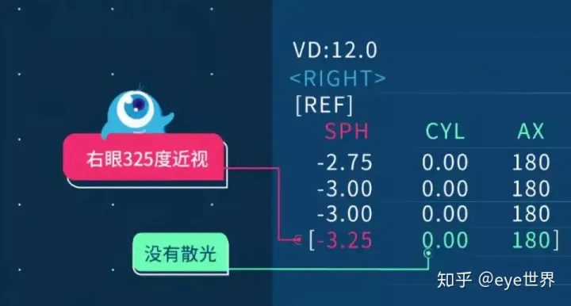
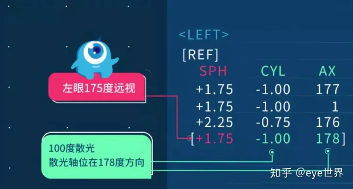

<h1>看不懂眼科视力检查单？三分钟带你破译它</h1>

当我们怀疑自己“近视”了，去看眼科医生的时候，医生大多会让您“验光”即去检查眼睛的度数。但报告单或病历本上写的验光结果可能只有几个字母、数学符号和数字，一般家长看得肯定是一头雾水，今天就来为大家上一堂如何看懂眼科检查报告单的课。

看不懂验光单？

SPH？CYL？AX？PD？

电脑验光单上的符号好深奥，

像密码般，是什么意思呢？

大多数人都看不懂！！

别急，这就带带你**3分钟**破译它！

**电脑验光单的含义**

  

  

如上图所示，这是一张普通的电脑验光单所展示的内容，我们先看一下上面的英文究竟代表什么含义：

 

  

可能东西有点多，有点记不过来。没关系，这里把重要的都标记出来：

  

  

表单中，**R(Right)代表右眼，L(Lift)代表左眼**。R栏中的数据便是你的右眼数据，左眼也是同理。

  

  

数据通常会测三次，并且取这三次的平均值作为最后的结果。

那在对应眼睛的数据中，S(SPH)、C(CYL)、A(AX)又分别代表什么意思呢？

  

  

**SPH意为球镜度数，是判断近视与远视的直接数据。**如果数值为“-”时，代表这只眼睛近视了。而当数值为“+”时，则代表远视。

  

  

  

  

**而CYL与AX都是与散光相关的数值**，CYL表示柱镜度数，也就是散光度。AX则表示散光的轴向。我们通过下面两张图来一次深刻的理解：

  

  

**近视无散光↑↑↑**

  

  

**远视且有散光↑↑↑**

理解了吗？我们现在回过头看看第一张电脑验光单，大家来尝试一下是不是能读懂它吧。

  

**公布答案：**

**右眼（R）数据为三次验光平均值：**

近视（S）：-2.75D，即近视275度。

散光（C）：-0.25D，即散光25度。

散光轴位（A）：124度方向。

**左眼（L）数据为三次验光平均值：**

近视（S）：-2.75D，即近视275度。

散光（C）：-0.25D，即散光25度。

散光轴位（A）：59度方向。

瞳距（PD）61.5mm。

怎么样？现在看电脑验光单是不是觉得轻松了许多？不过呀，电脑验光并非完全精准，所以，**还需要专业的验光师来进行更精确的“主觉验光”。**

  

  

  

  

  

  

**医学验光的内容和步骤:**

1. 眼科专家坐诊，眼科病史询问和眼科检查（角膜、晶状体、眼底等情况）;

2. 常规检查(裸眼视力、电脑验光、眼压等);

3. 医学验光：确定近视、远视、散光度数及轴位，红绿平衡、交叉柱镜、双眼平衡、主导眼检查等；

4. 检查眼位，内隐斜近视低矫，远视眼足矫，外隐斜近视足矫，远视眼足矫;

5. 调节力测定，调节力是指能看得清楚近距离物体的能力。

6. 检查双眼视功能，特别是两眼度数不等时;

7. 准确测量瞳距，以保持双眼视轴中心与眼镜光学中心一致;

8. 试戴眼镜，开具配镜处方。

**每个人都应该进行医学验光**

医学验光配镜不单凭验光结果确定眼睛度数，而是根据眼科医生的眼科检查，然后根据配镜者的年龄、眼球位置、眼睛的调节能力、双眼的协调能力，以及疾病对屈光的影响等综合因素决定，在戴镜后还要定期复查，适时调整眼镜度数。

**以下人群应该进行医学验光:**

A、 15岁以下的青少年

B、初次戴镜者

C、戴眼镜出现视疲劳者

D、双眼屈光参差者

E、曾患有眼疾者

F、需进行屈光手术者

G、短期近视度数增加较快者,如半年内就加深了100度

**验光周期:**18岁以下的青少年由于正处于眼睛发育过程，如果近视，3-6个月之间必须进行一次医学验光；倘如远视，则每半年就要进行一次。

**视力报告，一般包括视力和屈光度数两部分的结果。**

**1、视力**

视力大家都比较熟悉，是指眼睛分辨物体形状大小的能力，也就是看清东西的能力，通常使用标准对数视力表进行检测，以5米远为测量距离。

大家都知道1.0是标准视力，但是很多视力报告上并不是以1.0表示，而是用5.0表示，这就要跟大家解释一下，视力结果有两种记录方法，一种是小数记录，一种是五分记录，两者之间可以互换，如0.1对应4.0，而0.12、0.15、0.2、0.25、0.3、0.4、0.5、0.6、0.8、1.0、1.2、1.5、2.0依次对应4.1、4.2、4.3、4.4、4.5、4.6、4.7、4.8、4.9、5.0、5.1、5.2、5.3。
0.1、0.12、0.15、0.2、0.25、0.3、0.4、0.5、0.6、0.8、1.0、1.2、1.5、2.0
4.0、4.10、4.20、4.3、4.40、4.5、4.6、4.7、4.8、4.9、5.0、5.1、5.2、5.3
对于不同的年龄来说正常视力标准是不一样的，一般1岁儿童视力可达0.2，2岁可达0.4及以上，3岁可达0.5及以上，4岁可达0.6及以上，5岁可达0.8及以上，6岁及以上可达1.0及以上，家长可以根据孩子的年龄与视力结果对照看看是否达标，不达标则说明视力有问题，需要进一步查找原因。

**2、屈光度数**

视力报告上另外一个比较复杂难懂的结果就是屈光度数。屈光度数是指眼睛屈折光线成像在视网膜的度数，简单来说就是近视、散光的度数，一般使用台式验光仪进行检查，目前有相当一部分幼儿园或学校是用手持式屈光筛查仪进行检查的。

屈光度数一般包括三部分：球镜、柱镜和轴位。
1. 球镜，英文Sphere，缩写为SPH或DS，是近视或远视的度数，近视用负数表示，远视用正数表示，精确到小数点后2位，数值一般是0.25的倍数，比如-1.00就表示近视100度，+1.25就表示远视125度。
2. 柱镜，英文Cylinder，缩写为CYL或DC，是散光的度数，一般用负数表示，数值同样是0.25的倍数，比如-2.25就是散光225度。
3. 轴位，也称为轴向，英文Axis，缩写为A或AX，是散光的方向，若眼睛存在散光则一定有轴位，它是一个物理值，范围从0~180，一般为5的倍数。
三者组合起来就构成了屈光度数，比如-1.50DS/-1.00DC180就表示近视150度、散光100度、轴位180。另外，球镜和柱镜的数值越大，则度数越大，而轴位仅表示方向，不存在大小之分。

正常情况下，人出生时眼睛为远视，球镜为+3.00~+4.00（即远视300~400度），这种远视也被称为远视储备（即生理性远视），有远视储备则不容易近视，随着年龄增长，眼球发育，远视度数逐渐降低，2~3岁为175~200度，3~4岁为150~200度，5~6岁为150~175度，7~8岁为125~150度，8岁以上为50~150度，约在10~12岁降低至0~50度达到正视化。当孩子的屈光度数检查结果不在以上参考范围，就要引起重视，特别是球镜出现负数时则考虑可能近视了。

验光测到柱镜度数时提示眼睛存在散光，一般来说，50度以内的散光对视力无明显影响，不用特殊处理，不必过分担心，当散光超过75度，视力就可能受到影响，特别是高度数散光会严重影响视力发育，不及时处理可能会导致视觉发育异常，出现弱视，因此要引起警惕。

视力报告中右眼和左眼不一定用中文表示，有些会使用英文缩写，R是单词Right的缩写，表示右眼，L是Left的缩写表示左眼。此外，眼科中右眼还常用OD或od表示，左眼用OS或os表示，OD和OS是拉丁语右眼Oculus Dexter和左眼Oculus Sinister的缩写，眼科医生使用较多，日常生活中相对少见，希望通过这次讲解，大家以后看到这些字母时能分清左右眼。另外，视力（Vision）常用缩写V表示，视力报告上VOD或Vod就表示右眼视力，VOS或Vos就是左眼视力。