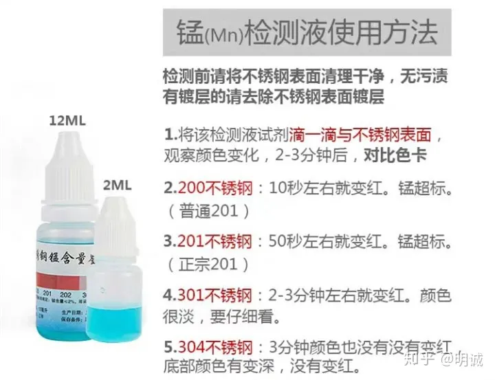

*   不锈钢的主要成分
*   不锈钢分类
*   奥氏体不锈钢
*   304、SUS304、06Cr19Ni10、S30408有什么区别
*   304不锈钢与316不锈钢哪个好
*   什么是食品级不锈钢
*   如何看待食品级不锈钢钢印
*   说说不锈刚检测液
*   怎么样确保自己买到的是食品级不锈钢
*   不锈钢“不生锈”的原因
*   443不锈钢简介
*   为什么有些不锈钢餐具带有一股“异味”
*   如何快速除去不锈钢表面的污垢
*   304不锈钢是不是都是无磁性的
*   不锈钢是不是一定不生锈
*   不锈钢盆用纸擦拭后纸表面变黑，可以安全使用吗？

## **一、不锈钢的主要成分**

不锈钢的主要成分是**铁、铬、镍**，还有少量碳和其它元素

## 二、不锈钢分类

按材料组织结构分

*   **奥氏体不锈钢**
*   马氏体不锈钢
*   铁素体不锈钢
*   奥氏体-铁素体双相不锈钢
*   沉淀硬化不锈钢

最常见的是**奥氏体不锈钢**，奥氏体不锈钢的产量约占到不锈钢总产量的**75%~80%**。

## 三、奥氏体不锈钢

经典的第一代奥氏体不锈钢称为**18-8钢（也就是我们常见304不锈钢，18-8的意思是含铬量约为18%左右，镍8%~10%）**，是最典型的代表钢种，其它奥氏体均是在18-8的基础上发展起来的。

奥氏体不锈钢按成分常见的有：

*   2XX系列（铬-镍-锰 奥氏体不锈钢，最常见的**201、202**）
*   3XX系列（铬-镍 奥氏体不锈钢，最常见的 **304、316**）

2XX系列源于二战时期，作为战略物资的镍在各个国家都严格控制使用（**镍很贵**），为了解决镍供应量严重不足的困境，美国首先开发出含镍低的2XX系列不锈钢的产品，作为3XX系列产品的应急和补充，2XX系列往钢中加入锰和（或）氮代替贵重金属镍元素而发展起来的，2XX系列耐腐蚀等性能不及3XX系列，**但二者都具有无磁性**，所以国内很多不法商家以201不锈钢以次充好冒充304不锈钢，但人体过多摄入锰元素会造成神经系统系统受损，所以2XX系列不可用于餐具。

## 四、304、SUS304、06Cr19Ni10、S30408有什么区别

**这些都是18-8奥氏体不锈钢在不同国家不同叫法**，304（美国标准，也就是美国名）、SUS304（日本标准，也就是日本名）、06Cr19Ni10（中国标准，也就是中国名）、S30408（S30408是06Cr19Ni10的UNS编号，美国304也有对应的UNS编号S30400），**不同国家标准会少许差异，但说来说去，这些大体可以认为是同一种材料**。

## 五、304不锈钢与316不锈钢哪个好

我们通常说的**316不锈钢指的是316L**，"L"是英文"LOW"的缩写，表示“低碳”的意思。316不锈钢与304相比**提升了镍的含量，减少了碳的含量，并且新添加了钼（304中不含钼**），镍、钼的添加让它的耐腐蚀、耐高温性大大增强，**当然成本也更高**。316主要应用于**海洋、高温蒸馏、特殊医疗器械**等需要耐腐蚀，耐高温的设备中，**所以普通食品接触304就够用了**。

## 六、什么是食品级不锈钢

食品级不锈钢是指符合国家强制标准GB4806.9-2016《食品安全国家标准 食品接触用金属材料及制品》的不锈钢。

从上面可以看出国家对食品级不锈钢的是要求主要两点：一是原材料要符合要求，二是这些原材料的重金属析出要达到食品级的标准。

**那很多小伙伴们会问那304不锈钢到底是不是食品级不锈钢？**

答案是：**304不锈钢“不等于”食品级不锈钢**，304是美国标准，中国的标准中自然不可能出现“304”这种美国标准的字眼，但通俗来说“**经过特殊处理的304不锈钢”是食品级不锈钢，普通的304不锈钢不是食品级不锈钢**，304不锈钢的工业用途很广泛，多数都不是食品级的。

## 七、如何看待食品级不锈钢钢印

以电热水壶为例，我们买的很多大品牌的壶内壁上会有食品级不锈钢钢印，是不是有钢印的就是食品级不锈钢呢？答案是：**不是。食品级不锈钢钢印并不是国家标准，是各家企业出于营销的目的自己加上去的，而且各家钢印的款式样式也是五花八门各不相同**。（默默想一下，即使国家真的出标准，标志中也不可能出会304这种美国标准的字眼），所以有无钢印不能作为鉴别食品级不锈钢的标准。

## 八、说说不锈刚检测液

现在大家在网上可以买到很多不锈刚检测液，这些产品的原理很简单：**溶液与不同种类不锈钢的某些成分发生化学反应，使溶液颜色发生变化**。检测液通常分为两种：

*   无需通电型
*   通电型

无需通电型，如：锰(Mn)检测液，**主要用来检测304不锈钢**（201，202中锰含量高，主要针对有些不法商家用201，202冒充304）

通电型，如：钼(Mo)检测液，**主要用来检测316不锈钢**（钼是贵金属其它不锈钢不含钼，主要针对有些不法商家用304冒充316）

这类检测液有三个缺点：

1.  **会对不锈钢表面有轻微腐蚀**
2.  **不能检测有镀层的不锈钢（有镀层的要锉掉镀层后才能检测）**
3.  **只是粗检，只是粗检，只是粗检，重要的事情说三遍**

以锰(Mn)检测液为例，合格说明锰含量符合要求，其它元素是否符合国家标准就不得而知了，也就是说这些检测液对一些常规套路性的作假还是有一定作用的。

[

N低 N8 M2(201 304 316)不锈钢检测药水快速鉴定识别液

## 九、怎么样确保自己买到的是食品级不锈钢

**方法只有一个：买正规大品牌的产品。**

还是以电热水壶为例，与水接触部分主体应为食品级不锈钢。因为**国家强制标准GB4806.9-2016是“强制性”的**，所以买正规大品牌产品都是符合食品级要求的。

## 十、不锈钢“不生锈”的原因

不锈钢不生锈主要靠其中的**铬**，铬的存在让不锈钢表面形成致密的**富铬氧化薄膜**，可防止腐蚀生锈。不锈钢钝化膜是氧烃基、水、铬化合物，若表面有伤痕，保护膜就会脱落，但周围的水和氧气会让它再生，维持耐腐蚀性，这样不锈钢表面就有了保持自身的“修复力”。

## 十一、443不锈钢简介

443不锈钢是**铁素体不锈钢**的一种，现在一般用来取代304不锈钢，防锈能力和加工性能与304相当，**导热性比304更好**，广泛应用于电器、厨房设备、电梯等领域。

## 十二、为什么有些不锈钢餐具带有一股“异味”？

有时我们的手接触金属，手上会有金属味，主要是因为**皮肤接触到了金属的表面时，皮肤上氧化的脂肪被金属的微量的金属离子催化分解成小分子的醛和酮被你闻到了**，其实跟血腥味、铁的味道是类似的情况。

不锈钢餐具在生产的过程中，为了让产品具有某种特殊性能，如防腐性或者防酸碱性，在成型泠凝之后，会用机械加工的方式浇灌以药水来打磨。尤其是到成型后精加工的过程中附着的机油等物质，都会产生“异味”，**如果你用的是304、316这种食品级不锈钢餐具，清洗后还是存在明显的“异味”，说明不锈钢质量不达标**。

## 十三、如何快速除去不锈钢表面的污垢？

我们常用的不锈钢锅、水龙头等不锈钢器物，长久使用表面会产生污垢，而且特别难擦除。尤其是不锈钢锅，经常变黄、发黑，影响美观。

除污的方法也比较简单：使用专用的**不锈钢清洁剂，**厚重的油垢配合**金刚砂海绵**就可以轻松去除。

[实测：不锈钢清洁膏去污效果3152 播放 · 1 赞同视频​](https://www.zhihu.com/zvideo/1404440214249623553)

## 十四、304不锈钢是不是都是无磁性的？

**奥氏体不锈钢（以304为代表）是无磁性或带有弱磁性**。由于冶炼时成分偏析或热处理不当，会造成奥氏体304不锈钢中出现少量的马氏体或铁素体组织，这样304不锈钢中就会出现弱磁性。另外，304不锈钢经过冷加工，组织结构也会向马氏体转化，冷加工变形越大，马氏体转化越多，磁性也会越强。而**铁素体（主要有430、409L、439和445NF等）和马氏体（以410为代表）一般都是带有磁性的**。

## 十五、不锈钢是不是一定不生锈？

不锈钢种类有很多，不同种类的不锈钢耐腐蚀性不同。因此，**不是任何一种不锈钢，在任何环境下都能耐腐蚀、不生锈的**。比如304的耐腐蚀性比较强，但是经常接触盐水、海水环境仍然会被腐蚀，这时就要用316 。但是如果是正常日常使用条件下304生锈了，只能说明是**产品工艺不达标**或者**其中金属铬和其他添加物含量不足**。

## 十六、不锈钢盆用纸擦拭后纸表面变黑，可以安全使用吗？

超市购物经常会附带一些小赠品，有些赠送的不锈钢盆用纸擦拭后，纸面会有一层黑黑的东西，清洗多次后仍然洗不干净，这层黑黑的东西很大的可能是**抛光蜡（还有一种说法是抛光蜡与金属粉末混合物）**，抛光蜡是一种有毒的物质，难溶于水，正常来说不锈钢产品抛光蜡应被清洗干净后才能出厂，如果带抛光蜡的产品流入消费者手中，先不说不锈钢本身是否达到食品级，至少说明厂家质量把控就存在问题，建议不要用这类产品接触食物或者直接扔掉。

（声明：本文为原创内容，非经授权，禁止转载！）

**更多相关链接：**

*   [1）干货！【铁锅】选购技巧](https://zhuanlan.zhihu.com/p/222654711)
*   [2）一张图带你了解——如何挑选不锈钢【蒸锅/汤锅】？](https://zhuanlan.zhihu.com/p/383147674)
*   [3）户外【野营便携式套锅】怎么选？不妨看看火枫（FIRE-MAPLE）口碑爆款“盛宴4“](https://zhuanlan.zhihu.com/p/414539979)
*   [4）干货！【砂锅】选购知识大全！](https://zhuanlan.zhihu.com/p/265229565)
*   [5）『不粘锅』那些事儿](https://zhuanlan.zhihu.com/p/257925203)
*   [6）干货！【砧板】（菜板）选购技巧](https://zhuanlan.zhihu.com/p/259217243)
*   [7）雪平锅品牌推荐：吉川、神田、川岛屋哪个好？](https://zhuanlan.zhihu.com/p/260373762)
*   [8）家用【厨刀】（菜刀）该怎么选？](https://zhuanlan.zhihu.com/p/268501033)
*   [9）【筷子】该怎么选？](https://zhuanlan.zhihu.com/p/282946583)
*   [10）深度分析：【保温杯】选购——“膳魔师”篇](https://zhuanlan.zhihu.com/p/339329612)
*   [11）有哪些“爆款”【儿童保温杯】（水杯/水壶）值得购买？](https://zhuanlan.zhihu.com/p/352634497)
*   [12）【户外便携炉】具推荐：卡式炉、酒精炉、分体式气炉哪个好?](https://zhuanlan.zhihu.com/p/293276442)
*   [13）“天生为煮炖而生的神器”—— 【珐琅锅](https://zhuanlan.zhihu.com/p/481137850)】