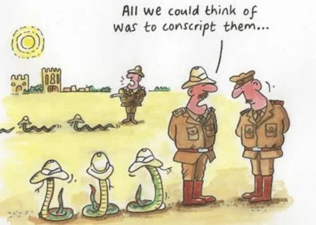
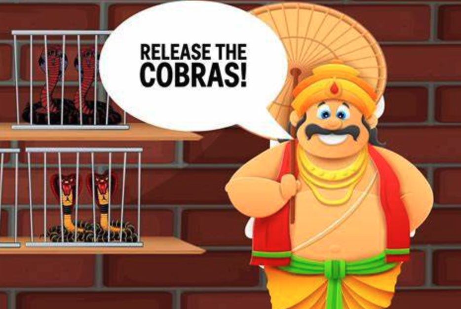
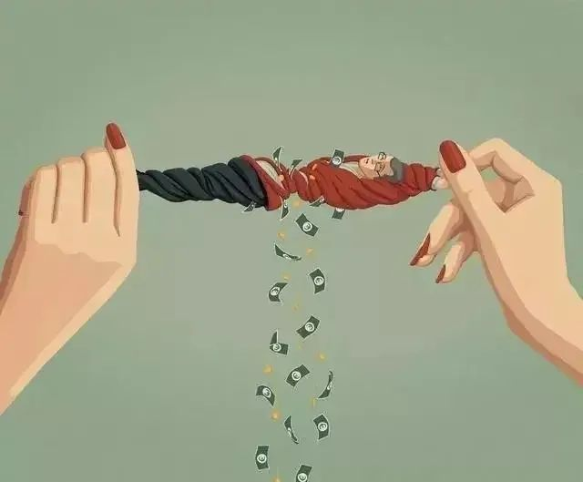

[人人都装杀毒软件的时代，电脑病毒却越杀越多，后来是怎么「清零」的？](https://mp.weixin.qq.com/s/9X1jqXNvv7hnXG-0EYWx2Q)
今天的文章，希望你能认真读完，因为这关乎我们每个人的切身利益。

我们这代人，一定都对「杀毒软件」印象深刻。

十几二十几年前，电脑病毒肆虐：各种木马病毒、CIH病毒，以及著名的熊猫烧香。

但凡买了新电脑，第一件要做的事，大概率都是装上杀毒软件。

去打印店，插U盘前也会问问老板：你家电脑没病毒吧？

而一批开发收费杀毒软件的公司，也随着病毒的猖狂迅速崛起：

卡巴斯基，江民，瑞星，金山毒霸......

比如说瑞星。

这个小狮子，大家应该不陌生。

当年发现了一种名叫CIH的病毒，只有1kb大小，却让全球数千万台电脑陷入瘫痪。

而当时发迹不久的瑞星，第一个开发出清除CIH病毒的软件。

**于是，病毒成就了瑞星。**

230元一套的杀毒软件，一个月能卖十万套。

2003年，瑞星年销售额就超过7个亿。

还有后来的金山毒霸。

为了抢市场，打出免费试用和低价策略。

不到三年，在市占率上就名列前茅。

那些年，真可谓是杀毒软件的黄金时代。

**可奇怪的是，当时不管这些技术先进的软件怎么遍地开花，电脑病毒却道高一尺魔高一丈，层出不穷，越杀越多。**

人们一度陷于被病毒支配的恐惧。

**更奇怪的是，后来，电脑病毒似乎一夜之间“消失”了。**

**现在我们很少再用什么杀毒软件，可“裸奔”的机器，照样很安全。**

这些，都是为什么？

**01**

聊这个问题前，先说另一个故事。

相传殖民时期的印度，毒蛇泛滥。

尤其是眼镜蛇，总在大街小巷出没，伤人不说，还常引起居民骚乱。

当局为了稳定局势，颁布悬赏：

只要有人能抓到眼镜蛇，就能领一笔赏金。

事实证明这是个好主意，当地居民人人热情高涨，上街打蛇，换取赏金。很快肆虐的毒蛇就被消灭干净了。

但，故事没有结束。

有一群人，在捕蛇运动中嗅到了商机，起早贪黑抓着成筐的蛇，换得盆满钵满，甚至以此为生。

可抓着抓着，毒蛇眼看不够用了，财路要断，怎么能行？

他们想出个好招：**饲养眼镜蛇。**

只要把蛇交上去，当局哪里能分辨出是家养还是野生，当然只能支付赏金。

**于是原本为了清理蛇患的政策，变成了一桩生意，越来越多的人开始专门养蛇领钱。**

持续了一段时间，当局再也撑不住了。

眼镜蛇越杀反而越多，悬赏金也严重亏空了财政。

调查之后，当局终于发现了其中猫腻。震怒之下，第二天就宣布废除悬赏。

这下闹剧该结束了吧？

**但结果是，大家一看养蛇没用了，急着脱手，干脆把毒蛇全部放生。**

大街上，蛇山蛇海，为了换钱而大量饲养的眼镜蛇在人间泛滥，反而造成了比之前更严重的蛇患......

这就是经济学上的**“眼镜蛇效应”**。

它不是偶然，不是孤例。

20世纪初，越南河内老鼠泛滥成灾。

当时的殖民总督想出了相似的办法，唯一不同的是，统治者担心抓来的老鼠堆积成山更有隐患，便宣布：

抓到老鼠后，自行消灭。只需把尾巴割下来，即可兑换报酬。

于是人人踊跃，一连两个多月，每天都有数千条老鼠尾巴被呈上。

但鼠患不光愈演愈烈，还满大街出现没有尾巴的老鼠。

原来人们根本不会真正杀掉老鼠，而是只切下尾巴，故意“放鼠归洞”。

**毕竟丢掉尾巴的老鼠性命仍在，可以继续繁殖出大量老鼠，继续提供老鼠尾巴。**

谁还会管老鼠携带的病菌害不害人？

反正多一条尾巴，就多一笔收入。

这些当局的政策，都错了吗？

不，这些措施都是出于好意。

不光在很大程度上解决了麻烦，还补贴了民众。

可问题是：

**当灾难能带来利益，就一定会有人不愿看到灾难结束。**

**02**

“眼镜蛇效应”，还会在更大的层面奏效。

19世纪80年代，德国“铁血宰相”俾斯麦通过立法，建立了世界上最早的工人养老金、社会保障、医疗保险制度。

这是德国社会救济制度的起源。

一百多年来，社会救助，已经发展成德国的第一大产业。

直接从业人数200万，比德国最著名的汽车产业庞大得多。

为的，当然是让穷人过上更有保障的生活。

让他们饥有所食，病有所医，让不那么幸运的人，不会陷入绝境。

他们可以领到很高的失业救助金，还可以住进环境优美、医疗护理都免费的福利房。

每年每套租金，只要0.88欧元，约人民币7块钱。

这是件利民的好事。

但如今，某种程度上，却变成了德国经济的一道伤痕。

为了避免政府机构的官僚主义和低效率，德国把福利救助工作大量外包给私营机构去做。

每年，为之几乎要拨款1/5的政府税收。

**这就意味着，私营救助机构的收入来源，靠的是政府补助。**

**更意味着，受救助的人越多，向政府领的钱也就越多。**

于是，各种救助机构如捕猎一般搜寻救助对象。

巡视社区，走遍街道，发掘甚至“培育”着“客户”。

**穷人不够，就创造穷人。**

1994 年到2010 年，仅十几年间，德国残疾人数量增长了一倍。

许许多多的健康人，被救助机构一顿“操作”后，被鉴定为残疾人。

他们还在下层阶级家庭中“挖掘”着有学习障碍的孩子。

即便有些问题，对成长中的孩子来说很正常，但在救助机构眼里，这些孩子是“优质客户”。

他们拿到了补助，孩子却被终身贴上了标签。

很难进入正常学校接受教育，成年后，也很难进入正常劳动力市场。

到了最后，甚至争先恐后从国外“引进”难民。

大批难民，按月从德国政府那里领取丰厚补贴，但其中很大一部分收入落到了谁手里，不言而喻。

而这背后所带来的社会问题，他们才懒得管。

这一切，不是没人在意。

2003年，德国时任总理施罗德宣布改革，缩减救助补贴。

不仅很大程度减轻了财政压力，失业率也逐步下降。

可仅仅两年后，他就在选举中失利，退出政坛。

那200 万从业人员，加上家属和上下游产业，德国至少有数百万乃至上千万人直接间接靠福利制度赚钱。

他们手中握着选票，很多人甚至能够影响别人的选票。

于是，任何试图削减福利制度的政策都难以通过，任何想制衡救助产业的人都会很快下台。

这颗“雷”，越埋越深，却无人敢碰。

那些养蛇的、放老鼠的、“制造”穷人的，也许从一开始，也像我们普通人一样。

不想看到有人受穷，不想看到虫患肆虐，病毒横行。

可当他们能从中获得惊人的利益，便摇身一变，成了灾害的帮凶爪牙。

他们说着冠冕堂皇的话，喊着公共利益的号子，却在混乱中笑得无比开心。

才不管蛇会咬谁，鼠疫会传染给谁，高昂的财政拨款最后是由谁纳的税来买单。

想到那个段子：

上帝来到人间，看到每当他安排雨神下雨时，路上行人只能无助地躲在屋檐下。

而卖伞的商家，总是能及时出现，给躲雨的人带来雨伞。

上帝赞赏他，便说：

**“就让卖伞商家掌管天上下雨吧，他知道行人出行时间，不至于让大家淋雨。”**

三年后，上帝又来到人间，才发现：

**三年来，这场大雨，从没停过。**

**03**

写到这里，你肯定理解了文章开头的那个问题：

电脑病毒后来为什么突然就不见踪迹了？

因为那时候，发生了一件事。

2008年7月，一家叫奇虎360的公司横空出世，宣布自己的杀毒软件永久免费。

当时所有的同行都不理解，不在意，等着它迟早倒闭。

结果它用广告变现的方式活了下来，用户数还突破了3亿，迅速拿下行业头把交椅。

其他公司还能怎么办，当然是被迫跟着免费。

于是，付费杀毒时代，宣告落幕，而曾经活跃在每台电脑上的杀毒软件们，也渐渐褪去了风头。

那么，是因为电脑病毒真的消失了吗？

当然并没有，它们依旧很有危害性，但却已把目标对准了高校、企业、政府机构这类对象。

因为对公采购，能获利更多。

而针对我们普通人个人电脑的病毒，从经济角度看并不能产生什么利益了，自然就消失了。

**打蛇行动的结束，不是因为蛇没了，而是利益没了。**

话已至此，诸位都懂。

**如果一直让捉蛇的人有高额赏金，蛇患哪一天能绝？**

**如果一直让“制造”穷人的机构挣大钱，穷人是会越帮越多还是越帮越少？**

**如果一直让卖伞的人握有降雨的权利，天什么时候能放晴？**

只有无利可图了，有些事情，才能有所改变。

灾难、病毒，往往也同时捆绑着利益、欲望。

**真正需要封控的，是卖伞的龙王，而不是淋雨的行人。**

****\-END-****