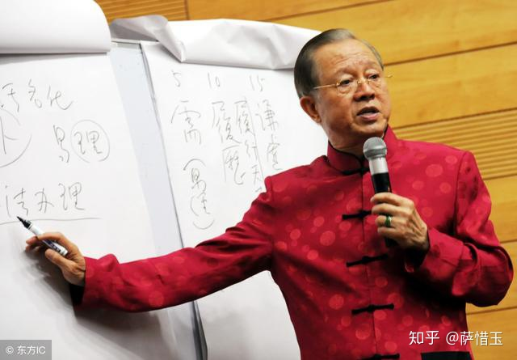
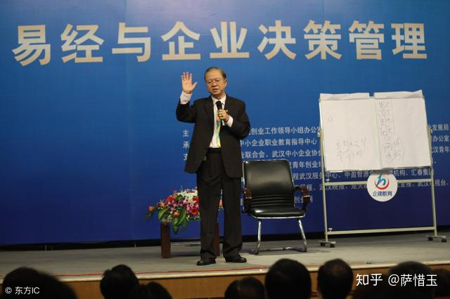

# 中国式管理精要
**一、中国式管理的含义**

1、中的意思，是合理。凡事求合理，是中国人特质。2、中国式管理，便是合理化的管理，务求管得合理。3、应该管的才管，管的方式要合理，即中国式管理。

**二、首先要有共同认识**

1、管理必须和自己的风土人情结合在一起，才有效。2、对中国人、中国社会，要有深一层的体认和理解。3、合乎中国人性格的管理，必须有更为优良的成果。

**三、把自己的定位做好**

1、基层员工，以“务实”为主，遵守规定照章行事。2、中高干部，以“应变”为主，合理应变以求制宜。3、企业总裁，以“前瞻”为主，随时抓住市场变化。

**四、培养敏锐的第六感**

1、总裁的主要职责，在领航、掌舵，方向感要准确。2、五官的感觉会骗人，一切依据有形来判断会上当。3、第六感最可靠，但是很不容易运用，要多多磨练。

  

  

**五、先孕育出合用制度**

1、逐渐形成，需要多少建立多少，不必刻意求齐全。2、由下而上，各单位自己去讨论，反正很快会调整。3、保留弹性，以适应内外的变数，在法中衡情论理。

**六、在团队中完成自我**

1、有本事，才能够充分表现能力，使大家乐于接纳。2、有理想，必须充分了解现况，才能够有效地实现。3、能调整，在动态的环境中，适时应变求生生不息。七、把能干团队带出来1、第一圈最要紧，多费心神培养彼此的共识和默契。2、由第一圈去带第二圈，依此类推，务求彼此呼应。3、大圈圈中有小圈圈，不要公而无私，就有利无害。

**八、维持合理的不公平**

1、对待员工，公正合理，基本上很不容易做到公平。2、因为机会有限，资源不足，不可能公平，做不到。3、最好以合理的不公平来取代不合理的公平、合理。

**九、让干部去从事管理**

1、作业是基层员工的职责，干部最好订规范少干扰。2、管理是干部的工作，总裁最好多支持少直接参与。3、总裁的主要职责在经营，知人善任才是首要任务。

  

  

**十、把人安顿好最要紧**

1、识人、知人、留人、用人一连串都和人心有关系。2、关心、用心、交心、绑心是领导员工的主要过程。3、把人安顿好，是总裁的首要任务，人不安事不行。

**十一、凡事务求慎始善终**

1、慎始，指谋定而后动，必须和干部互动、好商量。2、让干部先开口，才听得见不一样的声音、好意见。3、慎始不一定善终，必须重视过程中阶段性的调整。

**十二、无为才能够无不为**

1、无为并不是什么都不管，而是让员工能全力发挥。2、无不为才有效果，必须有目标、有计划、有方法。3、总裁无为，干部无不为，依此类推，才能总动员。

更多创业经验及思维我会每天在朋友圈分享给大家，目前我自己也有几个团队，我所分享的这些都是自己一步步实践总结出的经验和教训，谢谢大家，大家可以扫我二维码加我微信，祝大家发财。